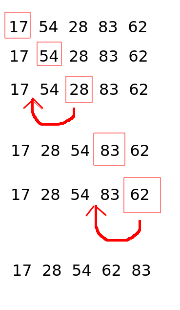
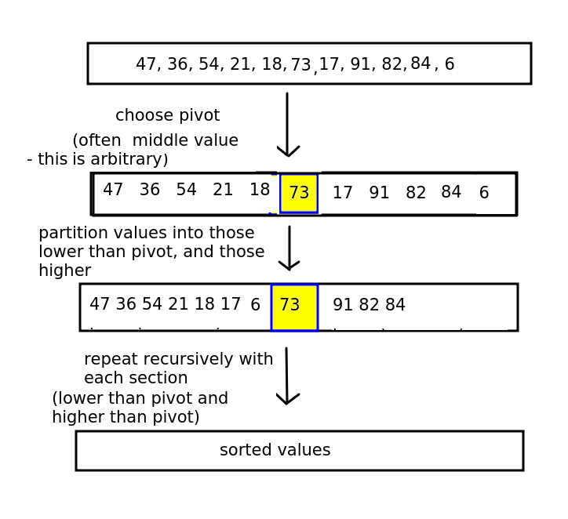
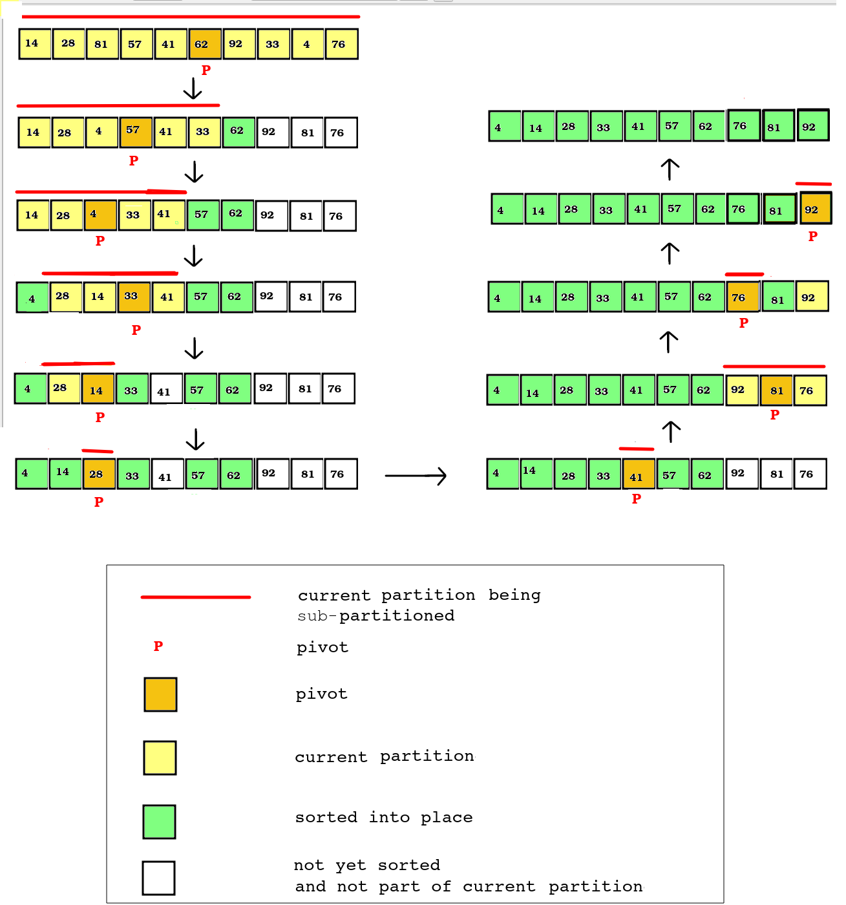
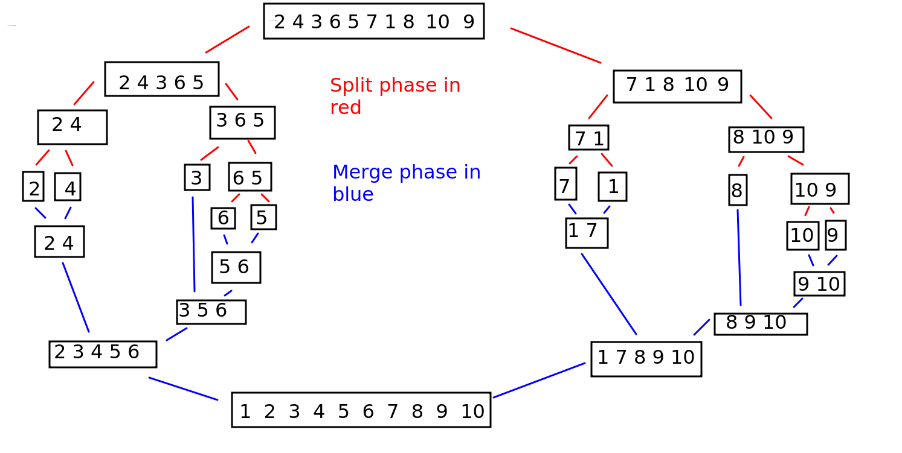

Topic 9: Further sorting algorithms
===================================

Introduction
------------

This week we will continue with our look at algorithms by examining some further algorithms, including _selection sort_ and _insertion sort_. We will also look at the more efficient but more complex _quick sort_.

Further Sorting Algorithms
--------------------------

### Insertion sort

A third type of simple sort, with complexity `O(n^2)` in many cases, but occasionally `O(n)` (see below), is the _insertion sort_. This is shown on the diagram below.

Insertion sort works by progressively _inserting_ values into the list at the correct place. A typical implementation will work through a list and sort it in-place (i.e. within the original list, rather than creating a new list), by defining a "divider" that separates out the list into sorted and unsorted parts. The "divider" moves forward one position on each iteration of the outer loop. The "divider" is shown by a red box in the diagram.

Each time we move to a new "divider", we compare the "divider" with the sorted part of the list, to its left. If all members of the sorted part are less than the "divider", we do nothing. If on the other hand we find a member, or multiple members, of the sorted part of the list which are _greater_ than the "divider", then we insert the "divider" into the sorted part at the appropriate place, and move all the remaining members on one place. This is done with the values **28** and **62** in the diagram above. This operation would be done using an inner loop, starting at the divider and moving back through the sorted part while there are values greater than the "divider". As soon as we find a value less than the "divider", we have our insertion position.

Note that we can perform a useful "trick" here which can prevent us having to do the inner loop at all. If the last value of the sorted part of the list - which will be the value immediately to the left (i.e one index below) the "divider", is _less_ than the "divider", then we **know** that the "divider" is already in its correct position. This is because the sorted part of the list is sorted, and the highest value within the sorted part will be immediately to the left of the "divider". So if the "divider" is greater than this value, we do not to move it. Thus, we do not need an inner loop.

**You should always be on the lookout for "tricks" like this when designing algorithms. Is there something about the data which means that, in some cases, we can avoid having to perform computationally expensive operations like an additional loop, and therefore reduce the complexity of the algorithm?**

The consequence of this is that if the list is "almost sorted", then the complexity will be closer to `O(n)` than `O(n^2)`, as in most cases, we will not need an inner loop. So if, for whatever reason, we know that our list is almost sorted already, an insertion sort is a strongly favoured choice.

More advanced but more efficient sorting algorithms.
----------------------------------------------------

We have covered some basic sorting algorithms, such as bubble sort, selection sort and insertion sort. However, we saw that their efficiency could be better, being `O(n^2)` in the worst case. We will look at one improved sorting algorithm, _quicksort_. An alternative, _merge sort_ is provided as extra reading.

Quicksort
---------

### Warning!

This is a more advanced topic which is not compulsory for passing the assignment, but might be useful for higher marks. It's included here to give those of you who are coping reasonably well with the module an idea on how more advanced and efficient sorting algorithms work.

If you need to catch up with previous weeks, please do this first!

These algorithms use _recursion_. Please see [the trees topic](trees.html) for a reminder on recursion.

### Intro to quicksort

Quicksort is the first of the two algorithms. It works by recursively _partitioning_ the list into two sections, or _partitions_, either side of an element we call the _pivot_.

An arbitrary element (e.g. the middle, the last, or the first) is picked as the pivot, and then the _partitioning phase_ begins. The aim of the partitioning phase is to rearrange the list so that it all the elements less than the pivot element are to its left, and all elements greater than the pivot element are to its right. To do this, the partitioning phase re-arranges the list, performing a series of swaps so it is ordered correctly.

The general procedure is shown below.

Next stage is to recursively perform the quicksort again on the partition _before_ the pivot, and the partition _after_ the pivot - as the elements in each partition will not be sorted yet, all we know is that the pivot is in the correct place. Each partition will have the algorithm applied to it (so that each parititon will have its own pivot, and the partition will be sorted into the sub-partition less than the partition's pivot, the partition's pivot, and the sub-partition greater than the pivot).

The procedure continues until the entire list is sorted.

This is a very high level overview and the implementation details are not obvious at this stage. We have to consider the _partitioning_ stage (working out which elements are less than, and which greater than, the pivot) in more detail. There are various approaches to this; we will use the Hoare partitioning algorithm.

### The Hoare partitioning algorithm

Described on [Wikipedia](https://en.wikipedia.org/wiki/Quicksort) and cross-checked against various academic sources including this one from [Stanford University](https://cs.stanford.edu/people/eroberts/courses/soco/projects/2008-09/tony-hoare/quicksort.html#algorithm).

The Hoare algorithm (developed by Tony Hoare) works by having two "fingers" (_term "finger" from notes by Brian Dupée, which were in turn sourced from the site sorting-algorithms.com_) pointing to the start of the list and end of the list. We move the first "finger", referenced by the variable `i` forwards and the second "finger", referenced by the variable `j`, backwards, until `i` points to something **GREATER THAN OR EQUAL** TO the pivot and `j` points to something **LESS THAN OR EQUAL TO** the pivot.

As we move each "finger" forward and back, we test whether any valuse need to be swapped. If the value at `i` is greater than the value at `j`, and `i` is still to the left of `j`, then we know that the values are in the wrong order and we swap them.

When `i` and `j` point to the same element (the pivot) or cross over (`j` is to the left of `i`), then we know that we have done all the swaps we can, because `i` will have scanned all values greater than the pivot which were to the left of the pivot (and have now been swapped), and `j` will have scanned all values less than the pivot which were to the right of the pivot (and have now been swapped).

We return the new pivot position (which will be either `j` or `i` - often they will point to the same value) so we can continue the operation recursively.

The algorithm is shown on the diagram below.

The quicksort function then:

*   gets a new pivot by calling the Hoare partitioning algorithm;
*   recursively calls quicksort on the section left of the pivot and section right of the pivot.

The recursion will stop when the found pivot position is either at the start or the end of the list, as that means all members are before or after.

Quicksort is rather difficult to figure out from scratch so I will present some Python-like pseudocode of the Hoare algorithm below. This can be found in multiple places on the web including [Wikipedia](https://en.wikipedia.org/wiki/Quicksort); as always you should always double-check anything on Wikipedia against other sources to check it's accurate.

    function hoare_partition(data, start, end)
        Let i = start
        Let j = end
        Let pivot = midpoint of list # this is arbitrary
    
        While true # this will loop forever
    
            Increase i until we find a number equal to or greater than number at pivot position
            Decrease j until we find a number equal to or less than number at pivot position
    
            # At this point, the numbers pointed to by i and j will be in the 'wrong' 
            # part of the list, so swap them, unless i and j are equal or have crossed over, 
            # in which case we have finished this run
    
            # If i and j haven't crossed over yet, swap the numbers
            If i is less than j
                Swap the numbers
            else
                return j  # i and j have crossed over. Use j as the new pivot - could also use i
    

We also need a "master" quicksort function which will recursively call itself. This expects our list, a partition start index (initially the start of the list), and a partition end index (initially the end of the list) as parameters and:

*   returns immediately if the end index is not after the start index. This means that, due to recursion, we have got a partition of length 1 and the process stops.
*   Otherwise:
    *   uses Hoare partitioning to partition the list and find a pivot
    *   recursively call the "master" function passing in the partition _before_ the pivot
    *   recursively call the "master" function passing in the partition _after_ the pivot

### Progressive sorting of quicksort

The diagram below shows how, with each run of the Hoare partitioning algorithm, the list is progressively sorted into place.  

### Complexity of quicksort

The complexity of quicksort can be as low as `O(n^2)` in unusual cases but on average `O(n log n)`([Khan Academy](https://www.khanacademy.org/computing/computer-science/algorithms/quick-sort/a/analysis-of-quicksort)). The maths behind calculating this complexity is quite advanced but is discussed at length in this article.

  

Further Reading: Merge sort
---------------------------

Reference: [Khan Academy](https://www.khanacademy.org/computing/computer-science/algorithms/merge-sort/a/overview-of-merge-sort)

Merge sort is another more advanced sort which continuously splits the list into equal parts until single elements are produced. For example, a list of length 8 would be split into two parts of length 4, then four parts of length 2, then eight single-item lists. Or, a list of length 10 would be split into two parts of length 5, then each part would be split into two parts of length 2 and 3, then each length 2 part would be split into two parts of length 1 while the length 3 part would be split into one part of length 1 and another of length 2, the latter of which would be split again. This is shown on the diagram below; the split phase is shown by the stages using red lines.

Once a split has happened, the components are recombined in sorted order. So a split of a 2-member part into two 1-member parts would be recombined into a 2-member part, but in sorted order. If a 3-member part was split into 1-member parts and 2-member parts, these would be recombined into a 3-member part, but again in sorted order. So the list gradually reassembles itself into its full length, but this time in sorted order. This is shown on the same diagram above; the merge phase is shown by the stages using blue lines.

How do we merge two parts so that they are in sorted order? The algorithm is as below. Also see [Khan Academy](https://www.khanacademy.org/computing/computer-science/algorithms/merge-sort/a/linear-time-merging) for a detailed explanation.

    combine(listA, listB):
    
        Set counterA to 0
        Set counterB to 0
    
        sorted_list = []
    
        while counterA not beyond end of listA and counterB not beyond end of listB
            if listA[counterA] < listB[counterB]
                Add listA[counterA] to sorted_list
                Increase counterA by 1
    
            else if listB[counterB] < listA[counterA]
                Add listB[counterB] to sorted_list
                Increase counterB by 1
    
        # At this point we will have added all elements from ONE of the two lists
        # to the output list but not the other
    
        if counterA is not beyond end of list A
            Add all remaining elements from list A
        else if counterB is not beyond end of list B
            Add all remaining elements from list B
    
        Return sorted_list
    

Why does this work? Let's consider merging the two 2-member lists \[2 5\] and \[3 4\]. A very important point is that **when merging lists, we know that the previous lists will already be sorted from the previous run of the merge algorithm.**

*   The while loop continues running until we reach the end of the shorter list. Here, both lists are the same length anyway
*   The first time the loop runs, we compare the first members of each list and add the _lowest_ to the output list. Here, 2 is lower than 3, so we add 2.
*   This will move the counter on one place for the first list, but keep it the same place for the second list. This is what we want, as we no longer need to consider the first member of the first list (as it's been placed in our output list), but we do need to consider the first member of the second list.
*   So the second time the loop runs, we compare the second member of the first list (5) with the first member of the second (3). This time, it's the member in the second list which is lowest, so we add it to the output list:

    Output list = [2 3]
    

and move the counter for the second list on one place.

*   The third time the loop runs, we compare the second member of the first list (5) with the second member of the second list (4). Again, the member in the second list is lower, so we add it to the output list:

    Output list = [2 3 4]
    

At this point, the counter for the second list will be beyond the end of the second list, so the loop exits. However, we still have one member (5) to be considered from the first list, so we add the remainder of the longer list elements (5) to the output list. (It's possible the two lists would be of unequal length, e.g. a 3-member list and a 2-member list; this last stage would also ensure that all un-added members from the longer list would be added)

### Recursive approach to merge sort

The entire merge sort algorithm is handled with a recursive function. This recursive function takes a list to be split as a parameter, and:

*   Returns immediately if the list is of length 1, as no further splitting needs to be done.
*   Otherwise:
    *   Splits the list in two equal or nearly-equal parts
    *   Calls the recursive function again with each subpart of the list
    *   Merges the return values of each recursive function call in sorted order (see above for details)
    *   Returns the merged list

### Complexity of merge sort

The complexity of merge sort is `O(n log n)`. See [here](https://www.khanacademy.org/computing/computer-science/algorithms/merge-sort/a/analysis-of-merge-sort) for a detailed explanation.

### Exercise (paper)

I believe that you will get a better understanding of quicksort, which is a rather complex operation, by doing a paper exercise first. Here is a list of numbers.

    [22,56,1,59,38,7,15,17,33]
    

On paper, perform quicksort on these numbers. Ensure you show all steps. Use the middle element of the list as the initial pivot (i.e. 38). It might take you a while as there will be multiple recursive stages!

### Exercise (code)

If you finish, have a go at implementing quicksort in code, using the pseudocode above to help you.

If you find quicksort daunting, have a go at coding insertion sort. If you successfully complete quicksort, try out insertion sort as well.

If you finish that, have a go at implementing merge sort. Hint: you should include three functions:

1.  A function to split a list into two. You can use range indexing to easily do this:
    
    	midpoint = math.floor(len(data)/2)
    	first\_half = data\[:midpoint\] # up to but not including midpoint
    	second\_half = data\[midpoint:\] # from midpoint onwards
    	return \[first\_half, second\_half\] # return a list of the two sublists
    	
    
2.  A function to combine two lists. See the explanation above for how to do this.
3.  A recursive mergesort function to control the whole process. This should take the list to sort as a parameter and then:
    *   Split the list using your splitting function;
    *   Test if the length of each sublist is more than one. If so, recursively call your mergesort function and pass the sublist to it. This will have the effect of recursively splitting the list until it can be split no further.
    *   Combine the return values of the two recursive mergesort calls, and return the combined list from the mergesort function.
