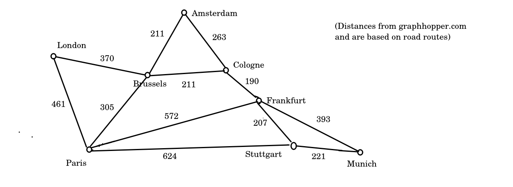
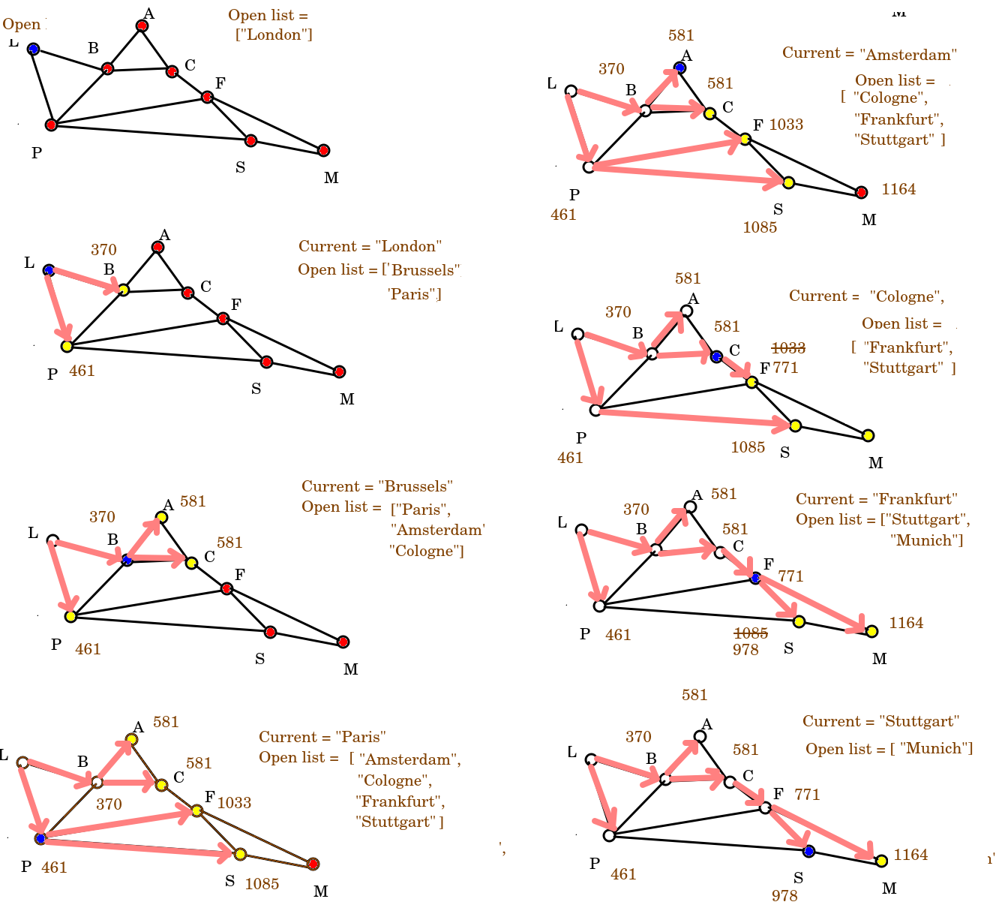

Topic 11: Graphs and Path-Finding
=================================

Introduction
------------

A common problem in computing is how to find the _shortest path_ from one point to another. This is particularly useful in _route finding_; for example, imagine we wanted to find the shortest or fastest route to the south of France by road, or the fastest walking route from the railway station to a cafe. There would be many possible routes we could take, so we need to find an efficient algorithm to calculate the "best" - usually quickest or shortest - route. We could use some other metric to measure the "best" route, for example if cycling you might want to avoid hills and busy roads, or if walking in the countryside you might want to avoid roads and experience nice views.

Another application of path-finding would be in a game, where we want monsters to intelligently calculate a route to the hero. A good example would be Pacman. If we just compared the `x` and `y` coordinates of the Pacman and the ghosts, the ghosts would get stuck behind walls. We need an intelligent algorithm to allow the ghosts to find their way around the walls and continue to chase the Pacman.

Graphs
------

When performing path-finding, we need to represent the network of possible routes as a specialised data structure. This data structure is called a _graph_. A graph consists of _nodes_ (also called _vertices_), representing individual points (e.g. points of interest, or road junctions) and _edges_, representing the connections between nodes. Edges would typically be annotated with the distance, so that we can take this into account when routing. They might also be annotated with other properties, for example is the route accessible to different modes of transport, such as foot, bike, car or horse?

What data would nodes and edges contain?

_Nodes_ would typically contain arbitrary data of some kind, such as the name of a place. They would also have a list of all _edges_ leading from this node.

_Edges_ link two nodes. They would typically contain `startNode` and `endNode` attributes representing the start and end node of a given edge. They would also typically have a numerical _weight_ and a series of _properties_ describing the edge, such as the name and class of the road that the edge represents. The weight is often the distance, but might factor in other metrics such as those mentioned above.

Here is a diagram of an example graph, showing the inter-city rail network between certain cities in Western Europe (note, this is approximate and not to scale).

You'll note that the graph is not supposed to be an accurate map, but a representation of key points (nodes; cities here) and the connections between them (edges). You can see a potential routing problem here. How would we route from London to Munich? We could either go via Brussels, Cologne and Frankfurt (3 intermediate stops), or via Paris and Stuttgart (2 intermediate stops) - plus potentially other, longer routes - but which would be the faster or the shorter?

Note how the edges are annotated with the distance (in km) between each node, but we need an efficient way of considering all possibilities and finding the shortest route. Algorithms include:

*   Dijkstra's algorithm
*   A\*

Dijkstra's algorithm
--------------------

Dijkstra's algorithm is one of the simplest route-finding algorithms. It starts at a given node and then adds all the surrounding nodes to a queue using breadth-first search. Each node is then given a distance. The distance is the distance of the parent (previous) node plus the distance of the edge leading to the node.

With Dijkstra's algorithm we start at the starting node and gradually explore adjacent nodes. With each node, we pick its neighbour nodes and add them to a data structure known as the _open list_. The open list is the set of nodes still to be considered. We work through the open list in _distance order_, so when selecting the next node to consider, we pick the one with the shortest distance from the origin. As soon as we have considered a node from the open list, we remove it, so it's not considered again.

The open list is typically implemented as a specialised data structure known as a _priority queue_. A priority queue is an enhanced version of a regular queue; it's a queue which can have a custom ordering, typically a numerical ordering. So in Dijkstra's algorithm we could order the nodes by distance from the starting node.

This is best illustrated by working through an example. Imagine we want to calculate the shortest route from London to Munich, using the graph shown above. We would follow steps shown on the diagram below.

To explain in words, we'd start at the London node and add London's neighbours - Brussels and Paris - to the open list, in distance order (so Brussels first and then Paris, as Brussels is nearer).

When we add a neighbour node, we store its total distance from the origin within the node. So the node for Brussels stores the value 370 km and the node for Paris, 461 km.

Having considered a node, it is then removed from the open list (so as soon as we add the neighbours of London to the open list, we remove London from it). Note how this is a breadth-first technique; you should recognise the approach from the trees topic.

So we then move on to Brussels as it's the closest-to-London member of the open list (370km), and add _its_ neighbours - Amsterdam and Cologne, which as it happens are exactly the same distance from Brussels. Note that Brussels also has Paris as a neighbour. However, because the distance of London to Paris via Brussels is longer than directly, we do nothing. At this point we remove Brussels from the open list.

Next we consider Paris (461km from London). Paris has Brussels as a neighbour, but Brussels has now been removed from the open list so we ignore it. So we add the two other neighbours of Paris: Frankfurt and Stuttgart, in that order (as Frankfurt is nearer Paris than Stuttgart is) and remove Paris from the open list.

We could then choose from either Amsterdam or Cologne, as both are 581km from London. Let's say we arbitrarily pick Amsterdam, perhaps because it's first in the alphabet. Nothing changes at this step as Brussels is not on the open list, and the route to Cologne via Amsterdam is longer than the direct route. So Amsterdam is removed.

We move onto Cologne. This is where it gets a bit interesting. Two of Cologne's neighbours - Amsterdam and Brussels - have already been considered and removed from the open list. The other, Frankfurt, has a distance (1033km) found from an earlier routing via Paris. However, the distance from London to Frankfurt via Brussels and Cologne is substantially shorter - 771km - so the old Frankfurt distance is replaced by the new. So hopefully you can see that even though there are more intermediate nodes via Brussels and Cologne, the actual distance is shorter. Having done this, we remove Cologne from the open list.

Next is Frankfurt (771km from London). Again some neighbours (Paris and Cologne) have been considered already. However, another - our destination, Munich - is not yet on the open list so we add it. The final neighbour - Stuttgart - is on the open list, but once again, we update its distance from London as the route via Brussels, Cologne and Frankfurt is shorter (978km) than via Paris (1085km). We then remove Frankfurt from the open list.

Then we consider Stuttgart (978km). The only neigbbour still on the open list is Munich, but neither route via Stuttgart is shorter than the route we have already calculated the distance of via Brussels, Cologne and Frankfurt, so we do not alter its distance.

Finally, we are at Munich, and have worked out the shortest route - i.e. the route via Brussels, Cologne and Frankfurt, at 1164km.

If there were more nodes in the graph, we would need to explore them too - just in case we find a shorter route.

How, though, do we get an actual route? We have to now start at the destination (i.e Munich) and work backwards to London, adding each node in turn to the _front_ of a data structure. A _deque_ (double-ended queue) is good for this, as you can add to both the front and the back of a deque. So starting at Munich, the contents of the deque will be, at each step:

    ["Munich"]
    ["Frankfurt", "Munich"]
    ["Cologne", "Frankfurt", "Munich"]
    ["Brussels", "Cologne", "Frankfurt", "Munich"]
    ["London", "Brussels", "Cologne", "Frankfurt", "Munich"]
    

To allow this "walking backwards" along the route to occur, each node will need a `parent` attribute representing its parent node in a Dijkstra routing. So, for example, the parent of Munich will be Frankfurt. The parent of Frankfurt will be Cologne. The parent of Cologne will be Brussels, and the parent of Brussels will be London.

We set the parent attribute when adding nodes to the open list. Each node that we add to the open list has the parent set to the current node, so that, for example, when we add Brussels and Paris to the open list, we set their parent to be the current node, which will be London. Furthermore, when we update a node's distance because we have found a shorter route (e.g. updating Frankfurt's distance due to finding a shorter route via Brussels and Cologne than via Paris) we also change the parent, so that in this example, the parent of Frankfurt will be changed from Paris to Cologne.

This variant of Dijkstra simply calculated the path from one origin to one destination. Dijkstra's efficiency can be improved if you want to calculate the route multiple times from a given origin node to another node, by pre-calculating the shortest path from a given node to every other node and, while doing so, permanently storing each node's shortest distance from the origin and parent so that these need not be recalculated each time

### Implementing a priority queue in Python

You can easily implenent a priority queue in Python using functions from the `heapq` module. Priority queues are implemented using a specific type of sorted tree known as a _heap_, hence the name. A heap is a tree "for which every parent node has a value less than or equal to any of its children" [Python docs](https://docs.python.org/3/library/heapq.html). Here is a simple example of creating a priority queue and then removing items from it. Note how we use `heappush()` to add to the queue and `heappop()` to remove from the front of it. See the documentation [here](https://docs.python.org/3/library/heapq.html)

    import heapq
    from heapq import heappush, heappop
    
    # Create an empty list. This will be converted to a heap.
    h = []
    
    # Add data
    heappush (h, 461)
    heappush (h, 370)
    heappush (h, 1164)
    heappush (h, 771)
    
    # Remove each item one by one from the priority queue until it's empty.
    while len(h) > 0:
        hp = heappop(h)
        print(hp)
    

Exercise
--------

Using the notes to help you, implement Dijkstra's algorithm to solve the problem in these notes (i.e. shortest train route from London to Munich). You will need to create `Node` and `Edge` classes to represent nodes and edges respectively, and a \`Graph' class to represent the graph.

Some hints:

*   your `Node` class should contain `dist` (containing the distance from the start), together with a `name`, a `parent` (set to `None`), and an `edges` list. **The distance should initally be a large number such as `sys.maxsize` (for which you need to `import sys`)** so that when updated, the new value will always be less than the old.
    
*   your `Node` class should also contain an `isInOpenList` boolean, to indicate whether the node is currently in the open list. It should be false initially, but set to true when added to the open list. This is to prevent duplicates of the same node being added to the open list.
*   `Node` should also havre an `removed` boolean, set to `False` originally. This will be set to `True` when the node is removed from the front of the open list, to indicate it does not need to be considered again.
*   your `Edge` class should contain `start` (the start node), `end` (the end node) and `dist` (the edge distance) and an appropriate initialiser method to initialise these three attributes.
    
*   `Graph` should contain a list of nodes and an `addNode()` method to add a node.
*   your `Graph` class should also contain an `addEdge()` method. This should take as parameters `start`, `end` and `dist`, representing the start node, end node and distance. It should then call the `addEdge()` method of `Node` twice:
    *   first create an Edge going from the `start` to `end` and add it to the `start` node's edges.
    *   then create an Edge going from the `end` to `start` and add it to the `end` node's edges. This way you have a two-way connection between nodes which will be more efficient,
*   your `Graph` should also have a `dijkstra()` method. This should take the `start` and `end` nodes as parameters and implement the algorithm:
    
    *   You'll need a `curNode` variable representing the current node, and a priority queue, `openList`, containing the nodes to still be processed.
    *   Set the distance on the start node to 0.
    *   Loop until there are no more nodes to be processed in the open list.
    *   Select the new current node using `heappop()`. When doing this you should also set the `removed` boolean to `True` on the node, to indicate that it's been considered and does not need to be considered again.
    *   Consider the neighbours by looping through the edges of a node. If the neighbour's `removed` is `False` consider it. Update the distance of the neighbour if you've found a shorter route to it (i.e the distance of the current node plus the distance of the edge is lower than the current distance of the neighbour). Also, if the neighbour is not currently in the open list, add it.
    
    Use a `deque` to loop back from the end node to start once you've found the route, e.g:
    
        route = collections.deque([])
        while curNode is not None:
            route.appendleft(curNode.name) # add to front of deque
            curNode = curNode.parent
        return route
        
    
    If the end node has no parent, what can you conclude?
    
    *   You will get a problem with the priority queue because, when comparing values, the queue will not know how to compare `Node`s. You can compare nodes by distance by _overloading the < operator for Nodes_. Here is how to do this. Add a `__lt__()` magic method to your `Node` class which compares `Node`s by name:
        
               def __lt__(self, other):
                    return self.dist < other.dist
            
        
    *   Using the graph of European cities above, test it out and see if it works.
    *   Try doing a separate path finding between two different cities, does it work? How can you fix the issue?
