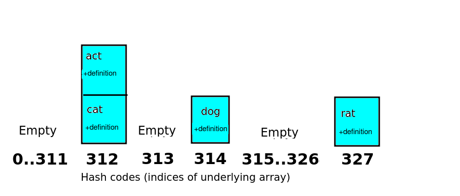
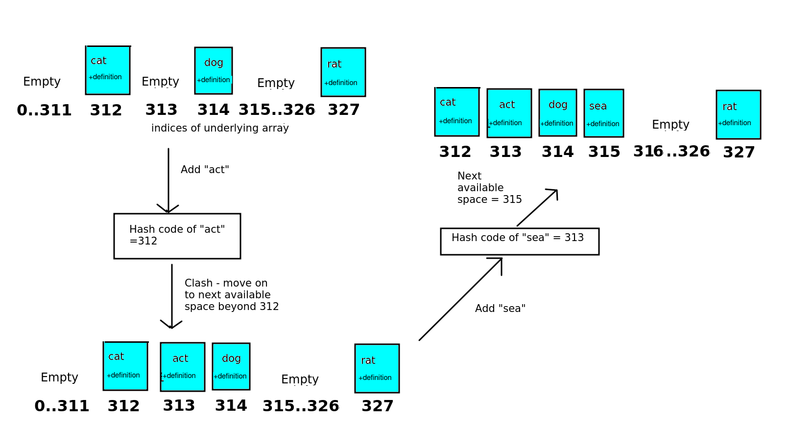

Topic 6 - Hash tables
=====================

What is a hash table?
---------------------

A hash table allows us to look up values efficiently using non-numerical indices or keys. For example, we might want to implement a dictionary in which the words are the keys and the descriptions, the values. Or we might want to implement an address book in which the names arr the keys and the addresses, the values. Another example would be a student records system in which the student ID is the key and the full student record is the value.

We could implement this simply by creating objects containing the key and the value, and then create an array containing many of these objects. However, this is _inefficient_. To search for an item by key, we'd have to use a loop (e.g. `while` or `for`) to search the array and compare the key of each item with the key we're searching for. If there are say 10000 items in the array this would be slow as we'd have to potentially look through 10000 items.

We can do better than this, though, and implement this sort of look-up search more efficiently using a _hash table_. A hash table is an efficient data structure in which the keys (indices) are converted to a numerical _hash code_ using a mathematical function of some kind. This hash code is then used to look up the item in an underlying array. The hash code will be used as the array's index.

An example
----------

It's probably best to start with a very simple example. A simple hash function might simply add the ASCII codes of the characters making up the key (use the `ord()`) function. We might use it in a dictionary program storing words as the keys and their meanings as the values.

*   e.g for the key "cat" - summing the ASCII codes gives 99+97+116 = 312
*   For the key "dog" - we get 100 + 111 + 103 = 314
*   For the key "rat" - we get 114 + 97 + 116 = 327

The hash code returned from the hash function can then be used as the array index to add the data to. So, we'd place the key/value pair "cat" and "Furry animal which goes meow" at index 312 in the underlying array. Similarly, we'd place the "dog" entry at index 314 and "rat" at index 327.

### Clashes

If, however, we try to add an entry containing the key "act" we have a problem. The hash function for "act" would be 97+99+116 which equals 312. 312 has already been used for "cat". Thus we have a _clash_. There are two common solutions to clashes, _separate chaining_ and _linear probing_.

### Separate chaining

With separate chaining, the underlying array is an array of "buckets". Each item with a given hash code is placed into the bucket for that hash code, so one bucket might have more than one item. In this example, "cat" and "act" would be placed in the same bucket, as they have the same hash code. Each bucket would contain a _list_ of items,

This is shown in the diagram below.

### Linear probing

Linear probing is an alternative approach. With linear probing, each array index contains only _one_ item, not a list. If there is a clash with hash codes, the item is moved on to _the next available place in the array_. So, in the above example, both "cat" and "act" would have a hash code of 312. As "act" is the second item to be added, it would be moved to the next available index after 312, which is 313. This is shown in the diagram below.

The diagram also shows a second clash and how it's resolved with linear probing. We try to add "sea". The hash code of "sea" is 313. However, _all indices between 312 and 314 inclusive have been used up by this point_, with "cat", "act" and "dog" respectively. So we have to move "sea" on _two places_ from its hash code, and add it to position 315 in the array.

Linear probing can lead to clusters if several keys have the same or similar hash code, which can be harder to search if we are looking up the entry using the key, because we have to move on several places along the array, which is inefficient in terms of time. However, separate chaining also has a time efficiency issue, as we have to search through a list if there are clashes. (Opinions differ on which is actually the most efficient)

### Better hash functions

The extremely simple hash function above, which simply adds the ASCII codes of the characters making up the string, leads to a high probability of clashes. So for this reason we must pick a hash function which ensures clashes have a low probability of occurring – these typically perform a more complex operation on the characters of the key.

When dealing with hash functions which produce a hash code for a string, a typical approach is to multiply a numeric code for each character in turn by a successive power of some factor **f** and sum the values together to arrive at the final hash code. To minimise clashes this should be a fairly large number; for example the Java language standard library uses 31. So, the first character's ASCII code is multiplied by **f^0** (1), the second character's code multiplied by **f^1**(f), the third character's code is multiplied by **f^2**(f squared) and so on.

So the equation for this, where **f** is the chosen factor, **s** is the string, and **n** is the length of the string, would be:

    s[0]*f^0 + s[1]*f^1 + ... + s[n-1]*(f^(n-1))
    

This is easy to implement with a loop, as we can just loop from 0 up to the length of the string and add all the values together to give the hash code.

(For what it's worth, the Java language does this in reverse, in other words uses f^(n-1) for the first character and f^0 (i.e. 1) for the last, but the same concept applies; [Oracle](https://docs.oracle.com/javase/7/docs/api/java/lang/String.html) )

If we run though this with "cat", and using the positions of the alphabet for the letters rather than ASCII codes, we end up with the following for "cat": (alphabet positions for 'c'=3; 'a'=1; 't'=20):

    3*(31^0) + 1*(31^1) + 20*(31^2) = 3 + 31 + 19220 = 19254 
    

For "act" we end up with:

    1*(31^0) + 3*(31^1) + 20*(31^2) = 1 + 93 + 19220 = 19314
    

You can see that the clash no longer happens automatically with keys which are anagrams.

Using this approach, while minimising clashes, will lead to large numbers as hash codes. Even if we assume that only lower-case letters are valid characters in the key (which means we can use the numbers 1-26 to represent the letters rather than the full ASCII range), a small word like "cat" has a large hash code of 19254.

For longer words, the hash code is going to be an even bigger number. This is clearly inefficient as, if we adopt the approach above without taking any further steps, our underlying array is going to need 19254 spaces ('buckets' as they are called in hash table terminology) to even be capable of storing a key like 'cat' !

So we then typically do a _modulo_ (remainder) operation. We decide how large our underlying array is likely to be (which will depend on our particular use-case, but should be larger than the likely number of items in the hash table) and take the modulo of that number. This will be a trade-off: over-large arrays will waste memory, but over-small arrays will lead to many clashes which means lookup will be slower as we will have to search through longer lists (assuming separate chaining) at each position or have to deal with more clusters (assuming linear probing). To minimise clashes, you should try and ensure your array is larger than the likely number of entries in your hash table. (Opinions differ on exactly how much larger, e.g. see [here](https://cs.stackexchange.com/questions/100074/determining-an-appropriate-number-of-buckets-for-a-hash-function) and [here](https://stackoverflow.com/questions/225621/how-many-hash-buckets), so it may be a case of experimentation to try and find a size which gives a tradeoff between memory efficiency and lookup time performance).

The chosen size should be prime (why this is, is explained below). So imagine we had a likely maximum size of 100 entries, we could find a prime number rather larger than 100, for instance 127. (For performance reasons to do with the ability to do bit-shifting operations, powers of two minus one are often recommended, and 128 is a power of two). So in the above case, the array index (or bucket number) for 'cat' would be:

    19254 % 127 = 77
    

so, 'cat' would be added to bucket 77 (where buckets are numbered from 0-126, i.e. 127 buckets - the underlying array has a capacity of 127).

#### Why use a prime array size?

This is discussed [here](https://cs.stackexchange.com/questions/11029/why-is-it-best-to-use-a-prime-number-as-a-mod-in-a-hashing-function/64191#64191). If our hash codes are truly random, there is no reason to use a prime bucket size. However, in certain cases, we might want to store data which is numerically related in some way. For example, as discussed in the link above, memory addresses are often multiples of 4, due to the way data is stored in memory. So if we want to calculate a hash code for a variable based on its memory address, all our hash codes will end up being multiples of 4. So using a multiple of 4 for the array size (number of buckets) will be a poor choice as clashes are very likely. All the buckets which are multiples of 4 will fill up, while all the other buckets will remain empty. This can be generalised: if the hash codes end up being multiples of some number _n_, then choosing a hash code which is also _n_ or a multiple of _n_ will end up with more clashes than expected by chance. So a prime number, (particularly a larger, 'obscure' prime number), where an enhanced likelihood of clashes will only occur if the hash codes are all multiples of that prime number, should be chosen. Even if your hash codes will not be related in any way, it's good practice to get into.

Implementation details
----------------------

Having looked at the basic workings of a hash table, how would we actually implement it? A `Hashtable` class would have two key methods:

*   `put(key, value)`, which adds a key/value pair to the hash table.
*   `get(key)`, which looks up an item in the hash table using its key. It should return the corresponding value.

We'll consider implementation using separate chaining, as it is the easiest to implement of the two methods. We'll look at the `put()` operation first, and then the `get()` operation.

`put()` is quite easy. (The first thing we have to do is convert the key to a hash code using a hash function. We'd then need to add the key and value to the appropriate 'bucket' in the array, using the hash code as its index. Each 'bucket' holds a list (a **linked list** is generally recommended as it's efficient to add to the end of the linked list), so you need to append the key and value to this listThe most efficient way of doing this in Python is with a tuple, so we'd create a tuple containing the key and value, and add this tuple to the linked list).

**Question: why do you need to add the key and value to the list, and not just the value?**

\-`get()` is also fairly straightforward. (Again, we have to convert the key to the hash code, find the 'bucket' with the index corresponding to the hash code, and then search through the list within this bucket to find the entry corresponding to the key).

### Advanced: Secondary hash function

To minimise clusters in linear probing, we can use a secondary hash function to calculate the displacement, and increase that number of places in the array in the case of a clash.

For example, if the secondary hash function gives 7 for "act", we'd place "act" at 312+7 = 319, rather than 313. This is shown on the diagram below:

Secondary hash functions typically involve a modulo calculation for example:

    secondaryHash = sumOfAsciiCodes % N
    

where N is some prime number (the reason for favouring prime numbers in hash tables is discussed above). **The secondary hash function must be different to the primary hash, in other words two keys with the same primary hash value must have different secondary hash values. If they do not, the clustering problem will still occur.**

Exercise 1 - Paper
------------------

1.  Draw the 17-item hash table (array of 17 'buckets') that results from using the hash function:

    hashCode = (2i + 3) % 17
    

where `i` is the (numeric) key, to hash the keys 36, 88, 54, 28, 49, 21, 63, 7, 19, 2, 11, 41 and 34, assuming collisions are handled by separate chaining.

**Just calculate the hash code of each key using the equation above. This is a simpler case than the example on the notes, which involved string rather than numeric keys.**

2.  Repeat question 1, but assume that collisions are handled by linear probing.

Exercise 2 - Code
-----------------

(_Questions 1-9 are the most important question to finish. The later questions involving linear probing are more advanced and designed for those of you coping well with the module so far_).

1.  On GitHub, _fork_ this repository:
    
    https://github.com/nwcourses/com431-hashtables-starter
    
    This repository contains some starter code to implement a linked list, to be used for separate chaining in your hash table.
2.  Clone your fork (you can get the fork from VCS within PyCharm).
3.  Modify the linked list as directed by the comments:
    *   The `add()` method should now take _a key and a value_ (corresponding to the keys and values used by the hash table) and create a _tuple_ using them. A node should then be created using the _tuple_.
    *   Also change the `find()` method so that it assumes the `searchInput` is a _key_. Where the code compares the `searchTnput` with the current value (line 37 in the original code), modify it so that it compares the key against the _first_ member of the tuple stored in the node. Return the _second_ member of the tuple, i.e. the value.
4.  Implement a hash table class using separate chaining. The keys should be strings and the hash function should be simply the sum of the ASCII codes (this is a poor hash function, as we have seen, but it's to keep things simple to begin with). You can use `ord()` to calculate the ASCII code of a character. The hash function should be a method of the hash table class, taking the key as a parameter and returning the hash code.
5.  Use an underlying _list_ with size 127 (i.e. 127 buckets), take the modulo 127 of the hash code, and use the _linked list_ above to store the list of items in each bucket. Initialise the underlying list to be an list of 127 linked lists:
    
    self.buckets = \[LinkedList() for i in range(127)\]
    
    This expression is known as a _list comprehension_ and is a quick way of filling a list with values.
6.  Implement a `put()` method in your hash table class. This should take a key and a value as parameters, calculate the hash code of the key, then calculate the modulo 127 of the hash code to find the bucket to add the data to. Use the linked list's `add()` method to add the key and value to the linked list for that bucket as a tuple.
7.  Implement the `get()` method in your hash table class, to find an item by key. This should calculate the hash code of the key, find the bucket, and then use the linked list's `find()` method to find the appropriate entry.
8.  Test the hash table by `put`ting a few keys and values into it and then `get`ting them back. Try to choose at least two keys which will clash.
9.  Enhance your hash table by using the "powers-of-31" approach (described above) to calculate the hash code. You should still use modulo 127 to calculate which bucket to place the value into.
    
10.  Copy your answer to questions 1-9 into a new Pycharm project, and change it to use linear probing rather than separate chaining. Move forward one space if there is a clash.
     
11.  **Advanced:** Enhance your linear probing-based hash table to use a secondary hash function to calculate how many spaces to move on when searching for a free space. It should be:
     

    secondaryHash = hashCode % 17 
    

where `hashCode` is the primary hash, i.e. the hash code calculated from the "powers-of-31" approach above.
