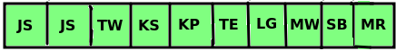
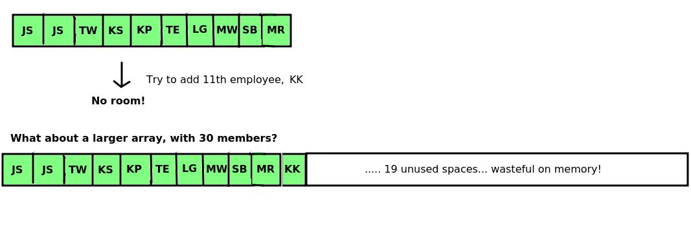
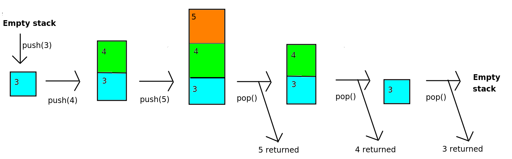

Week 1 - Basic Data Structures
==============================

This week we will be looking at some basic _data structures_, the array, the linked list and the stack, and looking at their relevance.

The importance of data structures
---------------------------------

We will start with a look at _data structures_. First of all, what is a data structure and why is it important? When it comes to programming, we frequently need to deal with _collections of data_, rather than a single item of data. For example, we might write a program to manage student records. This program would need to deal with not just one student, but _many_ students. Similarly, you might want to write a program for a live music venue, to allow the venue to store concerts and allow users to book tickets. Again, such a program would have to deal with _many_ concerts and _many_ users.

To store multiple items in a computer program, we need to choose an appropriate _data structure_. A data structure is a programming construct which allows us to store multiple items. When dealing with data structures, an important thing to consider is _which is the most appropriate data structure for the problem we are trying to solve_? Certain data structures are more suited to specific types of problem, and we will be looking at this through the module.

A basic data structure - the array
----------------------------------

Let's start with the most basic data structure of all, the _array_. An array is a data structure which can hold more than one item of data, and can be thought of as a series of "boxes" which can hold data. With an array, the key thing is that _each box is adjacent to its neighbours in memory_ which has some consequences in terms of efficiency which we will consider as we go on

The diagram below shows an example of an array which holds the names of five items of fruit.


The things to note here are:

- Arrays have _indices_. An _index_ is a number which represents the _position_ of an item in an array. In most programming languages, including Python, indices begin with _zero_. So the first item in the array has the index zero.
- The items in an array are stored _continuously in the computer's memory_ and _each item in the array uses the same amount of memory_. Here we assume that each item uses 64 bytes, so that the first item is stored at memory address 512, the second at memory address 576 and so on. This has some important consequences for performance of arrays versus other data structures, to be considered later.

Arrays do have some disadvantages. Their simplicity makes them easy to work with but this simplicity can lead to limitations.

```
John Stevenson
Jane Smith
Tim Wilson
Kate Stevenson
Kate Palmer
Tom Eastman
Laura Green
Mike Watson
Sally Black
Mark Ramsey
```

You are writing a program to store employees for a company. It's a small company, with only 10 employees, shown above.

@ex1

@answer(1)

- Kate Stevenson is the fourth member of the array, so would have index 3 (because indices start from zero). Mike Watson is the eighth member, so by the same logic, would have index 7.
- The memory address of the start of the array is 1600, and each item uses up 80 bytes. There are three members before Kate Stevenson, so these three members would use up 80\*3 = 240 bytes. Therefore, Kate Stevenson will be 240 bytes on from the start of the array, i.e. at memory address 1600+240 = **1840**.

@public

Advantages and disadvantages of arrays
--------------------------------------

### Advantage: Fast lookup

As we saw above, the advantage of using an array is that it is very fast to _index_ an array. This is because arrays are always _sequentially stored in memory_, so that in the example above, "apple", "orange", "pear", "grape" and "cherry" will be stored adjacent to each other in memory.

When indexing an array, the computer is able to work out where in memory the data is stored, **because each member of an array uses up the same number of bytes**. THe address is simply: 

```
Address = Start Address + Index * Size Of One Member
```

So imagine, for example, that each member of an array uses up 32 bytes, and the start of the array is at memory location 24576. It's an easy calculation to work out where the member with the index of 3 is located. If we substitute the values into the equation we get:

```
Address = 24576 + 3 * 32
```
    
which is `24576 + 96`, which is `24672`.

We ourselves do _not_ need to do this calculation. The _computer_ does it, when it encounters an array index. The CPU needs to work out where the data at that index is stored, so it uses the start address of the array, the size of one member, and the index, to work it out. This is just simple arithmetic. Therefore, **arrays are optimised for fast look-up of data using a numerical index**.

### Creating a simple program making use of an array

Here is a program which makes use of an array. We are creating an array called `people` to hold the names of members of a team.

    
```python
import numpy as np
fruits = np.array(['Apple', 'Orange', 'Cherry']) 
    
print("The first fruit is " + fruits[0])
print("The second fruit is " + fruits[1])
print("The third fruit is " + fruits[2])
```
    
    

Note a couple of things:

- To use an array we use the [NumPy](https://numpy.org) library, which provides a range of features for scientific computing. However our use of NumPy here will simply be to create an array.
- We define the array using the statement:
    
```
fruits = np.array(['Apple', 'Orange', 'Cherry'])
```
    
Note the square brackets surrounding the list of items to go in the array.

-   Note the code to print the members of the array:
    
```python
print("The first fruit is " + fruits\[0\])
print("The second fruit is " + fruits\[1\])
print("The third fruit is " + fruits\[2\])
```
    
This code shows the use an array _index_ to access each member of the array. The index is the number within the square brackets: 0 for the first member, 1 for the second and 2 for the third. Remember we discussed array indices above.

### Coding exercise 1.1

Write a program which creates an array with the 10 employees mentioned in Exercise 1. Display "Jane Smith" and "Mike Watson" by indexing the array appropriately.

### Disadvantage: not flexible, an array cannot be resized

Now, imagine you want to add two more entries to the array:

```python
employees[10] = "Kevin Kennedy"
employees[11] = "Lisa Lord"
```

Now run it. Do you get the result that you expected? See how this illustrates an issue with arrays: they have _fixed size_. If an array is initialised with a certain number of elements, you cannot add additional elements later and the only valid indices are those indices within the capacity of the array. Here, the array was initialised with 10 elements so only indices 0-9 are valid. Furthermore attempting to append to the end of the array via an `append` operation would not work either:

```python
employees.append("Kevin Kennedy")
```

#### Not enough space, or too much space!

Imagine we have a larger array storing company employees, as shown in the diagram below. (Just the initials of the employees are shown).



Let's say, though, the company takes on an 11th employee, "Ulysses Vernon" (UV). Do we have space in the array to fit this 11th employee? _No, we don't, because an array has fixed size!_

So **what happens if the company expands and takes on more employees**? What could we do?



- As shown in the diagram above, we could _make the array bigger than we are likely to ever need_, so we can add new employees. So we could create an array with 30 spaces, and add our 10 original employees to it. Then, there would be room for the 11th employee (and quite a few more, too). _Can you see the problem with this, though_? The _storage is inefficient_ as the array has many more spaces than we are likely to need and therefore it is _wasteful of memory_.

Using a List
------------

One solution is to use a more complex data structure, which can be extended with new data. In fact Python uses one such data structure, the _list_. A list is essentially a wrapper round an underlying array. With the list you can add new items of data to the end of the list using the `append` operation, and keep doing so until the computer runs out of memory.

Other languages have similar "extensible array" data structures, for instance C++ has the `vector` and Java has the `ArrayList`.

### Creating a simple program making use of a list

Here is a program which makes use of a list. We are creating a list called `people` to hold the names of members of a team. The list initially has space for three members, however we can later append to it, to expand the list.

    
```python
print("Please enter the three people in your team")
people = [None] * 3
people[0] = input("Please enter the first person:")
people[1] = input("Please enter the second person:")
people[2] = input("Please enter the third person:")
    
print("The first person is " + people[0])
print("The second person is " + people[1])
print("The third person is " + people[2])
    
fourth = input("Please enter the fourth person:")
fifth = input("Please enter the fourth person:")
people.append(fourth)
people.append(fifth)
print("The fourth person is " + people[3])
print("The fifth person is " + people[4])
```
    

Note a couple of things:

- We define the list using the statement:
    
```people = [None] * 3```
    
`*` is the _multiplication symbol_ in most programming languages. This will create a list with three blank members (i.e. `None` times 3; `None` basically means "nothing here yet").
- Note the code: `people[0]`. This is using an _index_ - remember we discussed indices above. Specifically this code is retrieving the member of the list with index zero.
- Note also how we can _append_ to the list: unlike an array, we can extend it after we created it so we are not restricted to the original size.

### Coding Exercise 1.2

Rewrite your exercise 1.1 code to use a list rather than an array. Try appending to it using _append()_. Does it work?

### How does a list work under the hood?

We have looked at how to use a list. However we are now going to look at what actually happens when a list is appended to, via an interactive exercise.

Lists contain an internal array. So what happens when we need to extend a list? We _create a new array with more space_ when the old one runs out of space. We need to:

- Create an array of the new, larger, size (large enough to hold all the new members we're trying to add);
- Copy all the existing members into the new array;
- Add the new members onto the end of the array.

This is shown below. This diagram shows a _simplified_ version of what happens when you append to a list. It is a repeat of the diagram showing array resizing, but also shows the _list_ (in green) as a wrapper round the array. It shows how the internal array has to be recreated and the old data copied across when you append to a list.


This however is _inefficient_ because a new internal array is created with additional space to hold the new elements, and then the old data is copied across from the old array to the new array. We have to loop through each element in the old array and copy it across to the new array, which is _slow_

(The Python list does however include some optimisations to improve the efficiency of append and insertion operations. For instance, more memory is allocated for the internal array than is needed, meaning that a new internal array need not be created if only a small number of items are added as there will be spare space at the end of the array to hold them. See [here](https://www.laurentluce.com/posts/python-list-implementation/) for details.)

The stack
---------

A stack data structure involves adding items from bottom to top, rather like a stack of plates. When we remove items from the stack, we remove from the top, again just like a stack of plates. The stack is known as a "last in first out" or "LIFO" data structure. It is called this, because the last things we add to the stack, are the first things we remove. Here is an example of a simple stack of numbers.



A stack can be used for any operation in which we need to navigate back to a previous state. Examples could include:

- Browser navigation. When we visit a website, we often need to navigate back to a previous site. When we click the 'Back' button, we want to return to the site _immediately preceding_ the one we are currently viewing. So when you click 'Back', the current site might be _removed from the stack_ so that you return to the previous site.
    
- Directory/folder structure. When navigating the folder system of your computer, you typically start at a 'root' folder (for example `C:\` on Windows, or your home directory on Linux) and then navigate to subfolders, for example `C:\Pictures`. You then might navigate to a sub-sub-folder, such as `C:\Pictures\Holiday` and then `C:\Pictures\Holiday\2018` and so on. In a subfolder you can navigate upwards to the previous folder, so that if you are in `C:\Pictures\Holiday` and you navigate upwards, you arrive at `C:\Pictures` and then `C:\` if you navigate upwards once more. So the process of navigating upwards _removes the current folder from the stack_ and returns to the previous folder.
    
- "Undo" commands in desktop applications. Each action you take in a desktop application might be stored on a stack, so that if you select "Undo", the topmost operation would be reversed, and then removed from the stack.
    

(In actual fact, each of these is now implemented in a slightly more complex way, in the sense that you can, in modern browsers, move both back and forwards along your history, but we are assuming a more simplified implementation in which you can only move back for the purposes of illustrating a stack).

Another use of stacks, which you will appreciate more when you have done more programming, is:

- Storing function calls in a program.

The two key operations of a stack, adding and removing items, have special terms.

- **Push**. To _push_ an item onto a stack means to add it to the top. It is possible the stack may only have a certain capacity, i.e. it can only hold a certain number of items (perhaps due to memory constraints) in which case an error occurs if the stack is full.
    
- **Pop**. To _pop_ an item off the stack means to remove it from the top. The item is removed, and we also obtain it as a result of the pop operation. If the stack is empty, an error is generated.
    

An additional operation is:

- **Peek**, To _peek_ a stack is to obtain the value of the top-most item of the stack _without_ removing it.

### Paper Exercise 1.3 : Stacks

We are now going to perform another paper-based exercise with stacks, to help you understand them and their operations.

Imagine you have an empty stack. Draw the stack after each operation below, and explain what, if anything is returned from each operation and any errors that might occur.

`push (a), push (b), pop (), push (c), peek (), pop (), pop (), pop (), push (d), push (e), push (f), pop (), push (g), push (h), peek (), push (i), pop (), pop (), pop (), peek ().`
