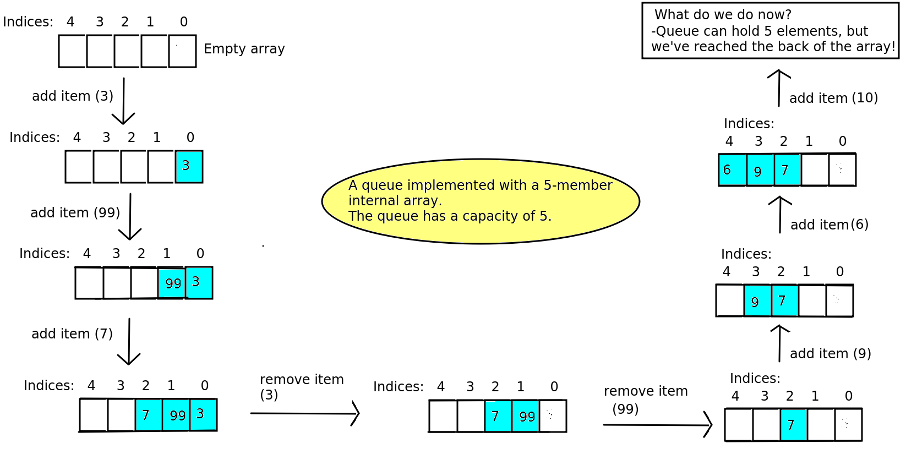
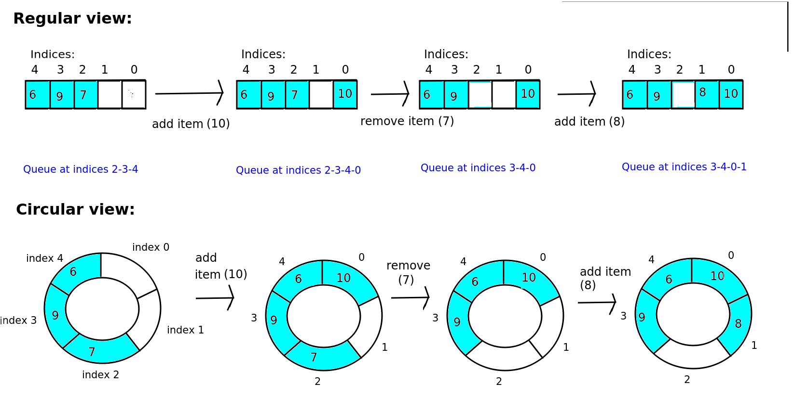

 COM431 - Queues 

Topic 5: Queues
===============

Introduction
------------

We have seen that a stack is a "last-in-first-out", or LIFO, data structure - in other words, the last item added (pushed) to the stack is the first item to be removed (popped). However, in certain circumstances it is more appropriate to use a "first-in-first-out", or FIFO, data structure. Luckily such a data structure exists, and that is the _queue_, so called because it behaves like a real-world queue. Items get added onto the back of the queue, and are removed from the front of the queue.

When would we use a queue? It would be used in any situation where we want to process tasks - or "jobs", in the order that they are submitted. There are many scenarios wheere we would like to do this. For example:

*   a printer queue. When we send something to be printed, the software on the printer would add it to the back of its queue. The printer "jobs" at the front of the queue would be processed first, and then the other "jobs" would move forward when the current "job" has finished printing.
    
*   websites which need to do pre-processing of data that users have submitted. An example here would be a website which allows users to share photos. Submitted photos would need to be checked, to make sure they are suitable, and perhaps altered. For example, faces and car license plates should be blurred for privacy reasons and to comply with the GDPR, and offensive material should be removed. Many users may be submitting photos all the time. Multiple photos cannot be checked in parallel at the same time, as the techniques used to detect objects in photos use a lot of memory - so the machine would quickly run out of memory and the website would stop functioning. Therefore, a queue is a better and more memory-efficient solution, as it allows processing of one photo at a time in the order the photos were submitted. In other words, when a new photo is submitted, it's added to the back of the queue, and the pre-processing software checks each photo in the queue in turn, starting with the first.
    

Implementing a queue
--------------------

How might we implement a queue? Let's start by going back to how we implemented a stack, using an underlying array. Can we do the same with a queue? The diagram below demonstrates this.

Note how the queue is implemented in this example using an internal array with a capacity of 5. When we add an item, the item is added to the first avaiable position in the internal array. So if the queue is empty, the item is added to position 0 of the array. (**Note how I have reversed the array so that index 0 is on the right and index 4 on the left. This is so that the diagram better reflects a real-world queue, with new items added to the back**).

So the first item - 3 - is added to the internal array at index 0. We then add another item - 99 - which is added to the back of the queue, in other words added to the internal array at index 1. Similarly, the next item - 7 - is added to the internal array at index 2.

As a consequence of this, we will **need a variable to represent the index in the internal array of the back of the queue**, so we know where to add elements. This variable will be 0 when the queue is empty, 1 after we have added 3, and 2 after we have added 99. In other words it is the index **one position beyond the back of the queue**. Can you see **why** it's better to point to the position beyond the back of the queue, rather than the back of the queue itself?

What happens, though, when we _remove_ an item? This happens next - we remove the front item on the queue (3). This results in _position 0 of the internal array becoming empty_ so that the remaining queue - 99 and 7 - starts at _index 1 of the array_ and not index 0. This illustrates a key point. **Because of the first-in-first-out nature of a queue, the queue is not always stored beginning at index 0 in the internal array.** The queue can "shift" down the array, as has happened here; when we remove 3, the remaining items - 99 and 7 - are at indices _1 and 2_ of the array. This is done because it is more efficient. If we wanted to ensure the queue always started at index 0 in the internal array, we'd have to do some wasteful additional processing to move 99 to index 0 in the internal array and move 7 to index 1. By letting the queue "shift" down the array in the manner shown in the diagram, we avoid the need for this additional processing.

The consequence of this in terms of implementation, though, is that **we will need another variable to represent the index in the internal array where the queue starts**, so that we can remove the correct item from the queue. (This is originally 0, but when we remove 3 from the queue it will change to 1.).

We then remove 99 from the queue, and consequently the queue shifts back one more place so that the start of the queue is at index 2. At this point, the queue will only store one item - 7 - so the start and the end of the queue both have index 2 in the internal array.

We then start adding items again. First we add 9, so that the queue occupies indices 2 and 3 of the internal array. Then we add 6, so that the queue occupies indices 2, 3, and 4.

What happens now, though, if we want to add a new item? We'd like to add a new member - 10 - which we should be able to do as our queue has a capacity of 5. However we have a problem because _we've reached the end of the internal array_. So we need to do something else.

The diagram below shows a common approach, which is to implement a **circular array**. When we reach the back of the array, we start adding items to the _front_ again. So if our queue occupies indices 2, 3 and 4, and we wish to add a fourth item, this will be added at _index 0_ of the array. So the queue will now occupy indices 2,3,4 and 0 - in that order. If you try to visualise the array as having a circular rather than linear structure, this is probably easier to understand. This is also shown on the diagram.

This shows how we add the fourth item (10) to index 0 as explained above, so that the queue occupies the array indices 2, 3, 4 and 0 in that order. Then we remove the front item of the queue, which is now 7, at index 2. _Make sure you don't get confused here into thinking that the item at index 0, i.e. 10, is at the front of the queue! It is not - the queue wraps around. The front of the queue is at index 2, then the next member is at index 3, then the next at index 4, and the BACK of the queue is at index 0_!

After removing 7, the front item of the queue is now 9, at index 3 in the array, so the queue occupies indices 3, 4, and 0 - with index 0 still at the back. So if we add yet another item - 8 - to the queue, it will be added at the next available space at the back of the queue, which is _index 1_ in the array, due to the wrap-around effect.

The top of this diagram shows the queue in a regular, linear view whereas the bottom of the diagram shows the same operations using a _circular_ view of the array, in which the array is represented as a circle from indices 0 to 4 and then back to 0. Note that this is just a _diagrammatic representation_ to make the concept of a circular, wrap-around array easier to understand. _The array is not actually stored in a circular way in memory!!!_

This question gets you to think about the reasons behind one of the implementation details for a queue. You will notice in the diagram above that when we remove the value "3" from the front of the queue, we **set index 0 to None and keep 99 and 7 in their original positions in the internal array**. An alternative approach could be **to move 99 and 7 forward within the internal array so that they occupy positions 0 and 1**. This alternative approach would mean that we would not need to implement the circular aspect of the queue.

The reason for this is _efficiency_. Think about what you would have to do if you shifted the values 99 and 7 forward from positions 1 and 2 to positions 0 and 1. You'd have to implement a _loop_ to move each member of the queue forward one position. This loop would have to run as many times as there are items in the queue, which is rather _inefficient_. By contrast, implementing the circular aspect does not require a loop. It merely requires an `if` statement to check whether we have reached the end of the internal array, and to reset the next available space to 0 if so.

### Paper Exercise 5.1

Exercise 1 is a "paper" exercise to help you understand the operations of a queue. Code is not needed for this. However please complete it electronically (e.g. on a text editor, Word, or Microsoft Paint) as it will be easier for me to check.

Start with an empty circular queue, represented internally by an array with capacity 8, and perform the following operations on it. After each operation, draw how the queue is represented by showing the internal array and the queue within it.

Note that `size()` should give the _size of the queue itself_, not the capacity of the underlying array.

    add (a), add (b), remove (), add (c), remove (), remove (), 
    add (d), add (e), add (f), remove (), add (g), add (h), 
    remove (), remove (), remove (), add (i), remove (), size().
    

This exercise gets you to think about how you will design the queue class before you code it. This week you will use a NumPy array to represent the internal array of the queue, to prevent you using shortcuts available with lists!

As well as the actual internal array, we'd need these attributes:

*   `front`, representing the index of the front of the queue. We need to know this so that we know where to remove the front item from.
*   `back`, representing the _next available free space_ at the back of the queue. We kneed to know this so that we know where to add the nex titem to.
*   and the `numberOfItems` currently in the queue too, so we can detect when the queue is full.

### Coding Exercise 5.2

*   Try creating a `Queue` class to represent a queue. Like your `Stack` class this should contain an internal array (use a NumPy array: see [Topic 1](/?module=DSA&topic=1) - _not_ a list!). Initialise it initally to five `None`s. As we discussed above in Exercise 2, _we also need other attributes_ (see the discussion for what they are) - make sure you include these.
*   On PyCharm you will need to install NumPy with `pip`. Go to the console and enter:
    
    pip install numpy
    
*   You can use `len()` to get the length of a NumPy array. You need this to get the capacity of the internal array.
*   Your `Queue` class should have two methods, `add()`, which should add an item onto the queue, and `remove()`, which should remove - and return - an item from the queue.
*   Also give your class a `__str__()` method, so that you can easily print your queue to see what its internal state is. This should return the result of the `__str__()` method of the internal array (so you can see what is stored in the array) and _also_ the values of the other attributes we talked about in Exercise 2, above.
*   Enhance your queue so that the capacity of the internal array can be passed in as a parameter in the `__init__()` method. You can use the `*` operator with a one-member list and a length to create a list with that number of spaces all containing that value, and then pass that to your NumPy array. For example, this will create a NumPy array of length 10 filled with `None`s:
    
    arr = numpy.array(\[None\] \* 10)
