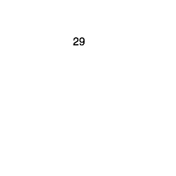
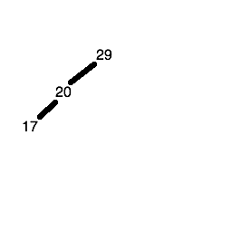
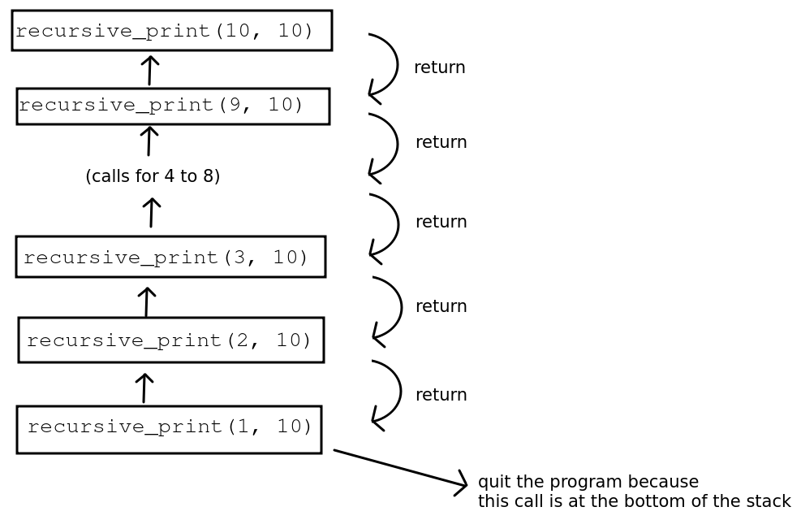
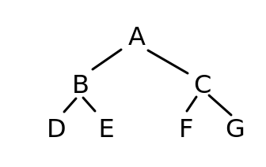

Topic 9  .draft { background-color: red; color:white}

Topic 9 - Binary Trees
======================

Trees
-----

A _tree_ is a commonly-used data structure to represent data in a hierarchical manner. An example of a tree is shown below:  

As can be seen, a tree structure resembles a real tree, but is upturned. It consists of a series of _nodes_, and each node can have one or more _descendants_. We can easily perform an operation on each node of the tree by starting at the root node, then looping through each immediate descendant in turn. Within a descendant, we loop through _its_ descendants, and so on.

### What are trees used for?

Trees have a variety of uses in computing, including:

*   Representing directory (folder) structures. The top-level directory is the root of the tree, and its sub-directories its descendants.
*   Representing hierarchical documents, such as HTML, the language of web pages. In HTML pages, the page contains a body (the content), the body can contain sections, and sections can contain paragraphs and images. Thus the body can be seen as the root node, a section would be the descendant of the body, and a paragraph or image, a descendant of a section.
*   Providing a way of sorting and searching for data efficiently - we will see this during this week and subsequent weeks in the algorithms section of the module.
*   _Scene graphs_ in graphical applications such as games. A scene graph is a way of organising 3D components of a graphical application so that 3D objects can have child, or descendant objects - and that any transformations applied to the parent object will be applied to all its descendants. For example a horse object might have a rider object. The rider would be a descendant of the horse. When the horse moves or turns, we want the rider to move or turn with it.

Binary Trees
------------

A _binary tree_ is a form of tree in which each node has two child nodes, a "left node" and a "right node".

This structure can be used to sort data. If you have an array of sortable data, such as numbers or words, you place the first member of the array inside the _root node_ (the top node of the tree). With each subsequent item of data, you place the item in the left node if the data item is less than the item in the root node, and in the right node if the data item is greater than the item in the root node. If the appropriate child node is already filled with data, we _descend the tree_ by moving down to that child node, and then comparing the new value to the value in the child node and then placing it in either the left or the right child node of _that_ node.

This is probably best illustrated by example. Imagine you want to sort the numbers 29, 20, 17, 40, 25, 18, 1. How might you do that with a binary tree?

You put the first number (i.e. 29) in the root node of the tree:

The next number (20) is less than 29, so it gets placed in the left child node of the tree:

The third number (17) is less than 29 and less than 20, so first we descend the left node of the root node (containing 29) and reach the node containing 20. 17 is less than 20 as well, so it gets placed in the left child node of the node containing 20.

The fourth number (40) is greater than 29, so it gets placed in the right child node of the root node.

The fifth number (25) is less than 29 but greater than 20, so first we descend the left node of the node containing 29, to reach the node containing 20. Since 25 is greater than 20, we place it in the right child node of the node containing 20.

The sixth number (18) is less than 29, so we descend the left node of the root node to get to the node containing the number 20. 18 is less than 20 so we descend the left node again, to reach the node containing the number 17. 18 is greater than 17, so 18 is placed in the right child node of the node containing the number 17.

The seventh number (1) is less than 29, so we descend the left node of the root node to get to the node containing the number 20. 1 is less than 20 so we descend the left node again, to reach the node containing the number 17. 1 is less than 17, so 1 is placed in the left child node of the node containing the number 17.

### Exercise 1

On paper, create a binary tree containing these numbers in order:

 389 843 9 8934 1 83 23 1124 532

### How do we retrieve the sorted data?

Once we have placed the data in the tree, how do we actually retrieve it to display it (or operate it in some other way) in order?

1.  Start at the root node.
2.  Descend to the left child node.
3.  If it has child nodes of its own:
    *   first descend its _left child node_ and print out the value within;
    *   print out the value within _this_ node;
    *   then descend its _right child node_ and print out the value within.
4.  If it does not have child nodes of its own, simply display the value within.
5.  Repeat the process with the right child node of the root.

What do we do if the left child node's own left child node also has child nodes? We simply repeat the process and keep going until we finally hit a node with no child nodes of its own.

Again this is probably best illustrated by example. Taking the tree produced above:

*   The 29 node has two child nodes, 20 and 40, so we descend to 20 first.
*   The 20 node has two child nodes, 17 and 25, so we descend to 17 first.
*   The 17 node has two child nodes, 1 and 18, so we descend to 1 first.
*   1 has no child nodes, so we just _print out 1_ and ascend to its parent (the node containing 17)
*   Having dealt with the left child of the node containing 17, we print out _the value itself (17)_ first, then descend to the right node (18)
*   The 18 node has no child nodes, so we just _print out 18_
*   We then ascend back to the 17 node. The 18 node was the right node of the 17 node, so we are done processing this branch of the tree. So we go back up again to the 20 node.
*   We have dealt with the left branch of the 20 node, but not the right. This means we first _print out the value, 20_ and then descend the right node.
*   The right node of 20 contains a value, 25, but no child nodes of its own so we just _print out the value (25)_
*   We then ascend back to the parent, 20, as we are done with this branch.
*   We have also covered all branches of 20, so we ascend back up to the root node, 29.
*   We have dealt with the left branch of the 29 node, but not the right. This means we first _print out the value, 29_ and then descend the right node.
*   The right node of 29 contains a value, 40, but no child nodes of its own so we just _print out the value (40)_
*   We then ascend back to the parent, 29, as we are done with this branch.
*   We have now covered the left branch, the value, and the right branch of the root node. This means we are done with the tree. If you track back the order in which the values were printed, you'll find they are in order:
    
    1 17 18 20 25 29 40
    

### Recursion

To implement a tree effectively we have to use a programming technique called _recursion_. The idea of recursion is that a function calls itself repeatedly until some condition is met.

When functions are called, each function call gets placed on the _call stack_ - a _stack_ of all function calls made by your program. So if a function calls itself, the call stack contains multiple copies of the same function, one on top of each other.

Then we stop recursing and descend the call stack. To illustrate the concept here is some code to print out the numbers 1 to 10 using recursion. It is annotated with explanatory messages to show how the recursion is operating, and uses the `inspect` module to actually display the current call stack.

from colorama import init, Fore
import inspect

def recursive\_print(num, limit):
    # This gets the current function call stack
    call\_stack = \[frameInfo.function for frameInfo in inspect.stack()\]

    print(f"{Fore.CYAN} Call stack:\\n {call\_stack}")
    print(num)

    if num < limit:
        print(f"{Fore.GREEN}    num has not reached {limit}, so calling recursive\_print again with argument of {num+1}")
        print(f"{Fore.YELLOW} Press enter to call function again recursively...")
        input()
        recursive\_print(num+1, limit)
        print(f"{Fore.CYAN} Back in recursive\_print() with parameter {num}. Call stack:\\n {call\_stack}")
    else:
        print(f"{Fore.RED}    Number {num} has reached limit {limit}, so not calling recursive function again...")

    print(f"{Fore.YELLOW}Press enter to return from recursive\_print call which had a parameter of {num}")
    input()

init(autoreset=True) # initialise Colorama
recursive\_print (1, 10)

What happens when we run this?

*   We call the `recursive_print` function with the arguments 1 (representing the current value) and 10 (the maximum value).
*   The function prints the current value (1) and then compares the current value (1) to the maximum value (10). Because the current value is less than the maximum, the if statement runs, which adds one to the value (so it becomes 2) and then calls the function again. A new copy of the function is placed on the call stack. This is the recursion.
*   This new copy then runs. 2 is still less than 10, so we print out the value 2, add one to the value (to give 3) and call the function a third time, placing a third copy of the function on the call stack.
*   Eventually the current value will become 10, on the tenth function call. At this point, we print out the value (10) but the if statement will no longer be true, because 10 is not _less than_ 10. So the call to `recursive_print()` with the _value_ parameter equal to 10 will return, after printing some information messages.
*   This then _pops the tenth copy of the function off the call stack_ and returns us to the previous call to `recursive_print()` with the _value_ parameter set to 9. Since there are no more statements in `recursive_print()` after the call to itself, this call also returns immediately, popping it from the stack.
*   We then return to the call to `recursive_print()` with the _value_ parameter set to 8, which also immediately returns and so we keep popping the copies of the function off the stack until we return to the original call, where _value_ was 1.
*   As the original call is at the bottom of the stack, we then return to the main program (outside the function) and our program exits, having printed 1 to 10 in order recursively.
*   Also note the use of the `colorama` package to improve the clarity of the output, as the main output (the numbers 1-10) are printed in white but the explanatory messages are printed in other colours. You can install `colorama` with:
    
    pip install colorama
    

Clearly recursion is an inefficient way of counting up to 10 (!), but in situations such as descending all branches of a tree, it's the best way of tackling the problem.

Here is a diagram showing this example of recursion, showing the call stack.

  
 

### Using recursion on a binary tree

So how would we use recursion on a binary tree?

*   Start at the root node and:
    *   Descend the left branch (see below);
    *   Print the value in the node.
    *   Descend the right branch (see below)
*   For each node we get to (for example the immediate child nodes of the root node), perform the first three steps again:
    *   Descend the left branch, if it exists
    *   Print the value in the node.
    *   Descend the right branch, if it exists
*   Hopefully you can see that the act of descending a branch is recursive, because when we descend a branch to reach a child node, we then may need to descend a branch again. Once we get to the bottom of a tree, we then ascend the tree again by returning from each successive function call.

### Example of tree recursion from the Python standard library

The `walk()` function from the `os` module allows you to "walk" a directory tree (note: not a binary tree) structure, starting at the root directory and recursively descending into subdirectories. For example:

import os

# walk the "src" directory and all its subdirectories
for directory in os.walk("src"):
    print(directory)

Each directory is represented as a three-member tuple, containing the directory name, a list of subdirectories, and list of files.

### Exercise 2: Creating a Binary Tree and using it to sort some data

1.  Create a TreeNode data structure to represent a single node in a tree:
    
    class TreeNode:
        def \_\_init\_\_(self, value):
            self.left = None
            self.value = value
            self.right = None
    
2.  Write a `recursiveInsert()` method in the `TreeNode` class. This should take a `value` as a parameter, and:
    *   See if the value is less than or greater than the current node's value;
    *   If the value is less than the current value, see if there is a left child node (i.e. test if `self.left` is `None`).
        *   If there isn't a left node, set `self.left` to a new `TreeNode` storing the value passed in.
        *   If there is a left child node, then we'll have to pass the value onto it so the left node can deal with it. Do this by recursively calling the `recursiveInsert()` method on the left node.
    *   The effect of this will be to search the tree to find a suitable node to insert the value.
    *   If the value is greater than the current value, do the same as above but with the right node.
3.  Implement a `recursivePrint()` method in `TreeNode`. This should :
    *   Recursively call `recursivePrint()` on the left node, if the left node exists (i.e. is not `None`)
    *   Print the value of the current node.
    *   Recursively call `recursivePrint()` on the right node, if the right node exists (i.e. is not `None`)
4.  Create a `BinaryTree` class, representing the tree as a whole, with one attribute, `root` (the root node of the tree). Set this to `None` in the `__init__()` method.
5.  Create two other methods of `BinaryTree`:
    *   `insert()`, which takes a value as a parameter and inserts a new node into the tree. This should set the `root` to a `TreeNode` containing this value if the `root` is `None`, otherwise it should call the `recursiveInsert()` method of the `root` node.
    *   `print()`. This should print the whole tree by calling the root's `recursivePrint()`, as long as the root is not `None`. This will print the whole tree, and nicely illustrates the power of recursion!

Tree Searching
--------------

We can efficiently search a _tree_ by virtue of its structure. There are two general techniques for searching a tree:

*   _Depth-first search_. This uses the recursive tree traversal technique we have examined already above, starting at the root node and then recursively descending into the child nodes. When the search term is found, we will return it. If the tree is not sorted, we need to keep track of which nodes have been visited and which have not, so we can explore the whole tree.
    
*   _Breadth-first search_. Rather than recursively descending the tree, we instead we consider each _level_ one at a time. So if we have a tree organised as below:
    

we would first consider node A (the first level), then nodes B and C (the second level), then nodes D, E, F and G (the third level).

### Binary search tree (depth-first)

This uses the technique we have seen already to search a tree for a given key (index), namely recursion. We recursively search each successive child node, starting at the root node, until we find the key we are looking for.

For the search to be efficient, we need the tree to be _sorted_. We have seen already how to add items to a tree in sorted order. The search technique can be considered a specific case of depth-first search in which the tree is sorted and thus we know whether to select the left or right child node, and can ignore the other. For general depth-first search, we cannot guarantee this, and we will need to "backtrack" along branches of the tree to ensure all nodes are visited. In fact depth-first search is a general technique that works on graphs - to be covered later - as well as trees. As we will see, graphs are usually not sorted in any way.

To search a sorted binary tree we need to:

*   Start at the root node and test that first. Return the value if the key matches.
*   If the root node key is less than the key we are searching for, descend to the right node, otherwise descend to the left node.
*   Repeat the process recursively until the key matches; when that happens, return the value.

Hopefully you can see that the complexity is of `O(log n)` form and it scales well to large values of `n`, the number of items stored in the tree.

*   If the tree has one level (a root only), we search one node.
*   If the tree has two levels (three members), we search two nodes.
*   If the tree has three levels (seven members), we search three nodes.
*   If the tree has four levels (15 members), we search four nodes.

The table below shows the relation between the number of nodes in a sorted and balanced binary tree, and the number of searches. (A _balanced_ tree is one in which the data is evenly added to the left and right sides of the tree. There are techniques for ensuring this, but we will not have time to cover these in this module; I will leave this up to you to research).

| Number of nodes | Number of searches |
| --- | --- |
| 1 | 1 |
| 3 | 2 |
| 7 | 3 |
| 15 | 4 |
| 31 | 5 |
| 63 | 6 |
| 127 | 7 |
| 255 | 8 |
| 511 | 9 |
| 1023 | 10 |

### Breadth-first search

This section covers breadth-first search in some detail. It is of note that breadth-first search does _not require recursion_.

Note the order again in which we consider our nodes: A (the root node) first, followed by B and C (the root's child nodes), followed by D, E, F, and G (the child nodes of B and C).

Our aim is to try and search for a value in the tree. How might we do this? We check A first, adding it to a collection of nodes to be considered.

    [A]
    

If A doesn't match, we move on to its child nodes - B and C - and remove A from the collection of nodes to be considered. So, once we've considered and rejected A, the collection will contain B and C.

    [B C]
    

If B doesn't match, then we know we might need to consider _its_ child nodes (D and E) so we add them to the collection of nodes. Because we are doing a _breadth first_ search, though, and considering the tree "level by level", D and E must be added to the collection of nodes to be searched _after_ C - because when we consider B, we will not have considered C yet, and C is on the same level as B. So after considering B, we remove it fron the collection of nodes to be considered - so we are left with:

    [C D E]
    

Next we consider C. If C doesn't match, then we know we might need to consider _its_ child nodes (F and G) so we add them to the collection of nodes to be considered. Because we consider each level left-to-right, these should again be added to the collection _after_ D and E. If C doesn't match, again we remove it, so at this stage, the collection of nodes to be considered will be:

    [ D E F G ]
    

Hopefully you can see that it has linear `O(n)` complexity, dependent on the number of nodes, and thus is not especially efficient when it comes to simple trees. The use of breadth-first search becomes more apparent when we look at graphs; I am introducing the algorithm here so that you understand it when we begin the graphs topic.

#### Which data structure to use for the nodes to be processed?

We use a _queue_ here, because with the breadth-first search, we process the nodes in the order they are added. In other words, the node we add first is the node we process first. We can use the standard library collection `collections.deque` to do this. A _deque_ is a double-ended queue: a queue which you can add to and remove from both the front and back of. However, here we are just using it as a regular queue.

Here is an example of using a deque as a regular queue. Note how we use `append()` to add to the deque, and `popleft()` to remove from it.

    import collections
    
    q = collections.deque([])
    q.append(123)
    q.append(456)
    q.append(789)
    print(q.popleft())
    print(len(q))
    

### Using trees to store key/value pairs

I have said several times that we test whether each node 'matches'. What exactly do we mean by this? We'd typically use a tree to store and efficiently search for data as an alternative to hash tables. In other words, each node would contain a key/value pair, such as "1smitj01"/"John Smith" for the key and value respectively in a student records system. In Python, this would probably be stored as a tuple (if we didn't want to change the values) or two-member list (if we did). So we could search the tree for a given key (index), and test each node we find in breadth-first (or depth-first) search to see if its key is the key we are searching for. If it is, then we return the value.

### Exercise 3

Start with your own tree from above.

1.  Implement _either_ depth-first _or_ breadth-first search using the tree (for now return True or False depending on whether the number is in the tree or not). **Hint:** for depth-first search, you will use a recursive approach very like what you did for Exercise 2.
2.  If you finish question 1, implement the other search.
