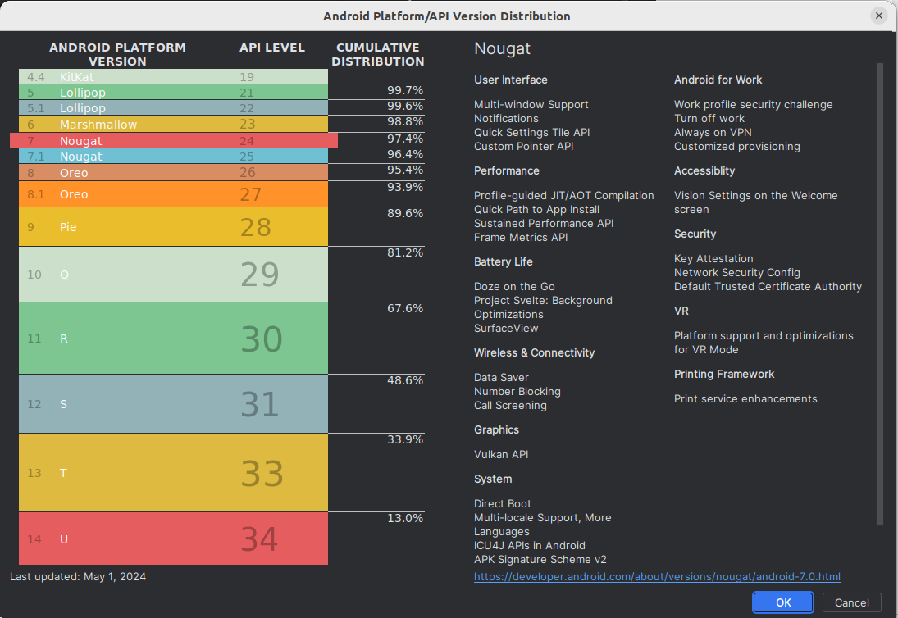
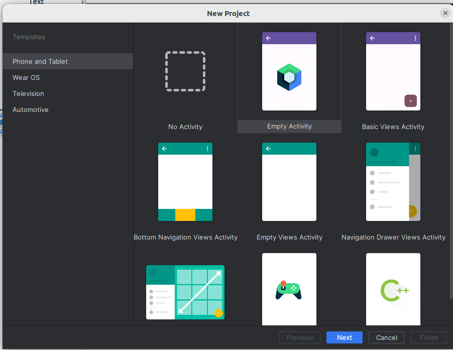
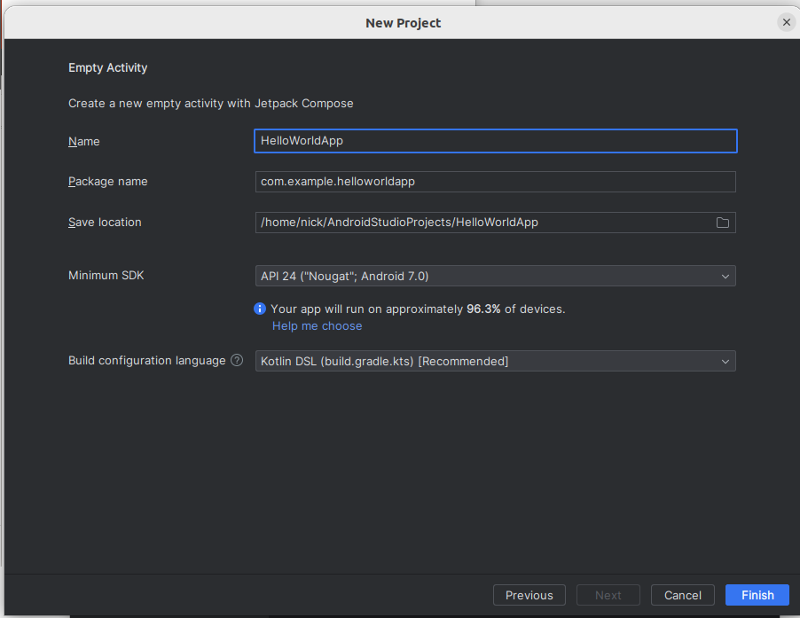
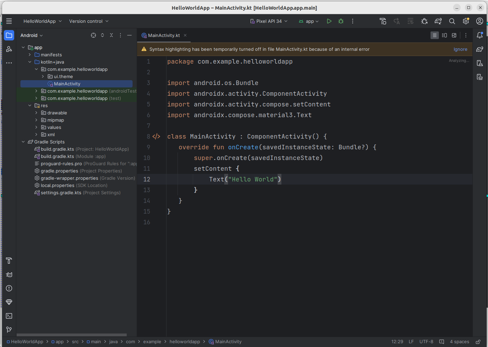
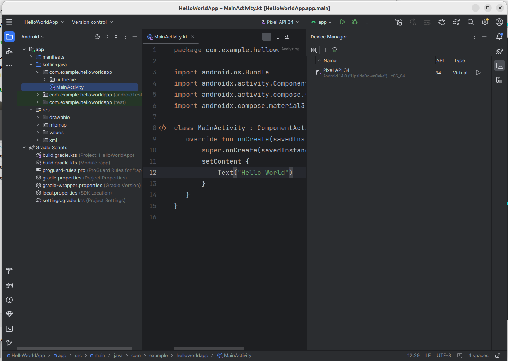
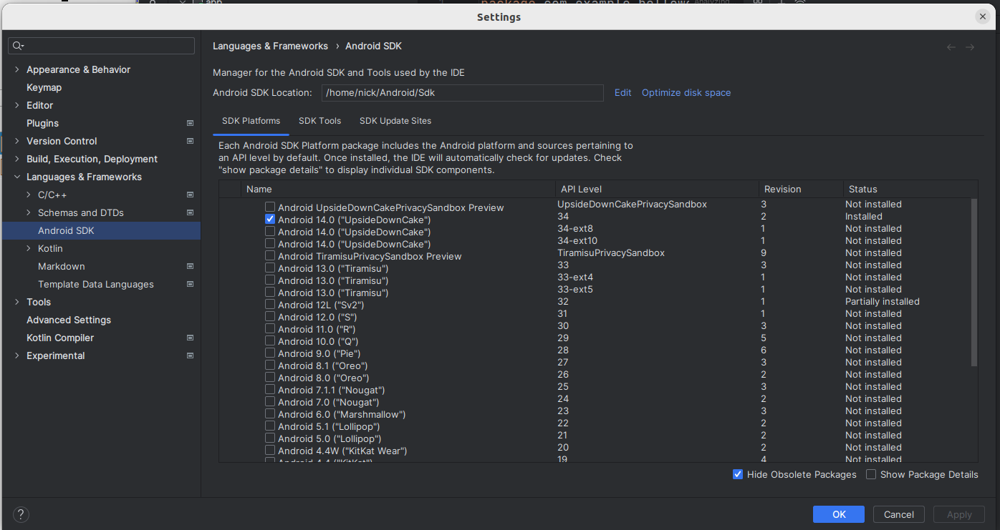

<!DOCTYPE html PUBLIC "-//W3C//DTD XHTML 1.0 Transitional//EN" "http://www.w3.org/TR/xhtml1/DTD/xhtml1-transitional.dtd">

<html xmlns="http://www.w3.org/1999/xhtml">
<head>
<title>MAD Topic 2: Intro to Android Development:
Setting Up the Environment and Hello World</title>
<link rel="stylesheet" type="text/css" href="../css/android.css" />
</head>

<body>
<div class='titlebox'>
<h1>MAD Topic 2 : Introduction to Android Development</h1>
</div>


<p>The <a href='http://www.android.com'>Android</a> mobile operating
system is the leading smartphone and tablet operating system. From a minority operating system only running on one phone (the T-Mobile G1) a few years ago it has grown into one of the leaders in the smartphone operating system field, along with iOS (on the iPhone), and to some extent, Windows Mobile.</p>
<h2>Why develop for Android?</h2>
<p>There is one very important difference between Android and many of its
competitors. It is an open source operating system, which means that you
are free to modify it for your own ends. Even more crucially for app 
developers is that as a result of its open-source nature <em>you can 
develop and distribute applications without restriction</em>. This is in
contrast to some of the other contemporary mobile development options in
which the operating system vendor restricts distribution to a single
channel owned by themselves, and "vets" software before making it 
available. Android has an official distribution channel (the
<a href='http://play.google.com'>Play Store</a>), but this is more
liberal with accepting apps than some of the other vendors. Also, there are alternative distribution channels for Android such as <a href='https://f-droid.org'>F-Droid</a></p>.


<h2>Android versions</h2>
<p>
At this point it is worth elaborating on the various <em>versions of Android</em>. At the time of writing the percentages of devices running different versions are as below (this is taken from Android Studio):
<br />

<br />
The most recent version deployed on actual mobile devices is 11, however, as can be seen above, many devices are running 6.0 (Marshmallow), 7.0 and 7.1 (Nougat), 8.x (Oreo), 9 (Pie) and 10.  A few devices are still running Lollipop (5.x) and around 6% version 4.4 (KitKat) or lower; therefore, targeting 4.4 upwards, or 5.0 upwards, is a sensible approach. The <em>Jetpack</em> support loibrary (which will be covered later) makes this easier.</p>
<p>Another concept that you need to understand is the <em>API level</em>. The <em>Android API</em> is the set of classes which are used to program Android apps with. The API level denotes revisions to the Android API, in a sequence of positive integers starting from 1. Thus, the numbers used for the API levels are not the same as those used for the Android versions, but each API level corresponds to a particular version. The idea is that each time Android itself is updated, the API is updated too. For example: 
<ul>
    <li>API level 15 corresponds to Android 4.0.3; </li>
    <li>API level 19 corresponds to Android 4.4;</li>
	<li>API level 23 corresponds to Android 6;</li>
	<li>API level 26 corresponds to Android 8.0;</li>
	<li>API level 28 corresponds to Android 9</li>
	<li>API level 30 corresponds to Android 11</li>
    </ul>
When developing an Android app, you have to specify the minimum API level on
which your app will run. Thus an app with minimum API level 19, for example,
will only run on 4.4+. As seen above, the vast majority of devices
are running at least API level 19 (Android 4.4; KitKat), so if you specify
API level 19 as a minimum you will be targeting the majority of devices.
</p>
<h2>Runtime Environment</h2>
<p>With standard Kotlin or Java, you compile to bytecode which is then run using the Java Virtual Machine (JVM). Android is similar but rather than using the standard JVM, it uses its own virtual machine and corresponding bytecode format, producing executable files known as DEX files. So "regular" Java bytecode will not run on Android and Android apps will not run on a regular JVM.
</p>
<p><em>Dalvik</em> was the original virtual machine, which versions of Android up to 4.4 used. 
With Android 5.0, a new virtual machine (<em>ART : Android Runtime</em>)
(see <a href="https://source.android.com/devices/tech/dalvik/configure.html">here</a>) is used instead.
See <a href="https://source.android.com/devices/tech/dalvik/">here</a> for more details on Android
virtual machines.</p>
<h2>General nature of Android development</h2>
<p>Android development is generally done in either Kotlin or Java, with
Kotlin the preferred language. 
However, because the environment differs from a standard desktop PC, the
actual libraries available differ somewhat from the standard Sun/Oracle
Java Development Kit. As well as the Kotlin standard library, many standard Java features from packages such as java.io and java.util are available; however (as you might expect) the standard Java GUI libraries (designed for desktop applications) are not, and also the structure of an Android application is significantly different due to the different style of interaction with a mobile device compared to a desktop computer.</p>
<h2>What do you need to start Android development?</h2>
<p>To get started on Android development you ideally need  the <em>Android Studio</em> IDE.  Android Studio is the recommended IDE for Android development. It is based on JetBrains' IntelliJ IDEA .  <p>It is also possible to develop apps purely using command-line (console) tools but we will cover this later.</p>
<p>Android Studio provides an IDE 'wrapper' round the core Android development environment, which contains the following components:
    <ul>
    <li>The Android Software Development Kit (SDK): provides Android libraries, tools to generate
	bytecode and distributable apps and the <em>SDK Manager</em> which allows you to download
	libraries for different versions of Android;</li>
    <li>The <em>AVD (Android Virtual Device) Manager</em>: allows creation of
    virtual phones or tablets allowing you to test your app in the absence of a real device.</li>
    </ul>
</p>
<p>You can access the Android SDK and the AVD Manager either through an IDE such as Android Studio or independently, via the command-line.</p>
<h3>Getting started</h3>
<p>The best way to explore the different components of the Android development environment is to get started with Android Studio. Launch Studio, you will see a screen like this:
</p>
<br />

<br />

<h4>Creating a project</h4>
<p>
Select "Create New roject". You will then see this screen.  This allows you to create a new project.  You will then see a screen like this:
<br />

<br />
Select "Empty Activity", as shown, to create an empty application (rather than one with existing pre-generated code).  </p>
<br />

<br />
<p>
To explain these one by one:
	<ul>
	<li><em>Name</em>: the name of your application.</li>
	<li><em>Package name</em>: the Java/Kotlin package name that will be used for your application.</li> 
	<li><em>Save location</em>: where your projects will reside.  You should make sure that this is somewhere easy to find, so you can navigate to it later.</li> 
 	<li><em>Language</em>: what language will the application be using (Kotlin or Java). Ensure you choose Kotlin.</li>
	<li><em>Minimum SDK</em>: what is the lowest Android API level which will run this app? You can leave it on the default (4.4 KitKat).</li>
	</ul>
</p>
<p>Once you click "Finish", your project will be created.</p>
<h4>Explaining the layout of a project</h4>
<p>The Android project will open, with a screen something like this:
<br />

<br />
On the right-hand side is the main code editor, containing your Kotlin
code. Note that some code is auto-generated: we will explain this later.
</p>
<p>On the left-hand side, the <em>project structure</em> is shown. An Android project contains of a series of files and directories, each containing different things. To explain each:
	<ul>
	<li><em>manifests</em>: this directory contains the <em>manifest file</em>, AndroidManifest.xml, which contains information about the app and its contents. We will return to this later.</li>
	<li><em>java</em>: the actual code. Note how it contains our activity, <em>MainActivity.kt</em>. Note that it's called <em>java</em> even if we are writing Kotlin; this is because the IDE expects a <em>java</em>
	folder to be present and contain the source code.</li>
	<li><em>res</em>: the <em>resources</em>. These are additional files our app needs, such as screen layouts, menus, images and so on. We will examine resources in more detail later.</li>
	<li><em>Gradle Scripts</em>: Gradle is a build tool to automate the process of building an application. It is similar in role to Maven; in other words it reads a configuration file which tells it how to build your application (including such things as third-party Kotlin or Java libraries - <em>dependencies</em> - our app needs to run), downloading them from online repositories if necessary. The Gradle build configuration file is <em>build.gradle</em>. In this file, we also specify the minimum Android version supported by our app.
	<br />
	Note that there are two <em>build.gradle</em> files, one to build the project as a whole, and another one to build the current module (the one in the <em>app</em> directory). In some cases, a project may contain multiple modules, though not in our case. Generally, you will find theat the <em>app</em> build.gradle is the one you need to modify most frequently.
	</li> </ul>
</p>
<h2>Hello World!</h2>
<p>We're now going to start - as always in software development - with 
a Hello World app. You should see pre-generated code something like this: 
<pre>
package whatever.your.package.is // leave this line as it was
import androidx.appcompat.app.AppCompatActivity
import android.os.Bundle

class MainActivity : AppCompatActivity() {

    override fun onCreate(savedInstanceState: Bundle?) {
        super.onCreate(savedInstanceState)
        setContentView(R.layout.activity_main)
    }
}</pre>
What does this code mean?
    <ul>
    <li>As mentioned above, the entry point to an Android application is an <em>activity</em>. An activity is basically a single screen of an Android app.  It contains "widgets" or user interface elements, through which the user can interact with the app: for example, text fields, buttons and radio buttons.  An Android app will typically consist of several Activities, representing different screens within the app, but there will be one main activity which launches when the app is launched. The main activity is defined in the manifest file (see later)</li>
    <li>The <em>onCreate()</em> method is the actual entry point to the activity. It can be viewed as roughly equivalent to the <em>main()</em> method in standard Kotlin, or in C or C++. Whenever an activity is created for the first time, its <em>onCreate()</em> method is called: therefore, initialisation code should be placed in onCreate().</li>
	<li>Note that the activity here is an <em>AppCompatActivity</em>, which is a subclass of plain <em>Activity</em>.  This allows us to use the Jetpack AppCompat library to include newer Android API features on older versions of Android. We will return to this later.</li>
    <li>The first thing we do is call the version of <em>onCreate()</em> in the superclass (i.e. AppCompatActivity). In this way, we can ensure that common functionality which occurs when all activities are created will also occur in our case.</li>
    <li>We then set up the layout. Don't worry about what the <em>R</em> means just yet: instead, take out the line
    <pre>
    setContentView(R.layout.activity_main)
    </pre>
    and replace it with
    <pre>
    val tv= TextView(this)
    tv.setText("Hello World from the TextView!")
    setContentView(tv)
    </pre>
    You will also need to add
    <pre>
    import android.widget.TextView
    </pre>
    in the imports section at the top of the file.
    </li>
    <li>Hopefully this code is fairly obvious but it does illustrate a couple of key concepts. The first is the concept of a <em>View</em>. Every Activity contains a View which is the "main component" of the screen, referred to as the <em>content view</em>. This might be a group of radio buttons, a list, a form or even a map. Here, it's the simplest type of View: a <em>TextView</em>. A TextView is what it sounds like: a View which can contain text. So here, we create a TextView containing the text "Hello world" and make it the content view of our Activity.
    </li>
    </ul>
</p>
<h3>Setting up an Android Virtual Device</h3>
<p>If you do not have an actual Android device, you will
need to set up an <em>Android virtual device (AVD)</em> before starting programming. This is an emulator which you can use to test your apps as you develop them. It resembles an actual phone, and the user interface looks just like a user interface on a real Android phone so you can test your apps fairly realistically. When creating an AVD you will be prompted for various properties of the emulator such as resolution.</p>
<p>To set up an AVD in Studio, select <em>Tools-AVD Manager</em>.  This will launch the Android AVD manager from within Android Studio, as shown below:
</p>
<p>

</p>
<p>This screen shows that there are three AVDs already set up, called <em>5.1 WVGA API 26</em>, <em>5.1 WVGA API 23</em> and <em>5.1 WVGA API 28</em>. On your system there probably won't be any yet. So Set up a new AVD as follows:
    <ul>
    <li>Click the "Create Virtual Device" button on the AVD manager.  This will bring up a dialog like the one below:
	<br />
	
	</li>
	<li>Select one with low resolution (higher-resolution ones may be slow).  <em>5.1" WVGA</em> is a reasonable one to pick.</li>
	<li>Select an Android version for the virtual device.  <strong>Choose an x86 image as it will be faster, but do NOT choose one with Google APIs as that will be a larger download, which could be slow on domestic internet, and we are not going to use Google APIs on this module.</strong> 
	<br />
	
	</li>
	<li>Once setup, your new AVD will appear on the "Your Virtual Devices" screen.</li>
    </ul>    
</p>
<h3>Running on an actual device</h3>
<p>You can test your apps on an actual device, though you have to enable the developer settings.  Full instructions on this are available
<a href='https://developer.android.com/studio/debug/dev-options'>from the Android site</a>.
On Linux and Mac OS X as no driver is required.  On Windows, a driver for your device is required, however Nexus devices can use the <a href="http://developer.android.com/sdk/win-usb.html">
Google USB driver</a> which comes with the SDK. For other devices, you can download a driver for your device from the Android developer site.  See <a href='http://developer.android.com/tools/extras/oem-usb.html'>the Android documentation on driver installation</a> for more details. To summarise, you have to <em>download</em> and then <em>install</em> the driver. Even with the Google USB driver, included in the SDK, the <em>installation</em> step is necessary.</p> 
<p><em>The Google USB Driver has been installed in the labs</em> which means that you can use Nexus and other Google-branded devices (e.g. Pixel) to test your apps on. The Samsung driver should also have been installed, meaning Samsung phones should also work.  If you have another Android device, you will need to use the emulator.</p>


<h3>The Android SDK Manager</h3>
<p>One of the most crucial components of the Android SDK is the <em>SDK Manager</em>. This piece of software, which can be run within Android Studio or standalone, allows you to download and install versions of the SDK for different versions of Android, along with other items such as documentation. So if a new version of the SDK is released, the SDK manager allows you to download that new version.  The default Studio download only comes with the latest versions of the SDK, so if you want to target older devices, you need to download older versions.
</p>


<h4>Starting the SDK Manager</h4>

<p>On Android Studio, select <em>Tools-Android-SDK Manager</em>. This will launch an intermediate screen listing installation options; however for more control it's recommended you then click on <em>Launch Standalone SDK Manager</em> which will give you the SDK Manager as it appears if you launch
it on its own without Android Studio.</p>

<h4>Installing SDK versions from the Android SDK manager</h4>

<p>You might want to install older SDK versions than those included by default by Android Studio.  For example, you might want to install Android 4.4 and 4.0.3 (API levels 19 and 15 respectively). To do this, you need to start the SDK manager as described above, and then select the platforms you want, e.g:
<br />

<br />
You will then need to accept the licence and it will download the individual components of these versions of the SDK.  

</p>


<h3>XML Layouts</h3>
<p>The Hello World example above will probably look familiar if you have done any programming in desktop GUI toolkits, such as Java AWT or Swing. We add components to the main screen programatically. However with Android we can cut down on the amount of setup code using <em>XML layouts</em> instead. With XML layouts, we define the layout of the content view of the Activity using XML tags; in that respect, there is some similarity with writing an HTML web page, but whereas websites are driven by a browser's engine, with apps <em>we</em>
are writing the engine and are thus much more in control.  (In case you are not aware, XML is a tag based format for representing data). XML layouts have a number of advantages, they include:
    <ul>
    <li>Separating the layout keeps the Kotlin focused on the app's logic, meaning that it's easier to understand the "nitty-gritty" of the app without having to wade through GUI setup code;</li>
    <li>We can change the layout without recompiling, simply by changing the XML; the XML is loaded by the application when it runs;</li>
    <li>Separation of the work of designers and developers: designers can work on the app's layout by manipulating the XML code without needing to know any Kotlin.</li>
    </ul>
Here is an example of an XML based layout:
```
<LinearLayout xmlns:android="http://schemas.android.com/apk/res/android"
    android:orientation="vertical"
    android:layout_width="match_parent"
    android:layout_height="match_parent"
    >
<TextView android:layout_width="wrap_content" 
android:layout_height="wrap_content" android:text="@string/hello" />
</LinearLayout>
```
To explain this:
    <ul>
    <li>The <em>LinearLayout</em> defines the view's layout. The layout specifies how the various components are arranged with respect to each other. LinearLayout indicated that components are placed adjacent to each other, either vertically or horizontally (depending on the <em>android:orientation</em> attribute)</li>
 
    <li>We then add a TextView tag. Basically every Android UI class has corresponding tag of the same name.</li>
    <li>The <em>android:layout_width</em> and <em>android:layout_height</em> attributes of the <em>TextView</em> describe how it fills its parent layout in the horizontal and vertical directions.  The most common values are <em>match_parent</em> and <em>wrap_content</em>. The former, as used here, means that the TextView entirely fills its parent (the LinearLayout), the result being that the TextView fills the entire screen.  The latter,<em>wrap_content</em>, means that <em>enough space to contain the content</em> (the text "Hello World" here) should be used.  </li>
    <li>The <em>android:text</em> attribute specifies the text within the TextView.  Note however how we don't give it a straight value, we use <em>@string/hello</em>.  This is described in more detail below.</li>
    </ul>
Where can the XML file be found? It is found in the <em>application resources</em>, described below.
</p>
<h3>Application resources</h3>
<p>Android apps consist of Kotlin or Java code plus <em>resources</em> - additional data which the app needs to do its job. An example of a resource is an XML layout file, as described above. Resources can be found within <em>res</em>, as we saw above.</p>
<p>Within the <em>res</em> folder is a <em>layout</em> folder, and within that is the <em>activity_main.xml</em> which is auto-generated when you start a new Android project: it is basically a default main view for your main Activity. You replaced it with code to manually create a TextView object above.  However, now you are going to change it back to reading the layout from the XML file. Replace (or comment out) the code you wrote above with this code (which was in the
original auto-generated code for your main Activity):
<pre>setContentView(R.layout.activity_main)</pre>
Run your app again and you will see that this message now appears:
<pre>Hello World!</pre>
Where is this message coming from? Remember that in the <em>activity_main.xml</em> file, the <em>android:text</em> attribute of the TextView describes the text on the TextView and this is set to the value <em>@string/hello</em>. What does <em>@string/hello</em> represent? It is a <em>string resource</em>. In Android development, to make it easier to translate apps into different languages, much of the text that we see within the user interface is defined in a <em>string resource file</em> so that we can easily translate an app to a different language simply by editing the string resource file. This can be found within the <em>values</em> folder within <em>res</em>, in the file <em>strings.xml</em>.  If you look in the <em>strings.xml</em> file, you will see this line:
```
<string name="hello">Hello World!</string>
```
Change this to:
```
<string name="hello">Geia sas Kosmos!</string>
```
(Sorry if I have got the Greek wrong!). 
Run your app again, and you should find it greets you with <em>Geia sas Kosmos!</em> Notice how each string in the <em>strings.xml</em>
file has a <em>name</em>, and we reference that name in the layout file with
<em>android:text="@string/(name of string)"</em>.</p>
<p>As well as layout and strings, the <em>res</em> folder can contain other types of resource. These include application menus (which we will come onto a bit later on) and images. When you distribute an app, all the resources are packed into one file along with your actual code.</p>
<h3>The auto-generated R.java file</h3>
<p>You might be a bit puzzled as to the meaning of the <em>R</em> in the code you added above, i.e.
<pre>setContentView(R.layout.main);</pre>
What, actually, is this "R"? It's a pre-generated Java class which contains "hooks" into your XML resource files. The <em>R.java</em> file, not directly accessible from Studio but present in your project, looks something like this:
```
/* AUTO-GENERATED FILE.  DO NOT MODIFY.
 *
 * This class was automatically generated by the
 * aapt tool from the resource data it found.  It
 * should not be modified by hand.
 */

package com.example.nickw.helloworld;

public final class R {
    public static final class attr {
    }
    public static final class drawable {
        public static final int icon=0x7f020000;
    }
    public static final class layout {
        public static final int activity_main=0x7f030000;
    }
    public static final class string {
        public static final int app_name=0x7f040001;
        public static final int hello=0x7f040000;
    }
}
```
</pre>
Notice that it contains several static variables. These are identifiers which your Kotlin or Java code can use to access the XML, for example <em>R.layout.activity_main</em> has the hex value <em>0x7f030000</em> which is a "handle" for the activity_main.xml resource file. Every time you add a resource to an Android app, your <em>R.java</em> will automatically be updated and you will be able to use static attributes of <em>R</em> in your Java code to access different resources. Never edit R.java directly by the way, the system will always do it for you!
</p>


<h2>Making our app do something!</h2>
<p>OK our app says 'Hello World'. And we've translated it into another language. But it doesn't yet actually <em>do</em> anything.  In this exercise you will add some <em>interactivity</em> by developing a simple application to convert feet to metres. <strong>Create a new project</strong> and call the main activity <strong>FeetToMetresActivity</strong>. Replace the auto-generated code with this code (obviously change the package name to that appropriate in your case):
```
package whatever.your.package.is

import androidx.appcompat.app.AppCompatActivity
import android.os.Bundle
import android.widget.Button
import android.view.View.OnClickListener
import android.view.View
import android.widget.TextView
import android.widget.EditText

class FeetToMetresActivity : AppCompatActivity () {
    override fun onCreate(savedInstanceState: Bundle?) {
        super.onCreate(savedInstanceState)        
        setContentView(R.layout.activity_main)
        val b = findViewById<Button>(R.id.btn1)
        b.setOnClickListener {
    		val et1 = findViewById<EditText>(R.id.et1)
    		val feet = et1.getText().toString().toDouble()
    		val metres = feet*0.305
    		val tv1 = findViewById<TextView>(R.id.tv1)
    		tv1.setText("In metres that is: $metres")
		}
    }
}
```
and also change your <em>activity_main.xml</em> layout file to look like this:
```
<LinearLayout xmlns:android="http://schemas.android.com/apk/res/android"
    android:orientation="vertical"
    android:layout_width="match_parent"
    android:layout_height="match_parent"
    >

<EditText
    android:layout_width="match_parent" 
    android:layout_height="wrap_content" 
    android:inputType="numberDecimal"
    android:id="@+id/et1"
    />

 <Button android:layout_width="wrap_content" android:layout_height="wrap_content" android:id="@+id/btn1" android:text="@string/convertBtn" />

 <TextView android:layout_width="match_parent" android:layout_height="wrap_content" android:id="@+id/tv1"/>

</LinearLayout>
```
and finally add the following line to your strings file:
```
<string name="convertBtn">Convert!</string>
```
</p>
<p>So how is this working? Let's start with the layout file as that's probably the simplest.  Note how we now have three components: an <em>EditText</em> (editable text field), a <em>Button</em> and a <em>TextView</em>. Also note that each has been given an ID: <em>et1</em>, <em>btn1</em> and <em>tv1</em> respectively. We will use these IDs to access each component from our Kotlin code. </p>
<p>Also note how we have specified the layout for each component. In particular, note the different layout specifiers <em>match_parent</em> and <em>wrap_content</em>. As seen above, the former specifies that the component will fill the entire space of its parent component. Note how for the edit text and the text view, we set the width to <em>match_parent</em> so that the component fills the entire width of the parent (the screen in this case); however, note the height is set to <em>wrap_content</em>. This means that the component will use up as much space is required, and if its content exceeds the space available to it, it will be wrapped to the next line.</p> 
<p>Finally notice that the <em>EditText</em> has an <em>inputType</em>
attribute. This specifies what type of data will be entered in the EditText.
Here we have set it to <em>numberDecimal</em> to indicate that it can only
be used for entering decimal numbers. Some other types:
	<ul>
	<li><em>text</em> - the default. Allows text and numeric entry.</li>
	<li><em>number</em> - positive whole numbers.</li>
	<li><em>numberSigned</em> - positive and negative whole numbers.</li>
	</ul>
You can combine types with the "or" symbol |, e.g.
<em>numberDecimal|numberSigned</em> would allow entry of positive and 
negative decimal numbers.</p>
<h3>On to the Kotlin code</h3>
<p>OK, how about the actual Kotlin code? First of all note how we access the user interface components from Kotlin. We use code such as:
<pre>val b = findViewById&lt;Button&gt;(R.id.btn1)</pre>
Note how the <em>findViewById()</em> method takes in an ID and returns the corresponding component. The ID matches the IDs that we specified in the XML file; for instance, our button was given an ID of <em>btn1</em> so we reference it in code with <em>R.id.btn1</em>.</p>
<h3>Event handling</h3>
<p>Obviously we need to make something happen when the user clicks the button! If you have worked with Java Swing or AWT, the approach taken by Android should be quite familiar.  We attach an <em>event handler</em> to the button. Note how our event handler here is a <em>lambda function</em>:
<pre>
b.setOnClickListener {
	val et1 = findViewById&lt;EditText&gt;(R.id.et1)
	val feet = et1.getText().toString().toDouble()
	val metres = feet*0.305
	val tv1 = findViewById&lt;TextView&gt;(R.id.tv1)
	tv1.setText("In metres that is: $metres")
}
</pre>
When the button is clicked, the specified lambda function will run, and
as you can see, the lambda first obtains the edit text
element, and then reads the feet from it with
<pre>val feet = et1.getText().toString().toDouble()</pre>
Note that unlike the equivalent in Swing, the <em>getText()</em> method of EditText does not directly return a String, but returns an object of type <em>Editable</em>. We then need to call <em>toString()</em> on the Editable to get the actual text out of the text field, and finally convert it to a <em>double</em> using <em>Double.parseDouble()</em>.</p>
<p>Then we convert the feet to metres and place the result in the TextView.</p>
<h3>SAM conversions</h3>
 In classic versions of Java, you could not use a lambda here. You would
have tto use code such as:
<pre>
// This code would be needed to add a listener to the button...
b.setOnClickListener (new View.OnClickListener() {
    public void onClick(View v) {
        // handle the click
    } 
});
</pre>
The <em>setOnClickListener()</em> method takes a parameter of type
<em>OnClickListener</em>, which is a Java interface. We have to pass in an
<em>anonymous class</em> implementing this interface as our argument to
<em>setOnClickListener</em>, and then implenent the single method of this
interface, <code>onClick()</code>, to handle the click.</p>
<p>However in Kotlin (and recent Java) we can use so-called <em>SAM conversions</em>. SAM stands for <em>Single Abstract Method</em> and describes an interface with only <em>one</em> method defined - as <em>OnClickListener</em> does here.</p>
<p>The idea of SAM is that <em>method calls which expect an interface with only one method defined</em> can be written instead as a lambda, as has been done
here.  So, Using SAM conversions, the code aboe which sets up the on click
listener could be rewritten (in Kotlin) as:
<pre>b.setOnClickListener { v -&gt; /* handle the click*/ }</pre>
or even, given the onClick() event handler has only one parameter: 
<pre>b.setOnClickListener { /* handle the click, use 'it' to obtain the view if we need it */ }</pre>
</p>

<h3>Making our code more concise with Kotlin getters and setters</h3>
<p>Kotlin features a more concise and flexible approach to
<em>getters and setters</em> compared to Java.
Rather than using explicit methods, Kotlin's approach is to
define <em>properties</em> (attributes) and then define how each
property can be read and written.</p>
<p>For example, imagine a Player class in a game in which you wanted the
property (attribute) <em>score</em> to have public read access, but not
write access:
<pre>class Player(val name: String) {
    public var score = 0
        private set

    fun changeScore(amount: Int) {
        if(amount &gt; score) {
            score = amount
        }
    }
}

fun main (args:Array&lt;String&gt;) {
    val p = Player("Pacman")
    p.changeScore(3)
    println(p.score) // OK because score is public

    p.score = 6 // Not OK, because the 'set' operation on the property is private
    
}
</pre>
This example shows how we can <em>get</em> the score from outside the
class (because it's a public property) but cannot <em>set</em> it (because
the set operation on the property is private, so can only be done incise
the class).
>If the outside world wants to increase the score, they must use the
<em>changeScore()</em> method, which has some appropriate validation
(checks the new score is higher than the existing score).
</p>
<p>How, then, can we use Kotlin getters and setters in our Android code?
We can use them to make our code more concise, e.g:
<pre>
b.setOnClickListener {
	val et1 = findViewById&lt;EditText&gt;(R.id.et1)
	val feet = et1.<em>text</em>.toString().toDouble()
	val metres = feet*0.305
	val tv1 = findViewById&lt;TextView&gt;(R.id.tv1)
	tv1.<em>text</em> = "In metres that is: $metres"
}
</pre>
Note how we have used the <em>text</em> property rather than <em>getText()</em>
and <em>setText()</em>.</p>
<h2>Further Exercise</h2>
<p>Develop a very simple Android calculator app. It should contain:
	<ul>
	<li>two EditTexts for two numbers;</li>
	<li>four Buttons for addition, subtraction, multiplication and division;</li>
	<li>a TextView to show the result of applying the chosen mathematical
	operation to the two numbers.</li>
	</ul>
Try to add the four buttons in their own row. <strong>Hint!</strong> You can
place layouts within layouts, e.g.:
```
<LinearLayout android:orientation='vertical' .... >
   <LinearLayout android:orientation='horizontal' ...>
```
Note how the inner LinearLayout has a horizontal orientation, which means that
the widgets within it will be arranged horizontally, rather than vertically.
</p>
<h2>Further reading</h2>
<p>You might want
to check out these resources for further reading:
	<ul>
	<li><a href='http://developer.android.com'>The official Android developers'
	site</a></li>
	<li><a href='http://www.vogella.de/articles/Android/article.html'>
	An in-depth tutorial on Android development</a></li>
	</ul>
</p>


</body>
</html>
