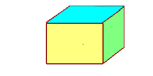
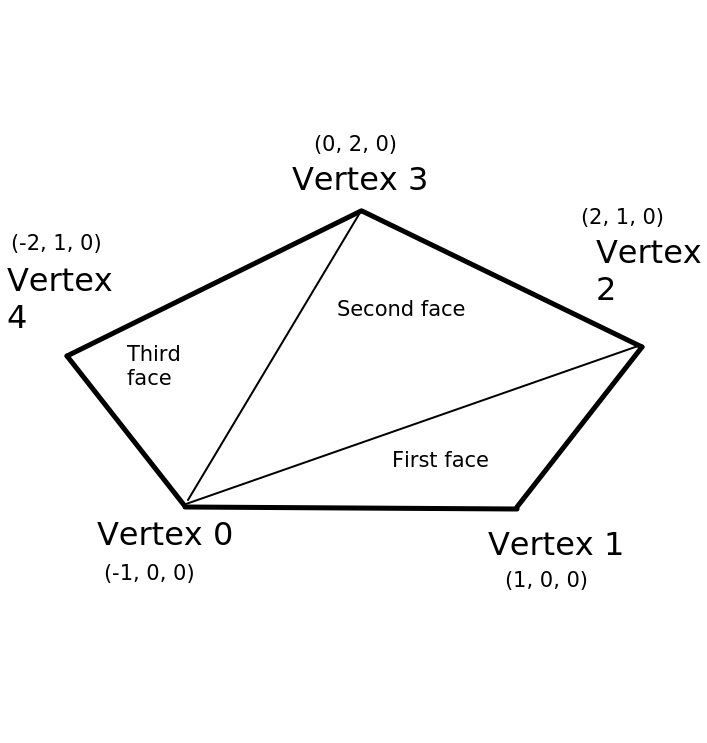

# Week 6: three.js and A-Frame

## Introduction

This week we will take a look at [three.js](https://threejs.org), the lower-level library which is used by A-Frame to perform 3D drawing. We will look at the basic components of a three.js application and examine the relationship between three.js and A-Frame.

## Introduction to three.js

[three.js](https://threejs.org) is a library for drawing 3D graphics in the browser using JavaScript. It is lower-level than A-Frame, but also very powerful. In A-Frame applications you can also access three.js, so that if there is anything that A-Frame does not provide directly but three.js does, you will be able to use it.

three.js itself wraps the lowest-level 3D graphics API, WebGL. WebGL is the native graphics API of the browser (in other words, the browser understands WebGL directly without needing any external libraries) but as we saw earlier, WebGL is very low level and requires quite a lot of code even to create a single box on the screen. Thus, few people use WebGL directly, most preferring to use three.js or A-Frame instead.

three.js consists of these key objects, many of which will be familiar through using A-Frame. Firstly, we will consider the objects defining the scene itself
and how it is rendered (drawn).

- a `scene`. The scene represents the 3D scene as a whole. A-Frame's `<a-scene>` wraps three.js's `scene`.
- a `camera`. As we have seen, the camera represents our current position and orientation within the 3D world.
- a `renderer`. The renderer is responsible for rendering (drawing) the scene to a particular HTML element, typically a canvas.

When drawing our 3D objects, we define a series of **`mesh`es**. A `mesh` is a 3D object within our world and consists of:

- a `geometry` describing its geometrical shape, and 
- a `material` describing the properties of its surface (for example colour, texture, light reflectance and so on).

These should be familiar from A-Frame. There are also additional objects we can use in three.js, and indeed in A-Frame, such as `light`s: light sources in our world. `light`s consist of ambient lights (general background lighting) and directional lights (lights placed at a particular position within our world and shining in a particular direction) amongst others. A directional light could be used to simulate the sun, for example.

### Resources

The site [threejsfundamentais.org](https://threejsfundamentals.org) is a very good tutorial site for three.js, covering everything from the absolute basics to advanced topics such as AR. Indeed, many of the techniques in this tutorial have been used as a basis for the techniques shown in this week's notes. Furthermore, it comes with interactive tutorials in which you can change the code live in the browser and see the result. In addition, the [website](https://threejs.org) contains full API documentation, plus examples.

### A basic example

Here is a basic example of three.js. It simply sets up a scene, it doesn't
draw anything yet. We will start with this HTML:

```
<!DOCTYPE html>
<html>
<head>
<title>three.js basic example</title>
<script type='module' src='main.js'></script>
</head>
<body>
<!-- By default, canvas is 300x150 so we could omit the width and height -->
<canvas id='canvas1' width='300' height='150'></canvas>
</body>
</html>
```
Note how the HTML page contains a `<canvas>`. The three.js scene will appear
here.

Moving onto the JavaScript (`main.js`):

```
import * as THREE from './node_modules/three/build/three.module.js';

const canvas = document.getElementById('canvas1');

const camera = new THREE.PerspectiveCamera(40, 2, 0.1, 10000);
const renderer = new THREE.WebGLRenderer({canvas: canvas});
const scene = new THREE.Scene();

requestAnimationFrame(renderScene);

function renderScene() {
    renderer.render(scene, camera);
    requestAnimationFrame(renderScene);
}
```
We are assuming that three.js has been installed locally with `npm`, i.e.:
```
npm install three
```

Note how we create a `camera` object, a `renderer` object, and then a `scene`
object. The camera is a `THREE.PerspectiveCamera`; why do we need this?


#### Perspective

When creating a scene, we need to account for
*perspective* in order to make nearby objects look larger than further away objects. This is not done by default in WebGL so we have to create a camera which will apply perspective effects. This is done in our code above, as our camera is a `THREE.PerspectiveCamera`. What do its arguments represent?

- The first argument is the *vertical field of view*. This is the field of view,
in degrees, that we can currently see in the scene in the vertical direction (40 degrees here). **Note that people more normally think of the horizontal field of view - the horizontal angle visible in the scene. The vertical field of view can be obtained by dividing the horizontal field of view by the aspect ratio, described below.**
- The second argument is the *aspect ratio* - the ratio of width to height. As our canvas is 300x150, we set this to 2 to match the canvas.
- the near clip plane (0.1)
- the far clip plane (10000).

The near and far clip planes define the nearest and
furthest distances that objects can be seen on the screen; here, images closer
than 0.1 units or further than 10000 units away will be invisible. 
The four arguments above define a shape, resembling a sawn-off pyramid, known as the *viewing frustum*, shown in this diagram.


#### The renderer

Next we create our `THREE.WebGLRenderer`. Note how we create a renderer and associate it with a particular canvas element in our HTML, in this example an element with the ID of `canvas1`.Having created a renderer we then create our scene.

#### The renderScene() function 

Note how we handle scene *rendering*. We need to tell three.js to render
the scene each time the display refreshes. We write a function `renderScene()` to do the rendering and schedule it using the JavaScript function
`requestAnimationFrame()` (not part of three.js, but a standard browser API
function). `requestAnimationFrame()` schedules a function to run before the next browser repaint ([Mozilla](https://developer.mozilla.org/en-US/docs/Web/API/window/requestAnimationFrame)).  The idea is we render the scene as often as possible so that if the positions of the camera or the objects change, the scene will update.

In `renderScene()` we call the three.js `renderer`'s `render()` method to render the given `scene` using the given `camera`. Then, once we've drawn the scene, we request it to be drawn again with another call to `requestAnimationFrame()`. Note that `requestAnimationFrame()` is rather like `setTimeout()` but has smoother animation as it matches the display refresh rate. It's also a bit like A-Frame's `tick()` but must be re-called on each rendering, it will not automatically be called repeatedly.

### Adding a 3D object to the example

The next example creates a 3D box:
```
import * as THREE from './node_modules/three/build/three.module.js';

const canvas = document.getElementById('canvas1');

const camera = new THREE.PerspectiveCamera(80, 2, 0.1, 10000);
const renderer = new THREE.WebGLRenderer({canvas: canvas});
const scene = new THREE.Scene();

const geom = new THREE.BoxGeometry(2,2,2);
const material = new THREE.MeshBasicMaterial({color: 0xff0000});
const mesh = new THREE.Mesh(geom, material);
mesh.position.z = -10;

scene.add(mesh);
requestAnimationFrame(renderScene);

function renderScene() {
    renderer.render(scene, camera);
    requestAnimationFrame(renderScene);
}
```
Note how in this example we create a `BoxGeometry` with dimensions in the 
x, y and z directions of 2 (this is similar to setting the `scale` in A-Frame).
Then we create a `material`: the `MeshBasicMaterial` is a basic material which does not have any special properties for reflecting light, for example. We define its colour: note that we do not use HTML-style colour strings (e.g. `"#ff0000"`) but instead, a numerical value for the colour. We use hexadecimal (`0x`) to allow us to define the colour in terms of red, green and blue components: note that `0xff0000` is equivalent to `#ff0000`.

Finally we create a `mesh` using the geometry and material, and add it to the scene.  Note how we set the mesh's `position`, by setting the `z` property of its `position` property. 

The rendering function is the same as before.

### Handling screen resize events

The example so far just uses a canvas with a fixed size: width 300, height 150. However, more commonly, particularly on a mobile platform, we need the canvas to *adapt* to the screen size. So more commonly we will set the canvas to occupy the whole of the screen e.g.:
```
<canvas id='canvas1' style='display: block; width:100%; height:100%'></canvas>
```
We also have to, in our CSS, specify that the `html` and `body` elements will have a `width` and `height` of 100% so that the `html` (the viewport) and the `body` (the content) - and thus the canvas, which occupies the whole of the body - will stretch to cover the whole window when the window resizes.
```
<style>
html, body {
    width: 100%;
    height: 100%;
}
</style>
```
Try modifying your HTML in this way: give the canvas 100% width and height
and add some CSS to set the `html` and `body` width and height to 100%.
What happens?

#### The result

You will find that the box appears "blocky" and "pixelated". Why? The 
problem relates to the difference between *canvas width and height* and *CSS width and height*. They are two different things. Even though the canvas will have a *CSS* width and height which covers the whole screen, its *canvas* width and height will still be 300x150. This is rather like setting the CSS width and height of an image of 300x150 pixels to 100% of the body. The image will still be 300x150 - its resolution will not magically increase - but it will be stretched across the whole of the page so will appear pixelated with poor resolution. Canvases are internally similar to images in HTML - what we are doing is stretching a 300x150 canvas across the entire screen without increasing the resolution of the actual canvas.

This is shown below. Here is a cube image of dimensions 300x150:



but here is the same image with the CSS width and height set to 900x450
(even though the actual image is still 300x150):


To increase the canvas resolution, we have to reset its `width` and `height` properties (these are the canvas width and height) so that they are the same as the CSS width and height of the canvas element. To obtain the *CSS* width and height of the canvas, we can use `canvas.clientWidth` and `canvas.clientHeight`.

What we can then do, in our rendering function, is to test whether the canvas width and height are different to the CSS width and height. If they are (which will occur after a resize), we reset the width and height of the canvas. For example, you can add this code to your `renderScene()` function:
```
if(canvas.width != canvas.clientWidth || canvas.height != canvas.clientHeight) {
    renderer.setSize(canvas.clientWidth, canvas.clientHeight, false);
}
```
We call the renderer's `setSize()` method to perform the resizing rather than directly changing the canvas properties, this ensures that three.js keeps track of the changes.

### Updating the aspect ratio

Once you've updated the canvas size in the previous example, you will still see a problem. Namely, the cube becomes distorted as you resize the window. This is because you have setup a camera with an aspect ratio of 2 (which it will be by default, due to the default canvas size of 300x150) but the canvas no longer has an aspect ratio of 2. So when the renderer is resized, you have to recalculate the aspect ratio of the canvas and reset the camera's aspect ratio appropriately. This can be done with:
```
camera.aspect = canvas.clientWidth / canvas.clientHeight;
camera.updateProjectionMatrix();
```
The first line should be obvious. The second is perhaps less so. Internally, three.js uses a mathematical *matrix* known as the *projection matrix* to represent the perspective; this matrix is used to draw objects with the correct perspective. The projection matrix depends on the properties of the viewing frustum: the aspect ratio, the field of view, and the near and far clip planes. Once we've updated the aspect ratio, we have to update the projection matrix as this will not be done automatically.

Add the code above to your `if` statement which handles screen resize. You will find that the box appears correctly as a cube even if you resize the window.

### The Object3D class

The `Object3D` class (described [here](https://threejs.org/docs/index.html#api/en/core/Object3D)) is a fundamental component of three.js.
`Object3D` represents a three.js object which can be moved, rotated, 
and scaled. Other three.js objects, such as meshes and cameras, are examples
of `Object3D`s. Furthermore `Object3D` forms the key link between three.js and
A-Frame, to be described later.

### Exercise 1

- Change the code so the box is rotated 45 degrees around the y axis, using the mesh's `rotation` property.
- Change the *camera* position so that it is two units distance from the box along the z axis. The box will appear bigger, because the camera is closer to it. Do not change the position of the box.

## Materials and lighting

We're now going to look at how we can add simple *lighting* effects to our scene. A word first on custom materials. The basic material does not take into account how our world is lit, in other words, whether there is any ambient light or directional lights present. To account for the effect of lighting, we have to use a different material such as `THREE.MeshLambertMaterial`.

The example below shows this. Note how we create two lights:

- a `THREE.AmbientLight`. Ambient light is the background lighting in our world. All objects, however they are oriented, will be lit by the ambient light. A good example of ambient light in the real world is the daylight on a cloudy day. You cannot see the sun but nonetheless the world is lit - perhaps rather dimly, but nonetheless still lit. There are no shadows, and everything is lit equally.

- a `THREE.DirectionalLight`. A directional light can be thought of as like a spotlight, or indeed, the sun. It is placed in a specific position within our world, and shines towards a specific *target* (by default the origin, i.e. x=0, y=0, z=0).  Note that we do not set the angle a directional light shines. Instead, we determine its direction by giving the light a position, and optionally a target (which should be another Object3D, e.g. a mesh).

```
import * as THREE from './node_modules/three/build/three.module.js';

const canvas = document.getElementById('canvas1');
const camera = new THREE.PerspectiveCamera(80, 2, 0.1, 10000);
const renderer = new THREE.WebGLRenderer({canvas: canvas});
const scene = new THREE.Scene();

const geom = new THREE.BoxGeometry(2,2,2);
const material = new THREE.MeshLambertMaterial({color: 0xff0000});
const mesh = new THREE.Mesh(geom, material);
mesh.position.z = -10;
mesh.rotation.y = 45;

// Ambient white light at low intensity (0.2)
const light = new THREE.AmbientLight(0xffffff, 0.2);
scene.add(light);

// Create a white directional light at full intensity (1.0)
const light2 = new THREE.DirectionalLight(0xffffff, 1.0);

// define its position. This light will shine straight down because its
// position is x=0, y=10, z=0 and by default it shines towards the origin.
light2.position.y = 10;

// Raise the camera to y=2 so we can see the top face of the box
camera.position.y = 2;

scene.add(light2);
scene.add(mesh);
requestAnimationFrame(renderScene);

function renderScene() {
    if(canvas.width != canvas.clientWidth || canvas.height != canvas.clientHeight) {
        renderer.setSize(canvas.clientWidth, canvas.clientHeight, false);
        camera.aspect = canvas.clientWidth / canvas.clientHeight;
        camera.updateProjectionMatrix();
    }
    renderer.render(scene, camera);
    requestAnimationFrame(renderScene);
}
```
Note the comments in the code explaining how we create lights. Note that
both lights have a colour and an intensity, and we specify the position of
the directional light.  Just like the camera and meshes, lights are themselves `Object3D`s, which means we can give them properties such as a position. 

### Exercise 2

Try changing the code so that:

- the directional light has a `z` coordinate of 20;
- the material of the box is yellow;
- the directional light is red;
- the directional light is green;
- the directional light is blue.

What effects do you see if you change the colour of the directional light? Can you see why? (**Hint**: the apparent colour of a material is the colour of light that it *reflects*. Remember that the primary colours of light are red, green and blue - and yellow light is made up of red light and green light).

## Custom geometries

Remember that a mesh consists of a geometry plus a material. Could we create a mesh using some geometry other than one of the standard types, such as box or sphere? You can, if you use the generic `THREE.Geometry` rather than one of the specific types such as `THREE.BoxGeometry`. You have to specify the vertices and faces making up the custom geometry.

Here is an example to create a flat pentagon. 
```
import * as THREE from './node_modules/three/build/three.module.js';

const canvas = document.getElementById('canvas1');
const camera = new THREE.PerspectiveCamera(80, 2, 0.1, 10000);
const renderer = new THREE.WebGLRenderer({canvas: canvas});
const scene = new THREE.Scene();

const pentagon = new THREE.Geometry();
pentagon.vertices.push(
    new THREE.Vector3(-1, 0, 0),
    new THREE.Vector3(1, 0, 0),
    new THREE.Vector3(2, 1, 0),
    new THREE.Vector3(0, 2, 0),
    new THREE.Vector3(-2, 1, 0)
);
pentagon.faces.push(
    new THREE.Face3(0, 1, 2),
    new THREE.Face3(0, 2, 3),
    new THREE.Face3(0, 3, 4)
);
const mesh = new THREE.Mesh(pentagon, new THREE.MeshBasicMaterial({color: 0xff0000}));
mesh.position.z = -15;
mesh.position.x = 5;
scene.add(mesh);

requestAnimationFrame(renderScene);

function renderScene() {
    if(canvas.width != canvas.clientWidth || canvas.height != canvas.clientHeight) {
        renderer.setSize(canvas.clientWidth, canvas.clientHeight, false);
        camera.aspect = canvas.clientWidth / canvas.clientHeight;
        camera.updateProjectionMatrix();
    }
    requestAnimationFrame(renderScene);
}
```
Note how we create a generic `THREE.Geometry()` (variable identifier `pentagon`) and keep pushing its vertices (defined as x, y, z coordinates) to the `vertices` property of our geometry. These will be *local* coordinates, local to the geometry - just like the concept of local model coordinates that we looked at last week.

With a custom geometry we have to define its *faces*, which are usually triangles. The idea is that we create our shape using a series of triangles (faces). Note how we add three `THREE.Face3` objects to the `faces` property of our pentagon. Each is a face; a flat pentagon will be made up of three faces, as shpwn in the diagram below. Faces are needed to handle such things as lighting effects; a fully-defined face will also have a *normal* - a vector pointing outwards - as we saw last week. I will leave it up to you to research how you can add normals to faces and apply lighting effects accurately to arbitrary geometries.

The numbers we specify when creating a `THREE.Face3` indicate the indices of the vertices in our `vertices` array. So the first face will be made up of vertices 0, 1 and 2; the second face, vertices 0, 2 and 3, and so on. The vertices making up each face should be specified in anticlockwise order. This is shown in the diagram below.



Having created our custom geometry, we can then create a mesh using it and a material - and position the mesh in the world, just as we did before.

## Using in A-Frame

Having now considered some of the basics of three.js, we are now going to look at how we can use three.js features within A-Frame. A key point is that all
A-Frame entities have an `object3D` property, which references the underlying three.js `Object3D` (this could, as we have seen, be - amongst other things - a mesh, a camera or a light... essentially anything with the ability to be positioned, rotated and scaled).

This allows us to change properties such as position, scale, rotation more efficiently than updating the DOM attributes, as we have done before. The
three.js `Object3D` has various useful methods available which will efficiently
translate, rotate or scale the object. So to perform such transformations on A-Frame entities, it is strongly recommended to use the `Object3D` methods as these are efficient, rather than the DOM manipulations (retrieving and altering the `position` and `rotation` properties for example) that we have done up to now. DOM manipulations involve parsing the data and are slower - we have used them up to now because they are simple and do not require any three.js understanding. 

We can also do things like create a new `<a-entity>`, create an `Object3D` with three.js (e.g. a mesh, a camera or a light), and attach the  `Object3D` to the entity using the entity's `setObject3D()` method.

```
const entity = document.createElement('a-entity');
const geom = new THREE.BoxGeometry(2, 2, 2);
const mesh = new THREE.Mesh(geom, new THREE.MeshLambertMaterial({ color: 0xff0000 } ));
mesh.position.z = -10;
entity.setObject3D('mesh', mesh);
```
This code should hopefully be fairly obvious. We create an A-Frame entity,
then a three.js mesh, and attach it to the entity. Note that `setObject3D()`
takes two arguments, an identifier for the `Object3D` we are attaching, plus
the `Object3D` itself. (It is possible to attach multiple `Object3D`s to an
entity).

To access the `Object3D` associated with an entity, you can use the entity's
`object3D` property. Once you have this, you can use any of the properties
or methods of three.js's `Object3D`, see the documentation [here](https://threejs.org/docs/index.html#api/en/core/Object3D). For example, to rotate an entity by 45 degrees around the Y axis:
```
const entity = document.getElementById('entity1'); // use DOM to get entity
entity.object3D.rotateY(THREE.MathUtils.deg2rad(45));
```
Note that three.js uses *radians* rather than degrees for rotation, so be careful with this! The code above shows the conversion from degrees to radians with the inbuilt three.js method `THREE.MathUtils.deg2rad()`; PI radians = 180 degrees.

Essentially the *whole three.js API* is available within an A-Frame application. Once you understand the relationships between A-Frame and three.js (the `object3D` is perhaps the most important), this allows you to build pure three.js features into an A-Frame application. There are other relationships, regarding the `<a-scene>` entity, which are useful to know, too: 

- the `object3D` of the `<a-scene>` gives, perhaps predictably, the `THREE.Scene`;
- the `camera` property of the `<a-scene>` gives you the Three.js camera being used; 
- and the `renderer` property of the `<a-scene>` gives you the Three.js `WebGLRenderer` being used.

### Cameras and lights in A-Frame

It should be noted that the default A-Frame scene comes with a perspective camera and two lights (an ambient light and a directional light) already added.
See the A-Frame docs [here for the default camera](https://aframe.io/docs/1.0.0/components/camera.html#default-camera) and [here for default lighting](https://aframe.io/docs/1.0.0/components/light.html).  If you add your own camera with `<a-camera>`, or `<a-entity camera>`, then the default camera is not added.

Note that there is a slight difference between using an `<a-entity>` with the `camera` component added (`<a-entity camera>`) versus using the `<a-camera>` primitive. `<a-camera>` automatically adds some further components to the camera, including `look-controls` (the ability to look around with the mouse or by moving a mobile device) and `wasd-controls` (the ability to move the camera with the WASD-keys). See [the documentation](https://aframe.io/docs/1.0.0/primitives/a-camera.html#sidebar)

The default lights in A-Frame are:

- an ambient light with a slightly greyish white (hex code #BBB)
- a directional white light with intensity 0.6. This has a position of
x=0.5, y=1, z=1, which means that (like the three.js lights, which the
A-Frame lights wrap) the light shines towards the origin from this
position. So it will shine from behind, and slightly to the right of, the user in the default A-Frame view (remember that by default the camera faces
negative `z`).

You can also easily add additional lights in an A-Frame scene by adding
`light` components to entities, e.g:
```
<a-entity light='type: directional; position: 0 1 0; color: #ffff00; intensity: 0.5'></a-entity>
<a-entity light='type: directional; position: -1 0.5 0; color: #0000ff; intensity: 1.0'></a-entity>
```
As decribed in the documentation, you can turn the default lighting off by 
setting a `light` component on the `<a-scene>` with the property `defaultLightsEnabled` set to `false`:
```
<a-scene light='defaultLightsEnabled: false'>
```

### Exercise 3

1. Return to week 4, question 2 - the exercise which involved contacting the web API, downloading JSON, and creating simple spheres (not models) representing points of interest. Rewrite the JavaScript code so that you create a `THREE.Mesh` for each entity and attach the mesh to the entity. Also set the mesh's `position` to the position from the JSON.  **Hint**: see the three.js docs for `THREE.SphereGeometry` [here](https://threejs.org/docs/index.html#api/en/geometries/SphereGeometry).

2. Change the `vertical-controls` component from Week 3 (the version using `delta` to obtain smooth movement) so that it updates the `y` coordinate of the camera using `Object3D`'s `translateY()` method, rather than updating the `position` via the DOM. Add the `vertical-controls` component to your scene from question 1, above.

3. Create a tetrahedron geometry in three.js in the same way as the pentagon example above.  A tetrahedron is made up of a triangular base and three triangular sides - in other words, four faces in total. See below:


Use the following coordinates for each vertex:

- Vertex 1: -0.5, 0, 0.5
- Vertex 2: 0.5, 0, 0.5
- Vertex 3: 0, 0, -0.5
- Vertex 4: 0, 1, 0 (this is the 'top')

Add some tetrahedrons to your scene in questions 1 and 2 by creating some
meshes from this geometry and attaching them to `<a-entity>`s.

4. Research normals on three.js (see the [Face3 documentation](https://threejs.org/docs/index.html#api/en/core/Face3)). Calculate normals for each face of your
tetrahedron.  Alter your scene so that the default A-Frame lights are not included and instead add the lights below to your scene. Also use a black `<a-sky>` to give an impression of night.

- a white ambient light, intensity 0.2
- a white directional light, intensity 1.0, shining from y=1, z=1.

Do you get the lighting effect you expect?
