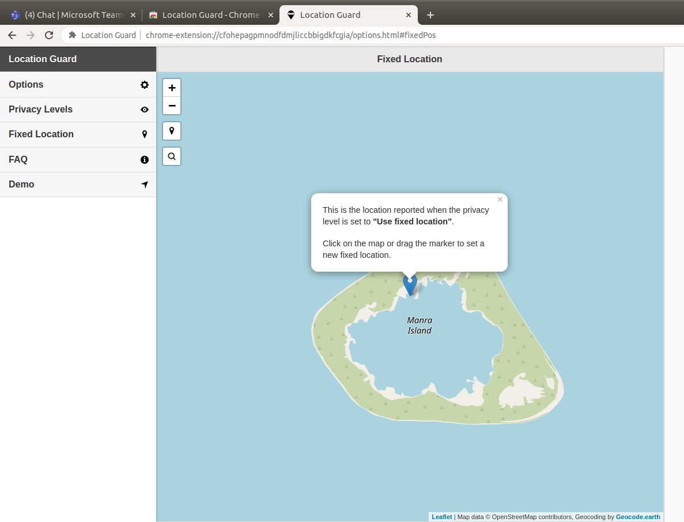

# Week 7 : Introduction to AR.js

## Introduction

This week we will start to look at how we can develop *augmented reality* applications in JavaScript, using the increasingly-popular *AR.js* library. Before we do so, we will take a look at the concepts of and *latitude and longitude*.

## Latitude and Longitude

In order to understand location-based applications, it is important
to understand the coordinate system used on the earth. The most common
coordinate system uses *latitude and longitude*. Latitude is a measure
of how far north or south you are: the equator is at 0 degrees,
while the North Pole is at 90 degrees North, we are at about 50 and Spain
is at about 40. Longitude is a measure of how far east or west you are:
0 degrees of longitude is referred to as the *Prime Meridian*
(or *Greenwich Meridian*) and passes through Greenwich, London. 
By contrast Germany is located
between approximately 7 degrees and 15 degrees East, while New York is at
74 degrees West and the west coast of North America at approximately 120
degrees West.


So a given point on the earth can be defined via its latitude and
longitude. The university is at, approximately, 50.9 North (latitude) and 1.4 West (longitude). By convention, latitudes north of the equator and longitudes
east of Greenwich are treated as positive, so we can also define our
position as **longitude -1.4, latitude +50.9**

### Obtaining your current position from JavaScript

It is possible to obtain your current position on the earth from JavaScript, using the Geolocation API. This is a standard JavaScript API which can be called from a browser without any additional libraries being needed. It usually makes use of GPS to get a location to within around 5 to 15 metres; however, if GPS is not available it will attempt to guess your location using either wifi networks or your IP address (but not always get it right). You can read more about this [on the WAD notes](https://nwcourses.github.io/wad/webmapping2.html); we will briefly cover it in class.

Using the Geolocation API you can, for example, show a map of your current location on a mobile device and use it to navigate. Web maps are again described [on WAD](https://nwcourses.github.io/wad/webmapping.html).

However, we will not be using the Geolocation API directly. This is because we can use AR.js to obtain our latitude and longitude without having to use the Geolocation API ourselves. The AR.js source code uses the Geolocation API to do this.

## Augmented reality

In the module introduction on SOL I have explained the concept of *augmented reality* but let's return to that now. Augmented reality is the *augmentation* of the real world by computer-generated content. A typical augmented reality application will run on a portable device such as a phone or tablet, and overlay the real world - as seen through the device's camera feed - with computer generated content, such as points of interest. Here is a video showing an augmented reality application:

<video src="https://hikar.org/video/hikarweb.mp4" width='600' height='800' controls></video>

This application - Hikar (available [here](https://hikar.org/webapp) - requires mobile device and may not work on certain browsers, I'd recommend Chrome on Android or Safari on iOS) has been written using AR.js so gives an impression of what can be achieved with web AR.

The type of AR that Hikar uses is *location-based* AR, In fact there are four main variants of AR:

- *Location-based* AR uses your location on earth (provided by GPS) together with the current orientation of the device (is it facing north, south, east or west, is it tilted and is it landscape or portrait?) to overlay geographical information, such as points of interest or roads and walking trails, on the camera feed. If you look at the Hikar video above, you can see that computer-generated roads and paths, are overlaid (more or less) on their real-world equivalents. Note that it is not a perfect fit - GPS is typically accurate to around 5-15 metres or so, and the device sensors, such as the compass and accelerometer, which are used to calculate the device's orientation, may not be completely accurate.

- *Marker-based* AR uses computer vision techniques to detect printed markers in the camera feed of the device. A typical example of a marker-based approach is shown in various AR demos in which a pattern is printed on a piece of paper and a computer-generated 3D model - often an animal in many demos - is overlaid accurately on the paper so that when the paper moves, the model also moves.

- *Natural feature tracking (NFT)*. This is similar to marker-based AR in the sense that it uses computer vision, but works with real-world images rather than markers. You can scan in an image that you later want to detect in AR. An example of this might be a painting, or image that will be used as a street advert. *Image descriptors* - points representing "interesting" features within the image, for example corners of shapes - will be created. Using these image descriptors you can develop an AR app which will detect that same image in the real world, so that, for example, if you point your phone at the same image that was originally used to create the descriptors, it will be detected and you can display AR content. This could be an augmented street advert in which 3D characters appear, or information about a painting in an art gallery.

- *Markerless augmented reality*. Markerless AR is the most sophisticated and advanced and can use sophisticated computer vision algorithms to detect flat surfaces within the camera feed. Thus, AR content such as models can be placed accurately and realistically on the ground without the need for markers or pre-scanned images as in marker-based and NFT approaches. A potential use of this approach is to improve the realism of location-based AR so that the augmented content does not appear to "float above the ground", as it does on the video above. Sadly the leading markerless approaches are proprietary, closed-source and often expensive software; there is little or nothing available yet in the open source world. Nonetheless this is an exciting research topic and something I am hoping to investigate personally.  Examples (proprietary) includie [ARCore](https://developers.google.com/ar/) on Android, [ARKit](https://developer.apple.com/augmented-reality/arkit/) on iOS, [8th Wall](https://8thwall.com), and [Wikitude](https://wikitude.com). 

We will primarily be focusing on location-based AR but will take a quick look at marker-based and NFT. AR.js supports all three.

You can read about AR.js [here](https://ar-js-org.github.io/AR.js-Docs/) and its GitHub repository is available [here](https://github.com/ar-js-org/AR.js).

## Location-based AR with AR.js

Note that much of this is based on the tutorial on the web [here](https://ar-js-org.github.io/AR.js-Docs/location-based-tutorial/). 

### Basic example 

We will start with a basic example, using pure HTML, to display a box close
to your location. 

```html
<html>
    <head>
        <title>AR.js Basic Projected Camera Example</title>
        <script src="https://aframe.io/releases/1.0.4/aframe.min.js"></script>
        <script src="https://raw.githack.com/AR-js-org/AR.js/master/aframe/build/aframe-ar-nft.js"></script>
        <!-- Look-at component. We don't need this now, but we will later. -->
        <script src="https://unpkg.com/aframe-look-at-component@0.8.0/dist/aframe-look-at-component.min.js"></script>
    </head>
    <body>
    <a-scene
        vr-mode-ui="enabled: false"
        arjs='sourceType: webcam; videoTexture: true; debugUIEnabled: false;'
        renderer='antialias: true; alpha: true'>
            <a-camera gps-projected-camera rotation-reader></a-camera>
            <a-box gps-projected-entity-place='latitude: near-your-lat; longitude: near-your-lon' material='color: red' scale='10 10 10'></a-box>
        </a-scene>
    </body>
</html>
```

Note that any application which obtains your GPS location muust be run on a server with HTTPS, or run locally on `localhost`. Make
sure you replace `near-your-lat` and `near-your-lon` with values close to your
actual position, or fake location (see below). To see the box clearly, I would recommend an offset of around 0.001 degrees in any direction for both the latitude and longitude. So if your latitude and longitude are 51.049 and -0.723, for example, I would recommend using values such as latitude=51.048, longitude=-0.724.

### How does this work?

- Note that our `<a-scene>` now has an `arjs` component (actually, it's not a component, strictly speaking, but a system: see [week 2](week2.html)).

- The `arjs` system of our `a-scene` initialises AR.js. Note the properties
we are setting: we set the `sourceType` to `webcam` to specify that our camera feed is coming from the webcam, and also set `videoTexture` to true. This is vital in an outdoor location-based AR app as it allows distant augmented content - such as mountain places - to be seen. (It does this by using a three.js texture for the camera feed which can be easily combined with our augmented content; if it is missed out, you will only be able to see content up to around 1 kilometre away).

- Note the `gps-projected-camera` component on our `a-camera`. This is the 
AR.js component which automatically converts latitudes and longitudes into 3D world coordinates, allowing us to use latitude and longitude, rather than world coordinates, when adding places.

- We then create an `a-box` primitive. This is the augmented content that we
want to display. Ordinarily, in A-Frame, you would give this a `position` in
world coordinates. However, AR.js, and specifically the `gps-projected-entity-place` component, allows us to position it using latitude and longitude. 
We can position *any* A-Frame entity at a given latitude and longitude using
`gps-projected-entity-place`.


### Faking your location

GPS signals can be unreliable indoors, depending on exactly where you are - if you're near a window in a less-urban area you will be OK, but away from windows and/or in cities you may have difficulty. Also, location can be wildly inaccurate on a desktop or laptop (rather than a mobile device), because it relies on wifi networks or IP addresses to get your location. For example at my home address it gives me a location more than 200 kilometres away. For this reason, if on a desktop/laptop you might want to **fake your location**. How can we do this? 

You can download the **Location Guard** extension for either [Firefox](https://addons.mozilla.org/en-US/firefox/addon/location-guard/) or [Chrome](https://chrome.google.com/webstore/detail/location-guard/cfohepagpmnodfdmjliccbbigdkfcgia). This will allow you to set a fake location for your browser, which will be reported when the Geolocation API is used in any application. (This also has the side-effect of hiding your real location from websites which may wish to gather this information for less-than-ethical purposes).



After you install, you will see a screen rather like the above. Select **Fixed Location**. This will give you a map which you can drag. Move to somewhere fairly urban in **Europe or Turkey**, so that places can be found - but not a very big city as there might be so much data (Southampton is OK, London is not) - and ideally, not your real location, for privacy reasons. Note that you should choose somewhere which uses the Roman alphabet (ABCDE etc), rather than Greek or Cyrillic for example - unless you install a custom font, see [Week 5](week5.html).

Then, once you have chosen a fake location, select Options and then choose "Use fixed location" for "Default level", as shown below.


### Exercise 1 

Start with the example above, changing the specified latitude and longitude to points close to your actual - or faked - location, as described above. Use a phone or tablet if you have your own web hosting space and have a good GPS signal, or a fake location on a desktop or laptop. On a desktop or laptop you will have to emulate moving the phone around by dragging the mouse left or right, in the same way as a regular A-Frame scene.

Note that Location Guard does not give numerical values for your position. However, I have added some code to this page which gets it as numerical values. Your current position (real or fake) is:

<div id='position'></div>

On a desktop or laptop you will need to create a local server with `npx ws`, as we did in Week 1, or use Apache if you have that installed locally. Do not try to run it without a web server, it will be blocked!

If you want to use your phone and do not have your own hosting space, you can use GitHub Pages to host static HTML and JavaScript content. See [here](https://pages.github.com/) for details on how to set it up. The idea is that you keep your work in a GitHub repository, and then commit changes locally and push to GitHub Pages. The changes will be visible on the web using your GitHub Pages URL.


- Change the `a-box` to some other kind of A-Frame primitive, such as an
`a-sphere` or `a-cylinder`. Does it still work?

- Try adding multiple objects with different colours at different locations.

- Try adding a text primitive at a nearby latitude and longitude. Use the
location-based example on the [index.page](index.md) to help you. You will
need to use the A-Frame `look-at` component to ensure the text always 
faces the camera, e.g this code will always look at the entity with a `gps-projected-camera` component attached to it, in other words the camera.
```
<a-entity look-at='[gps-projected-camera]' gps-entity-place=....></a-entity>
```

- Try giving your objects an elevation. This can be done by setting the
`y` coordinate of the `position` property to a given height (in metres), with `x` and `z` set to 0. **An important point is that one unit in A-Frame (or three.js) equals one metre in augmented reality. So if you set the `y` coordinate of an entity to a given value, it will be that number of metres above the ground.**

- Having done that, try giving the *camera* an elevation by similarly setting the `position` property, and look at the effect this has on where the objects appear.


### Introducing JavaScript with AR.js

Much of the power of A-Frame, and AR.js, comes from adding scripting to your
basic applications. You will already know the basics of how
to create components in A-Frame, but let's start with a refresher. Create
this file, `placefinder.js`:

```javascript
AFRAME.registerComponent('placefinder', {
    init: function() {
        alert('Place finder component initialising!');
    }
});
```

and link to it from your HTML by adding, in the head section after the
A-Frame and AR.js scripts:

```html
<script type='text/javascript' src='placefinder.js'></script>
```

Also add a new entity to your scene and add this component to it:

```html
<a-entity placefinder></a-entity>
```

Load your page again. You should see the alert box come up. Remember from
basic A-Frame that to create a component, you need to register it as in the
example above. Remember also that the `init()` function runs when the component
is first initialised, and you add components to entities by making them
attributes of the `<a-entity>` tag.

### Connecting to a web API

Now we've got a basic component set up, we are going to make it do something:
connect to a web API to retrieve the locations of nearby places - with our
eventual aim of making a placefinder app. There are various APIs which can
be used, but we will use one which is based on [OpenStreetMap](https://openstreetmap.org) data. This API is present on the [Hikar](https://hikar.org) web server and delivers the place data as GeoJSON, but only covers Europe, Turkey and Washington State, USA, due to server capacity constraints. (If you are currently not located in these areas, please use a fake location which is).

Modify your code as follows:

```javascript
AFRAME.registerComponent('placefinder', {
    init: function() {
        this.loaded = false;
        window.addEventListener('gps-camera-update-position', e => {
            if(this.loaded === false) {
                this.loaded = true;
                alert(`Your initial location is: ${e.detail.position.longitude} ${e.detail.position.latitude}`);
            }
        });
    }
});
```

What is this doing? We are listening for the `gps-camera-update-position` event. This is emitted by `gps-projected-camera` whenever our GPS location changes. The detail of the event contains a `position` object with `longitude` and `latitude` properties which contain our current position. For the moment, we just display an `alert` showing our current location, but later we will contact a web API to download the data we're interested in.

Note also the `loaded` boolean. This is used to prevent the code being run *every time the position changes*. which will clearly result in unnecessary network communication. 

#### Adding a place from JavaScript

We've seen how to add our `gps-projected-entity-place` components from within HTML, but what about from within JavaScript? You can use the same DOM-based techniques that you used with A-Frame without AR.js. For example:
```
const entity = document.createElement('a-box');

entity.setAttribute('material', {
    color: 'red'
});

entity.setAttribute('gps-projected-entity-place', {
    latitude: 51.048,
    longitude: -0.724
});
```
Add this code to your example. Be careful to choose latitude and longitude
near your location (real or fake)!

#### Connecting to a web API

Next, we will connect to a web API to download places. The web API is on the server `hikar.org` and can be downloaded using `fetch()` e.g.
```
const response = await fetch(`https://www.hikar.org/fm/ws/bsvr.php?bbox=${longitude-0.1},${latitude-0.1},${longitude+0.1},${latitude+0.1}&outProj=4326&format=json&poi=place`);
```
where `longitude` and `latitude` are our current longitude and latitude. What we are doing here is downloading data within a box, 0.2 degrees by 0.2 degrees, with our current position in the centre. This will download data a few kilometres around you so that you will be able to see places in AR.


### GeoJSON

What format does this API return? It returns a specific JSON format known as *GeoJSON* (see [geojson.org](https://geojson.org)). GeoJSON is designed to represent geographic data in a standard way.

<p>GeoJSON consists of a series of objects. These are:
    <ul>
    <li><em>Features</em>: a feature represents a geographical feature, such
    as a road, a path, a pub or a restaurant. Each feature has a 
    <em>geometry</em> (see below) and a series of <em>properties</em>.</li>
    <li><em>Geometries</em>: a geometry is the representation of the 
    <em>shape</em> of the feature. For a point of interest, this would simply
    be a point (defined by latitude and longitude); for a more complex feature
    such as a road, a path or the outline of a building, it would be a series of
    points making up either a <em>LineString</em> (a linear series of points)
    or a <em>Polygon</em> (a series of points arranged in a loop). LineStrings
    would typically represent linear features such as roads or paths, while
    Polygons would represent features such as lakes, buildings or woods.</li>
    <li>a <em>FeatureCollection</em> is, as the name implies, a collection of
    features.</li>
    </ul>
</p>
<p>Here is an example of some GeoJSON.
<pre>
{
    type: "FeatureCollection":
    features:
    [
        {
            type: "Feature",
            geometry:
            {
                type: "Point",
                coordinates: [-0.72, 51.05]    
            },
            properties:
            {
                poiType: "pub",
                name: "The Red Lion"
            }    
        },
        
        {
            type: "Feature",
            geometry:
            {
                type: "Point",
                coordinates: [-0.9, 51.1]
            },
            properties:
            {
                poiType: "restaurant",
                name: "Sams Burger Joint"
            }
        },

        {
            type: "Feature",
            geometry:
            {
                type: "LineString",
                coordinates: [
                    [-1, 51],
                    [-1.01, 50.99],
                    [-1.01, 50.98],
                    [-1.02, 50.97],
                    [-1.04, 50.96]
                        ]
            },
            properties:
            {
                poiType: "main road",
                number: "A987",
                name: "High Street"
            }
        }
    ]
}
</pre>
Note how this GeoJSON consists of a <em>FeatureCollection</em>. The
FeatureCollection in turn contains an array of <em>Feature</em> objects,
each of which contains three fields:
    <ul>
    <li>The <em>type</em>. This is just 'Feature', so that any client 
    application reading this GeoJSON is able to recognise that it's a
    feature;</li>
    <li>The <em>geometry</em>. This represents the actual points making up
    the feature. The geometry in turn has two fields, the <em>type</em>
    (e.g. Point, LineString, Polygon) and the <em>coordinates</em>. For
    a <em>Point</em>, the coordinates is simply an array with two members,
     the longitude and latitude respectively. For a <em>LineString</em>, the
    coordinates consists of an array of points, where each 
    point is itself a two-member array containing longitude and latitude.
    In other words, it is an array of arrays.</li>
    <li>The <em>properties</em>. This is a collection of variable/value
    pairs representing properties of the feature. In the road example
    above, there are three properties, the <em>poiType</em> (main road),  
    <em>number</em> (A987) and <em>name</em> (High Street). Note that these
    are not keywords: you are free to choose the property names yourself.</li>
    </ul>
</p>

<p>So, to parse this GeoJSON from JavaScript, you could use code such as:
<pre>
const response = await fetch('GeoJSON API');
const json = await response.json();
json.features.forEach ( feature => {
    console.log(`Name: ${feature.properties.name}`);
    if(feature.geometry.type == 'Point') {
        console.log(`Longitude: ${feature.geometry.coordinates[0]}, latitude: ${feature.geometry.coordinates[1]}`);
    }
});
</pre>

### Exercise 2

Now write code to parse the GeoJSON returned from the web API. The approach will be the same as when you parsed the JSON from the simple API in weeks 4 and 5, but the structure of the JSON is different.

The GeoJSON will have a format such as that below:
```
{"features":[
    {
        "type":"Feature",
        "properties":
            { 
                "osm_id":"262739",
                 "name":"Fernhurst",
                "place":"village"
            },
        "geometry":
            {
                "type":"Point",
                "coordinates": [-0.723310099899314,51.0481924947881]
            },
    },
    
    {
         "type":"Feature",
         "properties":
            {
                "osm_id":"262695",
                 "name":"Marley Common",
                 "place":"locality"
            },
          "geometry":
            {
                "type":"Point",
                 "coordinates": [-0.733907899897839,51.0736049947875]
            }
    },
  
    {    
        "type":"Feature",
         "properties":
            {
                "osm_id":"262742",
                 "name":"Kingsley Green",
                 "place":"hamlet"
            },
          "geometry":
            {
                "type":"Point",
                 "coordinates": [-0.723330999899311,51.0675999947876]
            }
    }
 ], 
 "type": "FeatureCollection"
}
```

For each place returned from the GeoJSON (all will have a `Point` geometry), create an `<a-entity>` with:
- a `text` component containing the place name;
- a `look-at` component. This should look at `[gps-projected-camera]` (the element containing a `gps-projected-camera` component, i.e the camera)
- a `scale` of 1000, this will make the text appear large enough. If too large (e.g you are very close to a given place) then try reducing the scale.
- a `gps-projected-entity-place` component containing the latitude and longitude from the GeoJSON.

*** !!! IMPORTANT !!! """

You will need to make your event listener an `async` function so that you can use `await` within it. For example:
```
window.addEventListener('gps-camera-update-position', async (e) => {
    // do your code to connect to the web API and generate the augmented content
});
```
#### Further things to try

- Rather than hard-coding the scale at 1000, add it as a property using the component's schema, and experiment with different values by setting the property in your HTML.

- Create a compound entity for each AR location, containing both a sphere of radius 150 metres and text. The text should appear 300 metres above the sphere. The text itself should be scaled by a factor of 1500.

<script type='text/javascript' src='week7.js'></script>
