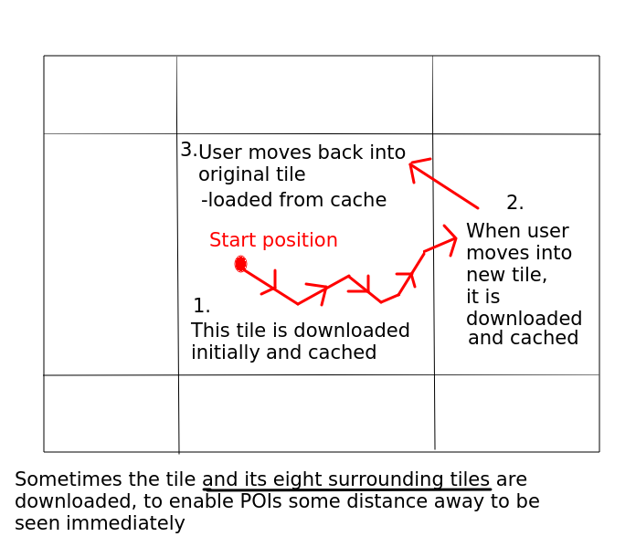

# Week 8 - Further AR.js: NFT, Tiling, Elevation

## Introduction

This is a relatively "light" week to allow you to catch up with previous weeks if necessary, as Week 6 and Week 7 had a lot of content. We will cover a few additional AR-related topics this week; first of all a taster of NFT (Natural Feature Tracking) and secondly the technique of *tiling* which allow you to efficiently download data to be used in an AR application. We will also look at how we can account for *elevation*.

I would recommend that you finish previous weeks before attempting this week's work.

## Natural feature tracking

We will just take a quick look this week at Natural Feature Tracking in AR.js.
As I indicated last week, Natural Feature Tracking allows an image to be scanned with numerical data - known as *descriptors* - extracted from the image which can be used to later recognise it.


Natural Feature Tracking allows an image to be scanned with numerical data - known as *descriptors* - extracted from the image which can be used to later recognise it.

See the documentation [here](https://ar-js-org.github.io/AR.js-Docs/image-tracking/).

There are two steps:
- Use a command line tool to extract the descriptors. This is available on [GitHub](https://github.com/Carnaux/NFT-Marker-Creator).
- Use AR.js with NFT to later detect the image by scanning it with your phone camera.

An image of a T-Rex has been prepared by the AR.js developers and is available [here](https://raw.githubusercontent.com/AR-js-org/AR.js/master/aframe/examples/image-tracking/nft/trex-image-big.jpeg). Try scanning this image by visiting [this link](https://hikar.org/nft/t-rex.html). You should find - hopefully - that a T-Rex model appears whenever the image is detected by your phone.

The NFT feature of AR.js is based on the [jsartoolkit](https://github.com/artoolkitx/jsartoolkit5) library. This is a port of the C++ based ARToolkit library to the web, and is a lower-level library for performing marker- and NFT-based AR.

The image has to be high quality and high resolution with many unique features to be successfully detected. See the [AR.js docs]( https://ar-js-org.github.io/AR.js-Docs/image-tracking/) for details.

Here is an example of how NFT can be integrated into an A-Frame application. This example has been taken from the example from the [AR.js Docs](https://ar-js-org.github.io/AR.js-Docs/).

```
 <a-nft
      type="nft"
      url="/nft/trex/trex-image/trex"
      smooth="true"
      smoothCount="10"
      smoothTolerance=".01"
      smoothThreshold="5"
    >
    <!--Had to rotate about x-axis to get the T-Rex to appear as intended-->
      <a-entity
        gltf-model="/nft/trex/scene.gltf"
        scale="5 5 5"
        position="50 150 0"
        rotation="-90 0 0"
      >
      </a-entity>
</a-nft>
```
Note how we specify an `<a-nft>` entity to add a Natural Feature Tracking entity to our page. It has a `url` property which should point to the location of the descriptors created by the command-line tool, above. The URL in the above example is a relative URL, in other words it will be at path `/nft/trex/trex-image/trex` on the current server. The command-line tool outputs three files, with extensions `.fset`, `.fset3` and `.iset`. They will have a common name with different extensions e.g. `trex.fset`, `trex.fset3` and `trex.iset`; it is this name minus the extensions that you have to specify here, i.e. `trex`. So here, these three descriptor files will be within the `/nft/trex/trex-image` directory on the current server. 
 
Note the "smoothing" parameters to the `<a-nft>` entity. These prevent the model making sudden "jerky" movements - more details are given in the [documentation](https://ar-js-org.github.io/AR.js-Docs/image-tracking/).

We then place an `<a-entity>` within our `<a-nft>` to represent the model itself. In this example, it's a GLTF model called `scene-gltf` within the `/nft/trex` directory on our server; we could alternatively place it within our `<a-assets>`. We add a `scale`, a `position` and a `rotation` to make it appear where we want it (in my test it appeared on the laptop keyboard when I was scanning the image in using the phone).  (I found that on my device I had to rotate the T-Rex model by 90 degrees clockwise around the X-axis compared to the example given in the documentation).

## Tiled data and elevation

### Using tiling in AR.js apps

(Please note, most of the following was taken directly from [the AR.js peakfinder tutorial](https://ar-js-org.github.io/AR.js-Docs/location-based-tutorial/) and modified slightly. This tutorial was created by myself.)

In the examples last week, we downloaded points of interest from our AR.js
application once, when we got the location for the first time. Obviously it
would be better if we could *continuously* download data as we move from place
to place, so that we get data local to our area if we travel around. So, for example, places within 10km of us are downloaded when we srart the app, and then, as we reach the edge of the already-downloaded area, new places are downloaded.

This approach is known as *tiling*. A *tile* is a rectangular, often square, area of the earth containing geographical data. When we start the application, the local tile - representing our current area - is downloaded, and cached on the device so that next time we visit the area we don't need to download again. Then, when we move to another area, a new tile is downoloaded and again cached. If we return to the original area, we load the data from the cache rather than over the internet.

This is shown below. Sometimes, to enable us to see points of interest some distance away if we are near the edge of a tile, the current tile *and the eight surrounding tiles* are downloaded.



It would be also nice to consider the *elevation* of points of interest when we show them, so that, for example, a mountain peak is displayed in its correct
place on the top of the mountain rather than at the base of the mountain.

These issues provide much of the complexity of a location-based AR app. Luckily, though, a pre-built solution to both problems exists. One of the great things about A-Frame is the fact that there are *many pre-built components which can be added to our app*, and two pre-built components exist for this precise problem: `terrarium-dem` and `osm3d`, both part of the [aframe-osm-3d](https://github.com/nickw1/aframe-osm-3d) package.

#### How the aframe-osm-3d components work

- `terrarium-dem` downloads Digital Elevation Model (DEM) elevation data for a given location. DEM data consists of elevation (height) data at closely-spaced points on the Earth, in a grid. This data was based on NASA SRTM data, and was converted into the Terrarium PNG format by the former mapping company Mapzen (see [original article](https://www.mapzen.com/blog/terrain-tile-service/)). As discussed in this article, elevation is encoded in the red, green, and blue channels of a PNG image, and is now available, without usage restrictions, on [AWS](https://registry.opendata.aws/terrain-tiles/). The raw elevation data is emitted within an event (see below) and optionally, the terrain is rendered as a 3D mesh.

- `osm3d` is used to download OSM data from a GeoJSON data structure in 3D, in other words, the coordinates of the OSM features contain not just latitude and longitude, but elevation in metres. The elevation is obtained from the DEM emitted from `terrarium-dem`, above; `osm3d` automatically listens for the `terrarium-dem-loaded` event emitted from `terrarium-dem` and uses the DEM to calculate the elevation.

You can find out how these components work in more detail by visiting their [GitHub repository](https://github.com/nickw1/aframe-osm-3d).


### Tiling coordinate systems

The `aframe-osm-3d` components discussed above both work using a tiling system with *coordinates*. Regions of the world are split up into *tiles*, using the "XYZ" or "Google" tiling system, which you can read about in more detail [on the WAD notes](/course/wad/webmapping.html) and [here](https://developers.google.com/maps/documentation/javascript/coordinates) The general idea is that each tile is defined by an X, a Y, and a Z coordinate, in which:

- X represents the tile's coordinate on a west-east axis; 
- Y represents the tile's coordinate on a north-south axis; 
- Z represents the tile's zoom level, discussed in more detail in the link above.

`terrarium-dem` reads in a given longitude and latitude, and downloads the current XYZ elevation tile at a given zoom level, *and* the eight surrounding tiles (nine in total). These tiles are internally cached by `terrarium-dem` so that if a nearby location is requested, and the user hasn't moved to a different tile, the cached data will be used, avoiding unnecessary downloads. Also, when tiles are downloaded, they are emitted within the `terrarium-dem-loaded` event, which the `osm3d` component responds to by downloading the corresponding tiles from an OSM web API, calculating the OSM data's elevation using the DEM, and again caching and emitting the result.

### The code - building a peakfinder app

With that in mind, we will develop a simple peak finder application which makes use of `terrarium-dem` and `osm3d`. What is a peak finder? Well, have you ever stood on a hill or mountain and wondered what other mountains you're looking at? A peak finder is an app which allows you to answer that by pointing your phone at mountain peaks and the name of the peak will be displayed in AR. 

The app will download elevation and OSM data to create peaks with elevations. We will start with the HTML:

```html
<!DOCTYPE html>
<html>
<head>
<meta charset="utf-8" />
<title>AR.js Peak Finder</title>
<script src="https://aframe.io/releases/1.0.4/aframe.min.js"></script>
<script src="https://unpkg.com/aframe-look-at-component@0.8.0/dist/aframe-look-at-component.min.js"></script>
<script src="https://raw.githack.com/AR-js-org/AR.js/master/aframe/build/aframe-ar-nft.js"></script>
<script src="dist/main.js"></script>
</head>
<body>
    <a-scene
        vr-mode-ui="enabled: false"
        arjs='sourceType: webcam; videoTexture: true; debugUIEnabled: false;'>
    <a-camera gps-projected-camera rotation-reader></a-camera>
    <a-entity terrarium-dem='zoom: 12; url: https://hikar.org/webapp/proxy.php?x={x}&y={y}&z={z}' osm3d='url: https://hikar.org/fm/ws/tsvr.php?x={x}&y={y}&z={z}&amp;poi=natural&amp;outProj=4326' peakfinder></a-entity>
</a-scene>
</body>
</html>
```

What's new here?

- Note that we are linking in our JavaScript (which we will come to shortly) as a *bundle*. As we saw in week 1, this is a great way of developing code which relies on third-party modules without having to link multiple JS files, and we will expand upon this below. The bundle here is in `dist/main.js`; this is the default Webpack output, see below.
- Note how our custom entity now has some additional components: the `terrarium-dem` and `osm3d` components which we discussed above. Note how each component has a `url` property defining the source URL to download the data.
- Note also how we set the `zoom` to 12 for `terrarium-dem`. This will use the zoom level of 12 for our tiles, which means that places several kilometres away in every direction will be downloaded on startup.

You'll notice that the `url` property for `terrarium-dem` is not an AWS URL but rather a URL on hikar.org, `proxy.php`. Why is this? Due to the [same-origin-policy](https://developer.mozilla.org/en-US/docs/Web/Security/Same-origin_policy) we cannot contact AWS directly via AJAX, so we need to create a proxy script to do it for us. 

For the OSM URL (on `hikar.org`), we do not need a proxy as this script has [CORS](https://developer.mozilla.org/en-US/docs/Web/HTTP/CORS) enabled by default.

We can now move on to our JavaScript. First of all you need to import the `aframe-osm-3d` module (see below for installation details):
```
import 'aframe-osm-3d'
```
The `init()` function in your `placefinder` component should be altered as follows. Note that we are now writing a `peakfinder`, not a `placefinder`. The only difference between the `placefinder` from last week and the `peakfinder` from this in terms of data downloaded is that we are asking the web API for peaks, rather than places.
```javascript
AFRAME.registerComponent('peakfinder', {

    init: function() {

        // Handle a GPS update ...
        window.addEventListener('gps-camera-update-position', e => {
            // Set the 'lat' and 'lon' attributes of the 'terrarium-dem'
            // component to our current latitude and longitude. This will
            // trigger a chain reaction of downloading first the DEM data, and
            // then the OSM data
            this.el.setAttribute('terrarium-dem', {
                lat: e.detail.position.latitude,
                lon: e.detail.position.longitude 
            })
        });

        // This event will fire when the elevation of our current location is available from the DEM.
        this.el.addEventListener('elevation-available', e => {
            // Imagine that 'camera' is our camera (see last week for how to obtain the camera)
            camera.object3D.position.y = e.detail.elevation + 1.6;
        });

        // This event will fire when the OSM data has been downloaded.
        this.el.addEventListener('osm-data-loaded', e => {
            // e.detail.pois contains GeoJSON data, as for last week.
            e.detail.pois
                .filter ( poi => poi.properties.natural == 'peak')
                .forEach ( peak => {
                    // Parse the GeoJSON, as for last week, and create an entity
                    // from it: ... for you to do ...

                    // set the elevation of the entity. This will be contained
                    // within the GeoJSON geometry's 'coordinates' array, as the
                    // third member. Units are in metres.
                    // To do this set the y of the element's position to this
                    // value from the GeoJSON.

                    // Add the entity to the scene as for last week ...
            });
        });
    }
});
```

How does this work?

- We start by *import*ing the `aframe-osm-3d` package. We have looked at importing packages already, in Week 1. This is a package available on [NPM](https://npmjs.com), and as we have seen, contains the `terrarium-dem` and `osm3d` components.

- Our `init()`. This works a bit differently this time:
    - We once again handle the `gps-camera-update-position` event, but this time we pass the latitude and longitude onto our `terrarium-dem` component. As we saw above, this will download the local tiles for this position.
    - We next handle the `elevation-available` event, which is emitted from our `terrarium-dem` component as soon as we have elevation available for our current position. The current elevation is contained in the emitted event; we handle it by setting the camera's `y` coordinate to that elevation plus 1.6 (to account for the fact that a user will be holding the device above the ground).
    - We then handle the `osm-data-loaded` event. This will be emitted from `osm3d` whenever new data has been downloaded from the OSM API and elevation added. This event contains various properties, but we will use the `pois` property which is an array of GeoJSON features, one for each POI. We filter these to only select peaks.
    - We then create one entity per place, as before. We ensure the entity is looking at the camera, and then create the text as per last week.
    - Note how, once we have set the latitude and longitude with `gps-projected-entity-place`, we **set the elevation** of each peak entity. We do this using the third member of the `coordinates` array contained within the GeoJSON, which will contain the peak's elevation in metres.

We now need to *build* the application, as we did in week 1. First 
install the `aframe-osm-3d` package with NPM (included with [Node.js](https://nodejs.org)).
```
npm install aframe-osm-3d
```
Next, we need to create a *bundle* with Webpack, again as done in Week 1.
```
npx webpack peakfinder.js
```
(assuming that you saved your peakfinder component as `peakfinder.js`).

The output, by default, will be in `dist/main.js`.

And that is it! Try it out and see if it works. For a good test, try somewhere
reasonably mountainous as your fake location. For instance:
- Grasmere, Cumbria, England
- Garmisch-Partenkirchen, Bavaria, Germany
- Mayrhofen, Tirol, Austria
- Somewhere else mountainous that you know of...


### Exercise

Implement the peakfinder, using the code above to get you started and the code from last week to parse the GeoJSON and create entities from it.

- Initially just show the peak name as text. Set the text scale to 1500.
- Next, create a compound entity for each peak containing two sub-entities: a text entity for the name and a cone (`<a-cone>`) for a graphic showing the peak. The compound entity should be placed at the peak's elevation. The text entity should once again have a scale of 1500 and be placed 300 metres above the
peak's elevation. The cone entity should have a scale of 150, a `height` of 3, a `radiusTop` of 0.1 and a `magenta` material colour.

#### Further things to try

It would be nice to show users status messages as the places are downloading. You can do this by handling a couple of other events:

- `terrarium-start-update` is emitted when we start to download new DEM data.
- `terrarium-dem-loaded`, as we have already seen, is emitted when DEM data has finished downloading.

Adapt your example to include a `<div>` which displays a status message. (You can make a `<div>` a child of your `<a-scene>`). Display "Downloading elevation data..." while it's downloading the DEM data, and then "Downloading OSM data" when the DEM download has finished. Finally, when the OSM data has loaded, set the `<div>`'s contents to a blank string. 

## One or two other things

There are one or two other things regarding A-Frame that we have not covered
yet, but are important - the *component lifecycle* and *emitting events*.

### Component lifecycle

We have considered `init()` and `tick()` methods of an A-Frame component, but
there are also other methods which can be important.

See [the A-Frame documentation](https://aframe.io/docs/1.0.0/core/component.html)

#### The update() method

The `update()` method is a key lifecycle method. It is fired whenever *you update the properties of an A-Frame component* and also *on initialisation, after init()*. For example, the code below updates the `velocity` property of the component `my-component`.
```
this.el.setAttribute('my-component', {
    velocity: 2
});
```
This would trigger the `update()` method of the `my-component` component.
In an `update()` method of a component, you would handle any changes that
need to be made as a result of the properties being updated. Note that the `update()` method has an `oldData` parameter containing the old values of the component's properties, so that you can compare the old and new data. (The new data will be accessible via `this.data`). So you can use code such as this:
```
AFRAME.registerComponent('my-component', {
    schema: {
        velocity: {
            type: 'int',
            default: 1
        },
    },

    init: function() {
        // ...
    },

    update: function(oldData) {
        // if the new velocity is not the same as the old velocity...    
        if (this.data.velocity != oldData.velocity) {
            // add code to handle the velocity changing...
        }
    }
});
```

#### Other methods 

Other lifecycle methods include:

- `pause()`: when the component 'pauses' e.g. when the scene is no longer visible. Can be used to stop such things as animations, or an enemy moving towards the player, when the scene is no longer visible. 
- `play()`: when the component 'resumes' e.g. when the scene becomes visible again. Can be used to resume animations, or enemy movement, when the scene resumes.
- `remove()`: when the component is removed, for example it's removed from an entity using DOM function calls. Used to clean up resources which are no longer needed when the component is not present.

### Events

We have seen examples of *event handlers* to handle different types of event, however how do we generate events in the first place? In fact, A-Frame uses standard DOM techniques for generating events. To generate an event, it's *emitted* from a specific entity. For example, the `elevation-available` event is emitted from `terrarium-dem` whenever the elevation is available. We handled this event in the peakfinder example. the code to generate this event might look like this:
```
this.el.emit('elevation-available', {
    elevation: // ... some elevation value ... 
}); 
```
Note how `emit()` takes two arguments, the *event name* (`elevation-available` here) and the *data* to pass through the event, which is a JavaScript object. In this example, the JavaScript object contains just one property, `elevation`, but it could potentially contain more. This data can then be retrieved later in the event handler using `e.detail`, where `e` is the event object. So in this example we would use `e.detail.elevation` to retrieve the elevation - as we saw in our peakfinder app, above.

To handle the event we attach an event listener to the entity which originally
emitted the event, so that when we handle the event with code such as:
```
this.el.addEventListener('elevation-available', e => {
    // do something with e.detail.elevation
});
```
then `this.el` would need to be the parent entity of the `terrarium-dem`
component, because the event was emitted from within `terrarium-dem` and therefore when we emit the event `this.el` would be te parent entity of `terrarium-dem`. (In our peakfinder, this is easy if the `peakfinder` component
is attached to the same entity as `terrarium-dem`).
