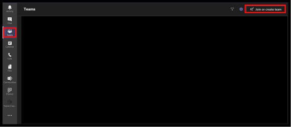

# Lecture (Start Here)

Most weeks I will be setting some on-demand videos that you should try and watch before your practical.

## Get started with teams

While there will be no live teams sessions, we will be using it to host in-class discussion:

Open teams and select “Teams” from the sidebar. Next, click join or create a team and enter this join code (mf0yfuz). You are now a member of our module team.

## Introduction to Module

First, you should ensure that you are aware of what the module is and what is required from you. Please take some time to watch the module introductory videos.

### Assessment Videos

#### Assessment 1

<iframe src="https://solent.cloud.panopto.eu/Panopto/Pages/Embed.aspx?id=de419b6d-604f-456b-b2ec-adac00d1e648&autoplay=false&offerviewer=true&showtitle=true&showbrand=true&captions=true&interactivity=all" height="405" width="720" style="border: 1px solid #464646;" allowfullscreen allow="autoplay"></iframe>

#### Assessment 2

<iframe src="https://solent.cloud.panopto.eu/Panopto/Pages/Embed.aspx?id=752fa121-1233-4c6a-8a4a-adac00d1e61b&autoplay=false&offerviewer=true&showtitle=true&showbrand=false&captions=true&interactivity=all" height="405" width="720" style="border: 1px solid #464646;" allowfullscreen allow="autoplay"></iframe>

## Weekly Introduction

Please watch the weekly introduction:

<iframe src="https://solent.cloud.panopto.eu/Panopto/Pages/Embed.aspx?id=eac06dd3-4f6d-4f91-9de8-ac46013224e0&autoplay=false&offerviewer=true&showtitle=true&showbrand=false&start=0&interactivity=all" height="405" width="720" style="border: 1px solid #464646;" allowfullscreen allow="autoplay"></iframe>
