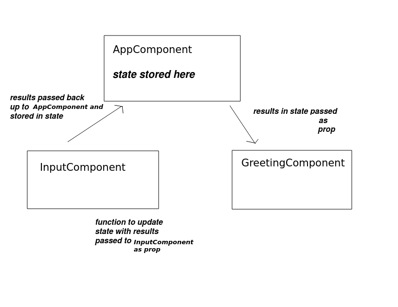

## Week 3 - More on State

Last week you were introduced to React *state*, however there is more to look at. Some of this was covered in COM518 last year, however not all of you studied COM518 so it will be covered now.

### Implementing an onChange() event handler

Consider this new version of the `InteractiveGreeting` example from last week. As well as displaying the name in the `div` it also displays it in the input box.

```javascript
import React from 'react';

function InteractiveGreeting() {

    const [name,setName] = React.useState("No name");

    return(
        <div>
        <h2>Enter your name</h2>
        <input id='txtName' type='text' value={name} />
        <div id='hello'>Hello {name}</div>
        <input type='button' value='update' onClick={updateStateName} />
        </div>
    );

    function updateStateName() {
        setName(document.getElementById('txtName').value);
    }
}

export default InteractiveGreeting;

```

If you try this out, you'll notice that it is impossible to change the text in the text field. Why is this? The text field is tightly bound to the `name` property of the state, so unless the state changes, the text field will not change. More generally, any element within the component which references the state is tightly bound to the state and will not change unless the state changes. To implement an editable text field, you need to implement an `onChange()` event handler on the text field to update the state. The next example shows this:

```javascript
import React from 'react';

function InteractiveGreeting() {

    const [name,setName] = React.useState("No name");

    return(
        <div>
        <h2>Enter your name</h2>
        <input id='txtName' type='text' value={name} onChange={updateStateName} />
        <div id='hello'>Hello {name}</div>
        <input type='button' value='update' onClick={updateStateName} />
        </div>
    );

    function updateStateName() {
        setName(document.getElementById('txtName').value);
    }
}

export default InteractiveGreeting; 
```

Note how the text field now has an `onChange` event handler, which is the `updateStateName()` function of the component. In `updateStateName()` we use the `setName()` method, remember that when we create the hook we obtain a series of variables, the state variable and a setter to update the state with.

Note that you must use the setter method to update the state; do not modify the state variable directly.


## Displaying lists in React

Often you will have to iterate over some data structures, like the one above, to construct your React views, this is very easy to achieve in JSX.

```js
....
function ListComponent() 
{
    const numbers = [1, 2, 3, 4, 5];
    const numbersList =  numbers.map(number => (
          <li key={number.toString()}>{number}</li>
    );
    return <ul>{numbersList}</ul>;
}
....
```

[We can simply use an array map function (see above) to render array structured data into our views](https://developer.mozilla.org/en-US/docs/Web/JavaScript/Reference/Global_Objects/Array/map). 

Here we are mapping an array of numbers into an array of `<li>` list items containing the number. This mapped array is stored in the variable `numbersList`. We are then returning a `<ul>` containing the list items from the component.

Note also how each list item has a unique key, equal to the current number.  React uses this to keep track of which item in the list is which, if items in the list are modified or deleted. We don't do this here, but nonetheless you should always give items in a rendered list of items a unique key.

## Larger Example - To Do List

The next example combines the discussion on state (last week) with the discussion on loops and arrays above, to implement a To Do list component by storing an array of tasks in state.

```javascript
import React from 'react';

let taskId = 1;

function TodoComponent({title}) {
    const [todo, setTodo] = React.useState([]);


    const todoHtml = todo.map ( task => <li key={task.id}>{task.name}</li>);

    return (
            <div>

            <h1>{title || 'My Todo List'}</h1>

            <div>
            <h2>Add something to your todo list</h2>
            <fieldset>
            <input type='text' id='task' />
            <input type='button' id='btn1' value='Go!' onClick={addTask} />
            </fieldset>
            </div>

            Here is your todo list:
            <ul>
            {todoHtml}
            </ul>

            </div>
        );


    function addTask() {
        const tasks = structuredClone(todo);
        const newTask = {
            id: taskId++,
            name: document.getElementById('task').value
        };
        tasks.push(newTask);
        setTodo(tasks);
    }
}

export default TodoComponent;
```


This is quite a bit more complex.

Note how we:

- Implement a method to add an task to the todo, `addTask()`. This runs when the user clicks the "add task" button. 
    - In here we make a clone of the todo state object with `structuredClone()` (we cannot add directly to an array stored in state, we must make a clone, add to that, and reset the state to the clone). 
    - We then create an object for the new task (`newTask`), containing fields for its ID and its name. The former is an auto-incrementing integer, the latter is what the user entered. 
    - We then add the task to the clone of the todo (`tasks.push(newTask)`), before updating the todo variable in the state to the clone (with the new task added) with `setTodo()`.

- Use the `map()` method of todo to convert it to an array of JSX, ready for rendering, as in the last example. Each todo task is converted to an HTML list item (`li`), containing the task's name. 

## Components containing other components, and sharing state ("lifting state up")

More complex components will contain **sub-components**. For example, imagine an extended version of the todo list in which there are **two React components**, one for adding a task, and one for showing the list of tasks. 

Why would you want to do this? You might want to use the component containing the todo list in *another application*, where the tasks are loaded in from the web rather than input by the user, for example. Or you might want the "input task" component to connect to a database and store the tasks in a database, rather than displaying them immediately. 

So by separating out the component into smaller, separate components, it makes each component *reusable* in different situations, and you can use one component without the other.

What you are probably asking is: how can the contents of the first sub-component (the input task) be passed to the second (the list of tasks)? The recommended approach (see the React documentation) is to store information that needs to be shared between the two components as state of the **parent**. This is known as **lifting state up** (i.e. up to the parent component).

This topic is discussed [in the React documentation](https://react.dev/learn/sharing-state-between-components)

### Lifting state up - a simple example

We will illustrate this with a simpler example. This example contains three components:

- an `InputComponent` to allow the user to input a name;
- a `GreetingComponent` to show a greeting to the user (using the name input in the `InputComponent`);
- an `AppComponent` to manage the application as a whole and to store the state. The name entered in the `InputComponent` will be "lifted up" to the `AppComponent`.

#### AppComponent

```javascript
import React from 'react';

function AppComponent({title, defaultName}) {
    const [name, setName] = React.useState(defaultName);


    function updateState(name) {
        setName(name);
    }

    return (
        <div>
        <InputComponent title={title} passBackUserInput={updateState} name={name}/>
        <GreetingComponent name={name} />
        </div>
    )

}
export default AppComponent;
```

#### InputComponent

```javascript
import React from 'react';

function InputComponent({title, passBackUserInput}) {


    function updateName() {
        const n =  document.getElementById('name').value;
        passBackUserInput(n);
    }

    return (
        <div>
        <h1>{title}</h1>
        <fieldset>
        <input type='text' id='name' onChange={updateName} />
        </fieldset>
        </div>
    )
}
export default InputComponent;
```

#### GreetingComponent

```javascript
import React from 'react';

function GreetingComponent({name}) {
    return (
        <div style={{border: '1px solid black'}}>{name}</div>
    )
}

export default GreetingComponent;
```

What is happening here? The diagram gives a general idea:



Firstly note the parent component, `AppComponent`. Note that the parent component stores the name in its state. Note how the name is passed down to the two sub-components, `InputComponent` and `GreetingComponent`, as their props. In a similar way to the text field value being tightly bound to the state, this will tightly bind the props of the sub-components to the state of the parent.

In the `GreetingComponent` we display the name prop, which as we have seen, is tightly bound to the state of the parent because it's passed down from the parent.

The important thing with the `InputComponent` is that it needs a way to send the name the user entered back up to the `AppComponent`, because that is where the name is being stored in the state. To do this, we pass a **method to update the state** into the `InputComponent`, which can then call it. We do this by passing the `updateState()` method of `AppComponent` (which updates the state) into the `InputComponent` as a *prop* called `passBackUserInput`.
```html
 <InputComponent passBackUserInput={updateState} name={name}/>
```
Thus, this prop, i.e. `passBackUserInput()`, can be called as a method from the `InputComponent`. This is precisely what happens when we encounter an onChange event; we first call the `InputComponent`'s own updateName() and then pass the name in the text field to passBackUserInput(). Since the passBackUserInput() property is set equal to the updateState() method in AppComponent, any  change to the name in the text field will update the state of the parent component. Then, since the `name` prop of the GreetingComponent is tightly bound to the parent's state, any updates in the text field will update the `GreetingComponent`.

## Exercises

1. Try out the "lifting state up" example to get an idea of how it works.

2. Then, modify it to develop a To Do application which allows the user to input a new task in one component, and displays the list of To Do tasks in another component. This will be a combination of the "lifting state up" example and the "To Do List" example, above.

3. **More Advanced**: Enhance your application so that it as two "To Do" lists, one for work and one for leisure. The form in the "input a new task" component should allow the user to choose which list to add the new task to. 

4. **More Advanced**: Available at `https://hikar.org/webapp/temp/artist` is a web API allowing clients to look up all songs by a particular artist. For example:
```
https://hikar.org/webapp/temp/artist/Beatles
```
Using a combination of lifting up state and AJAX (see [last year](https://nwcourses.github.io/COM528) ) write a React app containing one component allowing the user to enter an artist, and another component to display the results.


