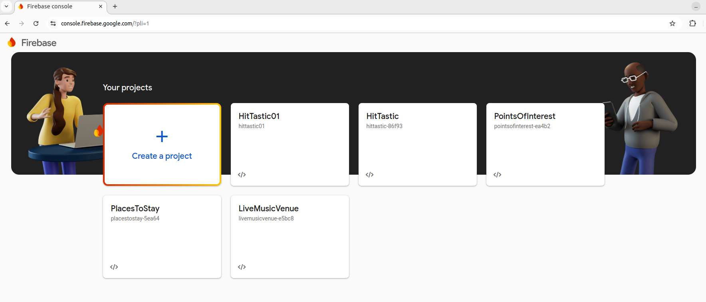

# Week 10 - Introduction to Firebase

*(Credits: notes taken from the originals from Joe Appleton, with amendments and additional information added)*

This week we will introduce the world of serverless systems by taking a look at *Firebase*.

**How can I authenticate my react applications allowing users to sign in using a range of different methods (facebook, email, gmail)?**

### Essential Reading

[Firebase Authentication](https://firebase.google.com/docs/auth/web/start)

## Firebase

[Firebase](https://firebase.google.com/docs) is a cloud infrastructure service that was acquired by Google in 2015 - it effectively is a sub-product suite of the [cloud platform](https://cloud.google.com/). At the time of writing, Firebase offers a range of web-enabled services, the most popular being:

- Authentication
- The Cloud Firestore Database
- Cloud Functions
- Hosting

Firebase, and other infrastructure as a service platform, delegate the need to manage infrastructure away from the developer. This is particularly appealing if you are working in a small team, or, as a solo developer. What's more, for our use, it has a very generous free tier.

## Getting Started

## Task 1 - Setting Up Firebase

The purpose of this task is simply to set up a firebase account, create a project and register your first application - it is much easier than it sounds.

First of all go to the Firebase homepage.

[Create a Firebase Account](https://firebase.google.com/)


Then, go to the Firebase Console. This is the main page for managing your Firebase applications:




Next, create a project and name it whatever you like.
Within your project, register a new web application, register a new web application, also name it what you like


This will then give you a screen such as that shown below, which will detail how to start your project. In particular, it gives you configuration code, including such things as your API key (keep private!) and project ID. You should copy and paste the sample code into your own code.


It will look something like this:
```JavaScript
const firebaseConfig = {
    apiKey: "xxxxxxxxxxxxxxxxxxxxxxxxxxxxxxxxxxxx",
    authDomain: "web-dev-practical.firebaseapp.com",
    databaseURL: "https://web-dev-practical.firebaseio.com",
    projectId: "web-dev-practical",
    storageBucket: "web-dev-practical.appspot.com",
    messagingSenderId: "1030945380946",
    appId: "1:1030945380946:web:ae1bca104338f617df9d8b",
    measurementId: "G-321SW2SPSG"
};
```
Clone [this project](https://github.com/nwcourses/FirebaseStarter)

This is an empty project with `package.json` and `webpack.config.js` setup for a basic Firebase project.

Install with `npm install`. This is using Webpack Dev Server so run with `npm start`.

Create an `index.js` file containing the sample code containing your Firebase configuration, shown above.

## Firebase Auth

The first Firebase product we will use is *Firebase Auth*. Firebase Auth gives you a standard secure and flexible cloud authentication service. You can choose to either use standard email/password authentication or third-party providers such as Google, Facebook, GitHub, etc.

Setting up Firebase in our project is fairly straightforward. First, we need to import our dependencies, this is included in the sample code when you create a Web project.

```javascript
...
import { initializeApp } from "firebase/app";
...
```

Next however we need to import what we need from Firebase Auth. Add this import statement:

```javascript
import { getAuth, createUserWithEmailAndPassword, signInWithEmailAndPassword, onAuthStateChanged, updateProfile } from "firebase/auth";
```
This imports various functions we will use.

To start using Firebase Auth we use the `getAuth()` function. This gives us an auth object.

```javascript
const auth = getAuth();
```

We can then signup a user with `createUserWithEmailAndPassword()`:

```javascript
try {
	const userCredential = await createUserWithEmailAndPassword(auth, email, password);
	// Signed up 
	const user = userCredential.user;
	console.log('signed up');
	alert('signed up');
	alert(user.uid);
} catch(error)  {
	alert(`ERROR: Code: ${error.code}, full message: ${error.message}`);
}

```
This function takes our original auth object, an email and a password as parameters and returns a promise which will resolve once the user has been added to Firebase. It resolves with an object representing the user credentials. This contains a user object `user` which itself contains a `uid` property containing a unique ID for this user.

If there are any errors with the signup process (these can include invalid email address or insufficiently complex password) the promise will reject and the catch block will run.

TO BE CONTINUED.
