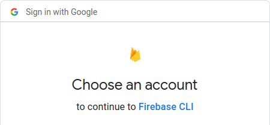
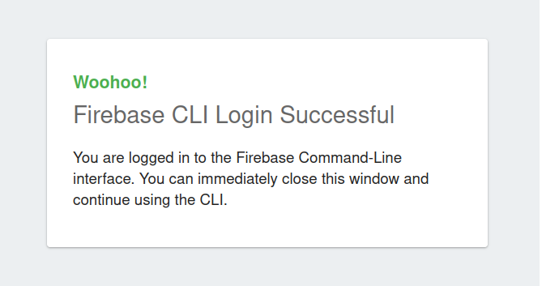
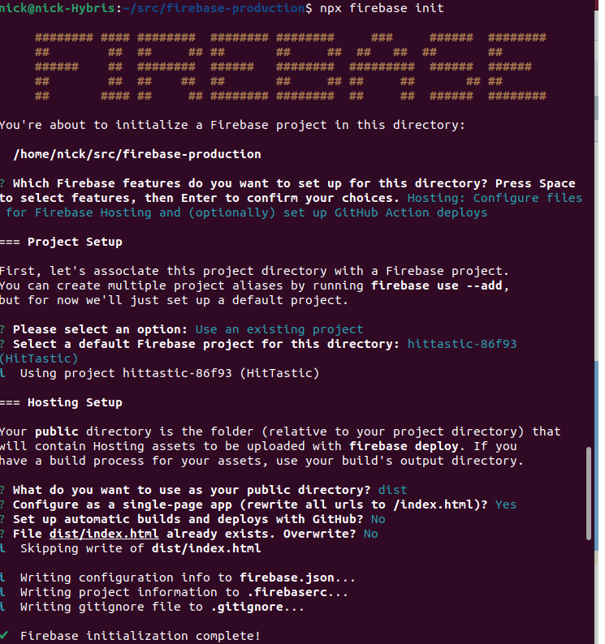
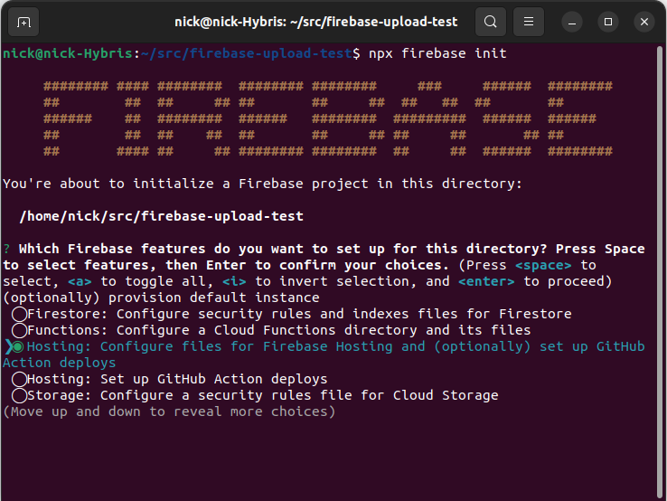
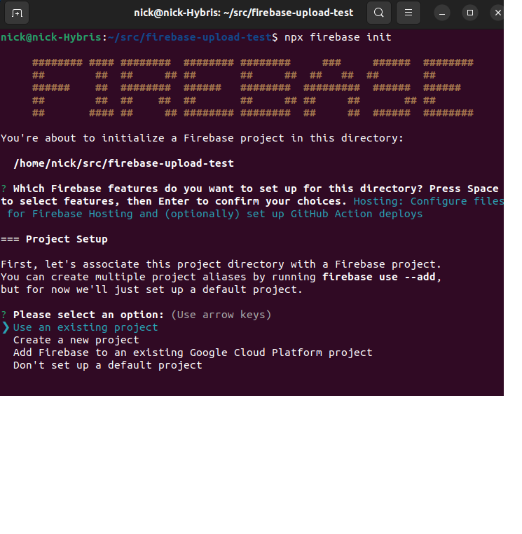
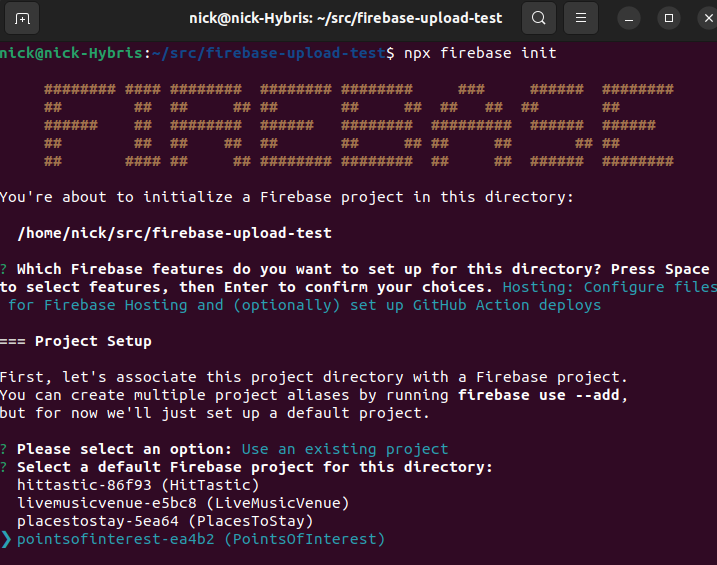
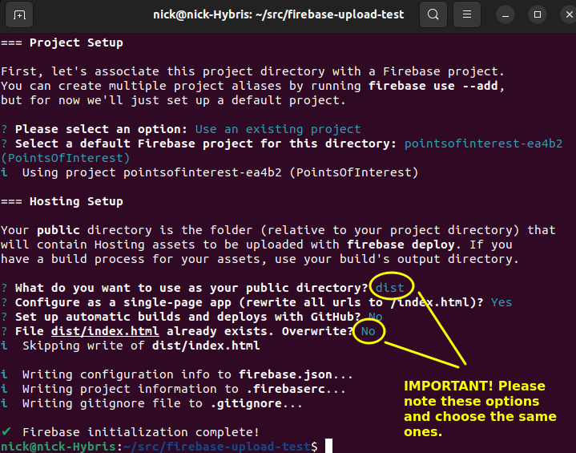

# Week 12 - More on Firestore rules, hosting a Firebase app

## More on Firestore rules

Last week we looked at some basic Firestore rules. We can make the rules more fine-grained, however, rather than just letting people read or write to the database depending on whether they are logged in or not. Here is an example of a more detailed set of rules:
```
rules_version = '2';

service cloud.firestore {
  match /databases/{database}/documents {
    match /songs/{song} {
      allow read: if true;
      allow create: if request.auth != null;
      allow update, delete: if !("userId" in resource.data) || resource.data.userId == request.auth.uid
    }
  }
}
```
There are quite a few things here to look at:

- firstly note the `match /songs/{song}` under `match /databases/{database}/documents`. What do these `match` statements mean? The first matches *all* documents in *all* collections. The second, however, matches **only documents in the `songs` collection**. So the rules will only apply to documents inside `songs`.

- note how we can split `write` into different types of write operations, i.e. `create`, `update` and `delete`. 

- the rule for `create` is easy: let the user create a document if they are logged in.

- What about the rule for `update` or `delete` operations? We have a more complex `if` statement here. The rule is saying: allow users to update or delete records if **either** there is no `userId` property (representing the document's creator) in the document, **or** there is a `userId` property, and it matches the user ID of the current user. **Note that `resource.data` represents the document's data**, so `resource.data.userId` represents a property called `userId` within the document.

So, documents without a `userId` can be updated or deleted by anyone. Documents *with* a `userId` can only be updated or deleted by the original creator.

You can even create functions to perform rules tests, e.g:

```
rules_version = '2';

service cloud.firestore {
  match /databases/{database}/documents {
  
    function isLoggedIn() {
        return request.auth != null;
    }

    function hasCorrectRights() {
        return !("userId" in resource.data) || resource.data.userId == request.auth.uid;
    }
  
    match /songs/{song} {
      allow read: if true;
      allow create: if isLoggedIn();
      allow update, delete: if isLoggedIn() && hasCorrectRights();
    }
  }
}
```

For more on Firestore rules, see [here](https://firebase.google.com/docs/firestore/security/get-started)


## Hosting a Firebase app

**Note that this section contains original notes by Joe Appleton, but has been significantly modified. The screenshots are my own.**

### Getting started with the Firebase Command Line Interface (CLI)

According to the documentation, "The Firebase CLI provides a variety of tools for managing, viewing, and deploying to Firebase projects". 

- Next, from within a terminal or shell run `npm install -g firebase-tools`. The `-g` option globally installs `npm` packages.

#### Warning
 - If you are working on the university computers, you can't do global installs `npm install -g firebase-tools`. 

- Instead, you will need to install the firebase cli locally: `npm install -D firebase-tools` 

- This gives you a `firebase` command which allows you to upload projects to Firebase. You should run this with `npx` (e.g., `firebase login` becomes `npx firebase login`)

### Using the Firebase CLI and Deploying to Hosting

- Within the terminal authenticate the CLI by running `npx firebase login`. This will open your browser and ask you to login to your Google account:



When you have logged in, this screen will appear:



- Next, within the terminal, navigate to the root of your goal tracking application and run `npx firebase init`.



- When prompted, select the option: <code>Hosting: Configure files for Firebase Hosting and (optionally) set up GitHub Action deploys</code>.



- As you already have a Firebase project setup, next choose <code>Use an existing project</code>.



- Next, select your Firebase project (in this example, we have many):



- You will be asked to choose several options relating to your project structure. Ensure you choose `dist` for your public directory and ensure you choose `No` when asked to overwrite `dist/index.html` (as you already have this file):



- We are now ready to deploy our application to the firebase hosting. First, create a production build of your project, `npm run build`. You will need to add an extra script to your `package.json`:

```json
"scripts" : {
    ...
    "build": "webpack --mode=production"
    ...
}
```

 After this command has run you should see a 'build' folder containing your production-ready application.

- Next, deploy the project to firebase hosting, you simply need to run the command `npx firebase deploy --only hosting`

- That's it! If all has worked, your application should have been deployed to its own custom URL. You may want to add the hosting deployment command, and further commands you use, to your scripts object in your `package.json` file.

- When it's all working, log out of Firebase with:

```
npx firebase logout
```

## Hosting and server components (IMPORTANT FOR ASSIGNMENT)

Note that Firebase hosting only works as described above if you use purely client components. This will be the case, for example, if you have a purely client-side React application.

Hosting server-side applications including server components (such as a server-based Next.js application) is possible, but requires a billable Firebase account (Blaze plan): see [the Firebase documentation](https://firebase.google.com/codelabs/firebase-nextjs#2).

This is obviously unsuitable for university coursework. Therefore, if you are using Next.js in the assignment **please do not attempt to host it on Firebase**. Instead:

- Hand in your code, minus the API key (this applies to purely client-side projects too, as API keys are supposed to be confidential).

- Provide me with a JSON "dump" of your Firestore database. You can do this, for example, by performing a search as shown in Week 10, and then using `JSON.stringify()` to output the search results as JSON. Hand in this JSON dump as part of your assignment.

- I will then populate my own Firestore database with this JSON data and run your app locally on my machine.
